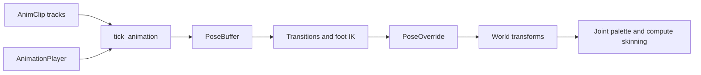

+++
title = 'Animation'
weight = 17
bookCollapseSection = true
+++

# Animation

Animation evaluates authored clips without changing the scene's saved transforms. The same track
model drives skeleton joints, ordinary scene nodes, and morph-target weights, while the runtime
keeps playback state on the entity that owns the rig or animated node forest.

An `AnimTrack` identifies a target, a translation/rotation/scale or weights path, an interpolation
mode, and its keyframes. Bone tracks bind by imported joint index with a name fallback. Node and
morph tracks bind by durable node name. The sampler supports Step, Linear, and CubicSpline curves;
linear quaternion tracks use spherical interpolation.

## Pose flow

`tick_animation` samples the active `AnimationPlayer` into a `PoseBuffer`. Clip transitions and
foot IK modify that buffer before the runtime writes a `PoseOverride` on each driven entity. Scene
hierarchy composition reads the override in preference to the authored `Transform`, then builds the
joint matrices consumed by compute skinning.

Edit mode previews one selected animation target. Play mode advances every player and supplies the
resulting poses to the physics world. A ragdoll can replace or blend individual bone poses, and an
active ragdoll uses the animation pose as its motor target. Morph animation follows a parallel path:
the evaluator writes `MorphWeightOverride`, which the GPU morph pass consumes before skinning.

## Pages

| Page | Covers | Code |
|---|---|---|
| [`animation-data-model`](animation-data-model/) | Clip, track, pose, and interpolation types | `AnimClip`, `AnimTrack`, `PoseBuffer`, `sample_track` |
| [`playback-runtime`](playback-runtime/) | Player advance, transitions, overrides, and wrap modes | `AnimationRuntime`, `tick_animation`, `AnimationPlayer` |
| [`skeleton-overlay`](skeleton-overlay/) | Selected-rig bones, joints, axes, and controls | `build_skeleton_overlay`, `set-skeleton-overlay` |
| [`timeline`](timeline/) | Clip selection, transport, ruler, keys, and scrubbing | `TimelinePanel`, `TimelineSurface`, `TimelineCanvas` |
| [`foot-ik-and-physics-ahead`](foot-ik-and-physics-ahead/) | Two-bone foot IK and ragdoll pose composition | `solve_two_bone_ik`, `FootIk`, `write_ragdoll_poses` |
| [`morph-targets`](morph-targets/) | Sparse blend shapes and GPU deformation | `MorphDelta`, `MorphWeightOverride`, `morph.slang` |
| [`node-trs-animation`](node-trs-animation/) | Animation of ordinary scene-graph nodes | `AnimTarget`, `tick_node_rig`, `resolve_node_targets` |

## In the code

| What | File | Symbols |
|---|---|---|
| Clip and track data | `geometry/src/types.rs` | `AnimClip`, `AnimTrack`, `AnimTarget`, `AnimPath` |
| CPU evaluator | `animation/src/runtime.rs` | `AnimationRuntime`, `tick_animation` |
| Pose math | `animation/src/pose.rs` | `JointPose`, `PoseBuffer`, `PoseDelta` |
| Scene playback state | `scene/src/component.rs` | `AnimationPlayer`, `PoseOverride`, `MorphWeightOverride` |
| Physics pose producer | `physics/src/world.rs` | `drive_ragdolls_to_pose`, `write_ragdoll_poses` |
