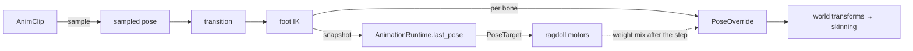

+++
title = 'Foot IK'
weight = 5
math = true
+++

# Foot IK

Foot IK bends a leg chain so the foot meets the ground instead of clipping through it or floating
above it. It runs inside the [playback runtime](../playback-runtime/) as a pose producer: after the
clip sample and any transition, a two-bone solve rewrites the leg joints of the frame's pose. The
clip keeps playing, and the sampling path never learns that IK happened.

## Pose producers

The authored bone `Transform`s hold the rest pose and are never written by animation. Every
animated pose reaches a bone through the runtime-only `PoseOverride` component, which
world-transform composition prefers when present. Anything that writes that layer is a pose
producer, and the producers compose per bone instead of fighting over the `Transform`:

- **Evaluator** — `tick_skinned_rig` samples the clip, applies the transition, and writes one
  `PoseOverride` per bone.
- **Foot IK** — `apply_foot_ik` edits the sampled pose in place, between the transition and the
  override write.
- **Ragdoll** — after the physics step, `World::write_ragdoll_poses` converts each simulated body
  to a bone-local TRS and mixes it into the same override by an eased per-bone weight (see
  [active ragdoll](../../physics/active-ragdoll/)).
- **Scripts** — the host ticks animation before scripts, so a Luau handler can overwrite a bone's
  override in the same frame.

The handoff also runs the other way. The evaluator snapshots each rig's post-IK pose into
`AnimationRuntime.last_pose` every tick; the play tick reads `last_poses` and hands one
`PoseTarget` per rig to the ragdoll's constraint motors. An active ragdoll therefore drives toward
this frame's animated pose, not last frame's, and the switch between animation and simulation does
not pop.



## Chains and the ground plane

`FootIk` lives on the rig entity beside `SkinnedMesh`: an `enabled` flag, a `ground_height`, and a
list of `FootChain`s. A chain names three joint indices into `SkinnedMesh.bones` (`upper`, `mid`,
`end`: thigh → shin → foot) and a `pole_vector` that orients the knee plane. A rig without the
component, or with `enabled` off, runs the unmodified animation path.

The ground is a horizontal plane at `ground_height`. The solve target is the foot's animated world
position with its Y raised to the plane (`target.y = end.y.max(ground_height)`): the target lifts a
foot and never pulls one down, so a foot in mid-swing above the plane keeps its animated arc. The
plane is independent of scene geometry; foot IK casts no ray and does not tilt the foot to a
surface normal.

## Two-bone solve

`solve_two_bone_ik` is a pure function: given the chain's current world positions (root, mid, end),
a target, a pole vector, and the segment lengths $a$ and $b$, it returns world-space delta
rotations for the upper and lower joints as a `TwoBoneIkResult`.

It is the standard analytic two-bone solve, the same shape as
[ozz-animation's `IKTwoBoneJob`](https://guillaumeblanc.github.io/ozz-animation/samples/two_bone_ik/)
and [Unreal's Two Bone IK node](https://dev.epicgames.com/documentation/en-us/unreal-engine/animation-blueprint-two-bone-ik-in-unreal-engine),
built on the [law of cosines](https://en.wikipedia.org/wiki/Law_of_cosines):

- **Clamp** the reach to $[\,|a-b|,\ a+b\,]$ so each $\arccos$ stays in its domain. An
  unreachable target straightens the chain toward it instead of producing NaN.
- **Bend** the knee. For a reach $c$, the interior angle at the mid joint is
  $\arccos\!\big(\tfrac{a^2+b^2-c^2}{2ab}\big)$; rotating the lower bone about the bend axis by
  the change from the current angle to that target angle sets the chain's span to the clamped
  reach.
- **Swing** the whole bent chain about the root so its root-to-end vector points at the target.
  The span already equals the clamped reach, so the end lands on the target exactly.
- **Twist** about the root-to-target axis so the knee lies in the plane spanned by the target
  direction and the pole vector. The twist is a signed `atan2` about the reach axis, which leaves
  the end position untouched.

The function is total over its domain and returns the result directly rather than a `Result`.
Crate unit tests pin the contract: an in-range target is reached exactly, an over-reach clamps to
a straight chain with no NaN, and flipping the pole vector flips the knee to the other side while
the end stays on the target.

## World deltas to a local pose

`apply_foot_ik` resolves each chain's joint world positions by forward kinematics from this
frame's sampled pose, not from the cached world transforms. The cache holds last frame's post-IK
output, so reading it would feed the solver its own result. The forward pass assumes a directly
parented chain (upper → mid → end) at unit bone scale, which the `FootChain` indices describe.

The solver returns world deltas and the pose stores local rotations, so each result is converted:
compose the delta onto the joint's pre-solve world rotation, then strip the parent's world
rotation. With $\Delta_u, \Delta_l$ the solved deltas and $W$ the pre-solve world rotations:

$$W'_u = \Delta_u W_u \qquad W'_m = \Delta_u \Delta_l W_m \qquad \text{local}_u = P^{-1}\, W'_u \qquad \text{local}_m = W_u'^{-1}\, W'_m$$

$P$ is the upper joint's parent world rotation. The mid joint strips the *solved* upper world,
because the upper's swing reaches the mid through the hierarchy. The next frame's world
composition re-derives every world transform from these locals.

## Driving it over the control plane

`set-foot-ik` resolves its selector to the model's rig descendant, attaches a default `FootIk`
when absent, and rejects an entity with no rig. Chains are ordinary component data, authored
through the generic `set-component`:

```sh
sa set-component --entity <uuid> --component FootIk \
   --json '{"enabled": false, "groundHeight": 0, "chains": [{"upper": 0, "mid": 1, "end": 2, "poleVector": {"x": -1, "y": 0, "z": 0}}]}'
sa set-foot-ik --entity <uuid> --enabled true --groundHeight 0.08
# {
#   "enabled": true,
#   "groundHeight": 0.08,
#   "chains": 1
# }
```

`get-foot-ik` reads the same `FootIkResult` back. The `tests/e2e/foot-ik.test.ts` suite drives
this exact path on a three-joint leg fixture: it raises the ground plane, asserts the ankle's
world Y rises to meet it, and asserts the ankle reverts when IK is disabled.

## In the code

| What | File | Symbols |
|---|---|---|
| Two-bone solver + unit tests | `engine/crates/animation/src/ik.rs` | `solve_two_bone_ik`, `rotation_between`, `TwoBoneIkResult` |
| Foot-IK producer (FK resolve → solve → local conversion) | `engine/crates/animation/src/runtime.rs` | `apply_foot_ik`, `tick_skinned_rig` |
| Post-IK pose snapshot | `engine/crates/animation/src/runtime.rs` | `AnimationRuntime` (`last_pose`, `last_poses`) |
| Chain + ground config, override layer | `engine/crates/scene/src/component.rs` | `FootIk`, `FootChain`, `PoseOverride` |
| Ragdoll producers on the same layer | `engine/crates/physics/src/world.rs` | `drive_ragdolls_to_pose`, `write_ragdoll_poses` |
| Play-tick handoff | `engine/crates/runtime/src/session.rs` | `RuntimeSession::step`, `PoseTarget` |
| Control commands | `engine/crates/control/src/commands_animation.rs` | `set-foot-ik`, `get-foot-ik`, `foot_ik_entity` |

## Related

- [Playback runtime](../playback-runtime/) — the evaluator foot IK runs inside
- [Animation data model](../animation-data-model/) — the decomposed joint pose the solve edits
- [Active ragdoll](../../physics/active-ragdoll/) — the physics producer on the same override layer
- [Ragdoll](../../physics/ragdoll/) — the passive collapse through the same layer
- [Transforms & matrices](../../scene-and-ecs/transform-and-matrices/) — the world composition the local conversion inverts
