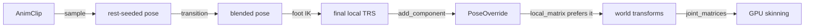

+++
title = 'Playback runtime'
weight = 2
+++

# Playback runtime

The playback runtime is the per-frame evaluator that turns an animation clip into a visible pose.
Each frame it samples every active `AnimationPlayer` at its playhead and writes the result into
runtime-only override components. The authored transforms hold the rest pose and are never
written, so previewing a clip in the editor cannot dirty the project.

## The flow



`tick_animation` runs once per frame over every entity with an `AnimationPlayer`. A player that
also carries a `SkinnedMesh` drives a skeleton; a player without one drives a
[node-forest rig](../node-trs-animation/), binding node-TRS and [morph-weight](../morph-targets/)
tracks to scene entities by name. The query gathers every rig in one `for_each` pass, then
`tick_rig` processes each with full scene access.

A skinned rig steps through:

1. **Gate.** In Play every rig is active; in Edit only a player with `preview_in_edit` set. An
   inactive rig has its overrides removed, so its bones revert to the rest pose.

2. **Advance.** While `playing`, the playhead moves by `dt × speed` under the wrap mode (below).

3. **Sample.** A pose buffer is seeded with each bone's rest local TRS, then the clip's bone
   tracks write over it. An untracked joint, or an untracked channel of a tracked joint, keeps
   its authored value.

4. **Transition.** An in-flight clip switch blends the pose (below).

5. **Foot IK.** A rig with an enabled `FootIk` component gets each chain re-solved against the
   ground plane, and the corrected rotations land in the same final pose (see
   [foot IK](../foot-ik-and-physics-ahead/)).

6. **Write.** Every bone receives its final TRS as a `PoseOverride` component, and the whole pose
   is snapshotted into `AnimationRuntime::last_pose` for the ragdoll motors.

A track binds to its joint by index while the index is sound and re-resolves by the durable node
name when it goes stale, so a clip keeps playing across a reimport that reorders joints (the
[clip/track model](../animation-data-model/) carries both).

`update_world_transforms` then composes each driven bone from its override instead of its
`Transform`; the override stores a quaternion, so no Euler round-trip distorts the sampled
rotation. `joint_matrices` builds the palette the GPU skinning prepass consumes. The skinning
math never changes — only the source of a bone's local transform does.

## A layer other pose producers write

The written `PoseOverride` is a blend layer, not a terminal value. Foot IK writes through it from
inside the evaluator: its corrected rotations replace the sampled ones before the override write,
so they travel through the last-pose snapshot like any sampled value.

The [active ragdoll](../../physics/active-ragdoll/) writes through it from the physics side.
`RuntimeSession::step` copies `last_poses` into per-rig `PoseTarget`s and drives each ragdoll's
motors toward them before the solve. After the step, `write_ragdoll_poses` converts each body's
world transform to a bone-local TRS and blends it over the bone's `PoseOverride` by an eased
per-bone weight. At full weight the physics pose replaces the override outright; below, it
blends over the animation pose written earlier in the frame, so a partial ragdoll keeps an
animated upper body over physical legs.

## Edit preview vs Play

Animation evaluates every frame in both modes; the gate is per rig.

- **Edit** — only a `preview_in_edit` rig animates; everything else stays at rest. The
  [timeline panel](../timeline/) sets `preview_in_edit` plus `playing`/`time` to play or scrub
  the selected entity, and an imported rig stays at rest until previewed.
- **Play** — every rig animates. Entering Play resets each player to `time = 0` with
  `playing = autoplay`, so only a deliberately authored player starts on its own. Play simulates
  on a [duplicated scene](../../ui-and-editor/play-mode/); animation behaves the same in both
  modes because it never mutates authored data.

`RuntimeSession::tick_animation` runs in the host's `update_session` before the gated simulation
step, so the frame's animated pose is on the bones before physics and scripts read the scene.

## Wrap modes and speed

`speed` scales `dt`, and a negative speed plays backward. `wrap` decides the end behaviour:

| Mode | Behaviour |
|---|---|
| `Once` | clamp at the end (or the start, playing backward) and stop |
| `Loop` | wrap the playhead modulo the clip duration |
| `PingPong` | bounce at each end, flipping the stored `ping_forward` direction |

## Transitions

A clip switch pops when the new clip's first pose differs from the current one. Two blend modes
smooth it, both keyed by the rig's id uuid in `AnimationRuntime` and captured once at the switch
frame:

- **Cross-fade** freezes the outgoing pose (each bone's current override, or rest) and blends it
  toward the incoming clip by a smoothstepped `transition / transition_duration`. Only the
  incoming clip is evaluated; the outgoing side is a snapshot, not a second sampling pass.
- **Inertialize** (the default) captures the per-joint offset between the outgoing pose and the
  incoming clip at the switch, then evaluates only the incoming clip and decays the offset with a
  quintic curve whose value, slope, and acceleration all reach zero at the end. The technique
  comes from
  [Bollo's GDC 2018 talk](https://www.gdcvault.com/play/1025165/Inertialization-High-Performance-Animation-Transitions)
  on Gears of War 4.

The offset is a `PoseDelta`: an additive translation, a delta quaternion
`outgoing · inverse(incoming)` decayed by a slerp from identity (never a raw component lerp), and
a multiplicative scale ratio. `apply_delta(incoming, offset, k)` returns the outgoing pose at
`k = 1` and the incoming pose at `k = 0`, so the switch frame matches the outgoing pose exactly
and the result eases onto the incoming clip.

A Loop wrap can transition too: with `loop_blend > 0`, crossing the seam captures the end pose
and inertializes onto the wrapped start pose over `loop_blend` seconds, so looped locomotion does
not stutter. The other transitions start from control commands — `play-animation` with `blend`,
or `seek-animation` with `seekBlend`, which opens a self-transition that eases the pose onto the
seeked time.

```sh
sa play-animation Rig Walk --blend 0.3      # inertialize onto Walk over 0.3 s
sa seek-animation Rig 1.25 --seekBlend 0.2  # scrub, easing the pose to the new frame
```

## In the code

| What | File | Symbols |
|---|---|---|
| Evaluator (gate, advance, sample, write) | `crates/animation/src/runtime.rs` | `tick_animation`, `tick_rig`, `advance_time`, `apply_foot_ik` |
| Runtime state (clip cache, transitions, last pose) | `crates/animation/src/runtime.rs` | `AnimationRuntime`, `ClipLoader`, `last_poses` |
| Transition math | `crates/animation/src/algebra.rs` | `pose_diff`, `apply_delta`, `blend_joint`, `smoothstep01`, `quintic_decay` |
| Player + override components | `crates/scene/src/component.rs` | `AnimationPlayer`, `Wrap`, `Transition`, `PoseOverride`, `FootIk` |
| Override composition | `crates/scene/src/hierarchy.rs` | `local_matrix`, `update_world_transforms`, `joint_matrices` |
| Per-frame wiring | `crates/runtime/src/session.rs`; `crates/host/src/layer.rs` | `RuntimeSession::tick_animation`, `update_session` |
| Ragdoll write-back | `crates/physics/src/world.rs` | `drive_ragdolls_to_pose`, `write_ragdoll_poses` |

> [!NOTE]
> The clip cache resolves through an injected `ClipLoader` closure (the animation crate must not
> depend on `saffron-assets`, so the host hands in a loader borrowing the live catalog). It is
> keyed by clip uuid and cleared on project (re)load. A failed load is negative-cached as an
> empty clip, so a broken asset is not re-read every frame.

## Related

- [Animation data model](../animation-data-model/) — the clip/track/pose types this samples and blends
- [Foot IK](../foot-ik-and-physics-ahead/) — the in-evaluator pose producer and its two-bone solve
- [Node-TRS animation](../node-trs-animation/) — the skinless rig kind on the same evaluator
- [Active ragdoll](../../physics/active-ragdoll/) — the physics producer behind the blend weight
- [Transforms & matrices](../../scene-and-ecs/transform-and-matrices/) — the world composition this feeds
- [Play mode](../../ui-and-editor/play-mode/) — the duplicate-and-discard scene Play simulates on
