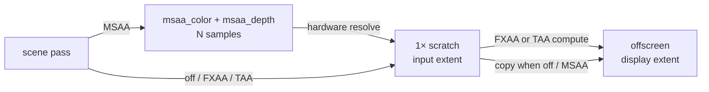

+++
title = 'AA modes'
weight = 3
+++

# AA modes

Anti-aliasing hides the stair-step edges that appear where a triangle boundary crosses the pixel
grid. A renderer can address the problem at different points in the pipeline, and each point is a
distinct mode with its own cost and quality.

Anima has three such modes and treats them as mutually exclusive: at most one is active at a
time. One selector holds the state, one control command switches it, and a loaded project's saved
[render settings](../../geometry-and-assets/project-serialization/) restore it. The host starts
with anti-aliasing off (1×).

The editor gizmo is unaffected by the active mode. It draws after the resolve and
[anti-aliases itself analytically](../../ui-and-editor/gizmo/).

## The modes

| Mode | `set-aa` arg | What it is | Where |
|---|---|---|---|
| Off | `off` | no anti-aliasing | — |
| MSAA 2× / 4× / 8× | `msaa2` / `msaa4` / `msaa8` | multisampled scene color + depth, hardware-resolved at end of pass | [MSAA](../msaa/) |
| FXAA | `fxaa` | luma-edge blur, one compute pass over the finished frame | [FXAA](../fxaa/) |
| TAA | `taa` | jittered samples accumulated over time through motion-vector reprojection | [TAA](../../screen-space-and-post/taa/) |

## One scene path, three resolves

Whatever the mode, the scene rasterizes at input extent into a 1× scratch image, and a resolve
stage reconstructs the scratch into the display-extent offscreen that tonemap and the present
blit read. The modes differ only in what feeds the scratch and which resolve runs: under MSAA the
scene draws into a multisampled pair that hardware-resolves into the scratch, FXAA and TAA write
the offscreen from their own compute pass, and the off/MSAA paths use a plain copy.



## Selecting a mode

`Aa::set(msaa_samples, fxaa, taa)` folds a sample count plus two flags into one active mode. The
count maps to a `vk::SampleCountFlags` bit and clamps to the largest count the offscreen color
and depth formats both support (`clamp_sample_count`). MSAA wins when the clamped count is 2 or
more; otherwise FXAA beats TAA. Only `Aa::set` mutates the selector, and it never leaves more
than one mode active.

| `set-aa` arg | `msaa_samples` | `fxaa` | `taa` |
|---|---|---|---|
| `off` | 1 | false | false |
| `msaa2` / `msaa4` / `msaa8` | 2 / 4 / 8 | false | false |
| `fxaa` | 1 | true | false |
| `taa` | 1 | false | true |

On the wire the mode is a typed enum (`AaModeDto`), so an unknown name is a usage error before it
reaches the renderer. The reply reports the mode actually applied, after the clamp:

```sh
sa set-aa msaa8     # on a device whose formats top out at 4×
# {
#   "aa": "msaa4"
# }
```

Project load takes the name path instead: `Renderer::set_aa_mode` folds the saved
`renderSettings.aa` string through the same precedence, and an unrecognized name falls back to
off.

## What a switch rebuilds

Switching modes is a full reconfigure, not a flag flip. `Renderer::set_aa` idles the GPU, since
the targets and pipelines about to be destroyed may still be in flight. It then rebuilds each
view's AA targets (`ViewTarget::build_aa_targets`): the multisampled color + depth pair under
MSAA, and TAA's history and lock ping-pong plus its reactive mask. Every view is rebuilt, not
just the active one, so a later view switch finds targets already sized for the current count.

The motion-vector target is not TAA's alone. It is built whenever the screen-space chain exists,
because [SSGI](../../screen-space-and-post/ssgi/) reprojects through it too, and which consumer
runs is gated per frame rather than by the target's existence.

`Aa::set` returns `true` when the MSAA sample count changed; on that signal the
sample-count-baked pipelines go too. `Pipelines::set_sample_count` clears the mesh PSO cache and
drops the depth-prepass and meshlet PSOs so they rebuild lazily at the new count, and
`Sky::set_sample_count` rebuilds the sky PSO immediately — it draws straight into the scene color
and would otherwise rasterize a multisampled attachment with a 1× pipeline. The screen-space and
shadow PSOs are always 1× and stay untouched.

## Reading back the active mode

`Aa::mode` (surfaced as `Renderer::aa_mode`) names the current mode: `fxaa` and `taa` by their
flag, otherwise the sample count decides — `off` at 1×, `msaaN` above. `sa render-stats` carries
the same name as its `aa` field, and the project save path writes it into `renderSettings.aa`.

Under TAA the resolve doubles as a temporal upsampler: the scene renders below display resolution
and the resolve reconstructs the display image. `sa set-upscale --ratio 0.67` sets the
input:display scale; see
[TAA → Temporal upsampling](../../screen-space-and-post/taa/#temporal-upsampling-taau).

## In the code

| What | File | Symbols |
|---|---|---|
| Selector: clamp + exclusivity | `aa.rs` | `Aa::set`, `Aa::set_mode`, `Aa::mode`, `clamp_sample_count` |
| Reconfigure on switch | `renderer.rs` | `Renderer::set_aa`, `Renderer::set_aa_mode`, `Renderer::aa_mode` |
| Per-view target rebuild | `view_target.rs` | `ViewTarget::build_aa_targets` |
| Sample-count-baked PSO cache | `pipelines.rs` | `Pipelines::set_sample_count` |
| Sky PSO rebuild | `ibl.rs` | `Sky::set_sample_count` |
| Wire command + DTO | `commands_render.rs`, `dto.rs` | `set-aa`, `aa_selection`, `aa_mode_from_name`, `AaModeDto` |
| Saved mode in the project | `render_settings.rs` | `RenderSettings`, `Renderer::apply_render_settings` |
| Upscale command (TAAU) | `commands_render.rs` | `get-upscale`, `set-upscale` |

## Related

- [MSAA](../msaa/) — the rasterization-time mode
- [FXAA](../fxaa/) — the cheap post-process mode
- [TAA](../../screen-space-and-post/taa/) — the temporal mode
