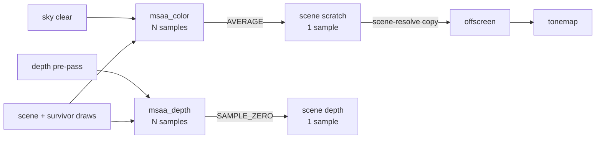

+++
title = 'MSAA'
weight = 1
+++

# MSAA

Multisample anti-aliasing rasterizes several coverage samples per pixel and resolves them down to
one color, so triangle edges land on a finer grid than the shading
([LearnOpenGL's Anti Aliasing](https://learnopengl.com/Advanced-OpenGL/Anti-Aliasing) walks the
mechanics). The hardware tests coverage and depth per sample but runs the fragment shader once per
covered pixel, so edge quality scales with the sample count while shading work stays per-pixel.
It smooths geometric edges only; aliasing inside a triangle looks the same at any sample count,
which is what the [FXAA](../fxaa/) and [TAA](../../screen-space-and-post/taa/) modes address
instead.

## Multisampled targets

When MSAA is the active [AA mode](../aa-modes/), `ViewTarget::build_aa_targets` allocates
`msaa_color` (rgba16f) and `msaa_depth` (d32) at `Aa::sample_count` and the render extent. Both
exist only for this mode and only as attachments; nothing ever samples them. The single-sample
scene scratch stays allocated alongside, because it receives the resolve.

The count is clamped before any image is created. `Device::supported_sample_counts` intersects the
device's framebuffer color and depth sample limits with each format's image support, since a count
valid as a framebuffer limit can still be invalid for a specific format. `Aa::set` then picks the
largest supported count not above the request, out of 8×, 4×, and 2×.

The pair is not cheap. At 1920×1080 and 4×, `msaa_color` holds 2,073,600 pixels × 8 bytes × 4
samples ≈ 63 MiB and `msaa_depth` another ≈ 32 MiB, roughly four times the single-sample scene
targets.

## One resolve, owned by the last raster pass

Several passes rasterize against the multisampled pair, and exactly one resolves it. The sky pass,
when it draws, clears and stores the multisampled color; the depth pre-pass, when enabled, clears
and stores the multisampled depth. The scene pass loads whatever an earlier pass wrote (clearing
the rest itself) and replays the visibility traversal's counted indirect draws.

When the survivor raster runs — the `scene-survivors` pass that redraws the occlusion-retest
survivors over the provisional scene — the scene pass stores its samples through to it and the
survivor pass carries the resolve on its attachments; otherwise the scene pass carries it. Either
way the samples exist for one pass chain and collapse at its end.



The color resolves into the scene scratch (`scene_output`), the same render-extent image the scene
writes directly in every other mode. The `scene-resolve` compute pass then upscales the scratch
into the display-extent offscreen that [tonemap](../../screen-space-and-post/tonemap-and-exposure/)
reads; at a 1:1 render scale that is a straight copy. Depth resolves into the single-sample scene
depth, which the post-tonemap grid and gizmo overlays depth-test against.

## Resolve in the graph

`record_scene_graph` declares the resolve on the resolving pass's attachments — the scene pass, or
the survivor pass when it runs: the multisampled image is the attachment and
`RgAttachment.resolve` names the single-sample target. The
[render graph](../../frame-and-render-graph/render-graph-overview/) treats a resolve target as a
second write of the attachment's kind — `derive_pass_barriers` runs it through the same
`ColorWrite` or `DepthWrite` usage, so its barrier and layout come out as for any other attachment.

The graph builds the dynamic-rendering attachment info with resolve mode `AVERAGE` for color and
`SAMPLE_ZERO` for depth, the two modes the
[Vulkan render-pass chapter](https://docs.vulkan.org/spec/latest/chapters/renderpass.html) defines
for multisample resolve operations. Averaging N HDR samples is the anti-aliasing itself; depth
takes sample zero because an average of depths lies on no surface. The resolving pass stores both
multisampled attachments with `DONT_CARE`: after the resolve their samples are discarded, and only
the resolved images leave the pass.

## Sample count baked into PSOs

A graphics pipeline's multisample state fixes the sample count it rasterizes against, and Vulkan
requires it to match the attachment. The übershader cache keys every mesh pipeline on
`PsoKey.sample_count`, and the depth pre-pass and sky PSOs bake the count too. Changing
the MSAA level therefore cannot just swap targets; every one of those pipelines goes stale.

On a count change `Renderer::set_aa` idles the GPU, then `Pipelines::set_sample_count` clears the
mesh PSO cache and drops the depth pre-pass PSOs so they rebuild lazily at the new
count. The sky PSO rebuilds immediately via `Sky::set_sample_count`, since the next frame's sky
pass draws before any lazy request. The [AA modes](../aa-modes/) page covers the full switch
sequence.

## Alpha-to-coverage

MSAA also upgrades masked (alpha-tested) materials. Under any other mode a masked fragment is a
hard per-pixel `discard`, which aliases exactly like a geometric edge. With a sample count above
1× the PSO cache mints an alpha-to-coverage permutation (`PsoKey.alpha_to_coverage`), and the
fragment passes a canonical coverage value to the hardware sample mask:

```hlsl
CoverageSample coverage = sampleCanonicalCoverage(
    source, uv, coverageAnchor, sourceKind, classification, baseColorAlpha,
    sourceExtent, salt, temporalPhase, cutoff, canonicalProbability, true
);
```

Standard alpha is rescaled around the cutoff by its screen-space derivative. Thin-sheet coverage
textures already store probability at each mip and bypass that reconstruction. Both paths give the
hardware a continuous value, so foliage and cutout edges resolve as smoothly as triangle edges. A
masked material at 1× shares the plain opaque PSO; the permutation exists only where the samples do.

## In the code

| What | File | Symbols |
|---|---|---|
| Multisampled target pair | `view_target.rs` | `ViewTarget::build_aa_targets`, `msaa_color`, `msaa_depth` |
| Count selection + clamp | `aa.rs`, `device.rs` | `Aa::set`, `Aa::sample_count`, `clamp_sample_count`, `Device::supported_sample_counts` |
| Scene attachment + resolve wiring | `renderer.rs` | `record_scene_graph`, `scene_output`, `add_scene_resolve_pass` |
| Resolve in the graph | `render_graph.rs` | `RgAttachment.resolve`, `derive_pass_barriers` |
| Sample count in PSOs | `pipelines.rs` | `PsoKey`, `Pipelines::set_sample_count`, `Pipelines::request_mesh_pipeline` |
| Alpha-to-coverage cutout | `mesh.slang`, `coverage.slang` | `fragmentMain`, `sampleCanonicalCoverage` |

## Related

- [AA modes](../aa-modes/) — the mode selector and what a switch rebuilds
- [FXAA](../fxaa/) — the post-process alternative
- [TAA](../../screen-space-and-post/taa/) — the temporal alternative
- [Render graph](../../frame-and-render-graph/render-graph-overview/) — derives the resolve's barriers
