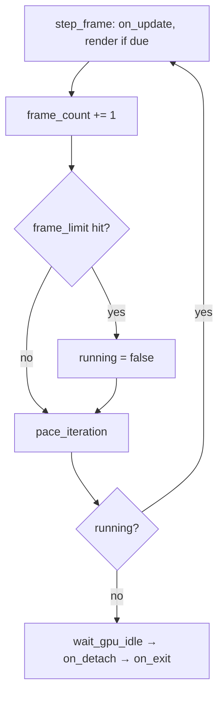

+++
title = 'Headless runs'
weight = 5
+++

# Headless runs

A headless run boots the engine, renders a bounded number of frames, and exits on its own, so a
script can drive and verify the host without a person at a window. One environment variable bounds
the loop (`SAFFRON_EXIT_AFTER_FRAMES`); capturing the rendered result is a separate control-plane
concern. The render rate is not an env knob — the loop paces itself reactively (see
[main loop](../main-loop-and-run/)).

## Two host modes

`run` picks its mode from the environment. When `SAFFRON_EDITOR_NATIVE_VIEWPORT` is present (any
value, including empty), `HostMode::from_env` selects `Headless`: the renderer is built on a
no-surface offscreen device (`SurfaceSource::Offscreen`), no window exists, and a plain `while`
loop (`drive`) runs the frames. This is the mode the editor spawns the host in. Unset, the host
runs windowed under winit with a real swapchain.

The frame limit applies to either mode; `just run-engine-headless [frames]` combines both knobs
into one recipe (headless mode, a per-run control socket, exit after `frames`).

## Exit after N frames

`SAFFRON_EXIT_AFTER_FRAMES=N` stops the loop after `N` iterations. `frame_limit_from_env` parses
the value strictly (`parse_strict_u64`): the whole string must be a base-10 `u64`, so a typo like
`10x` is logged and ignored rather than read as its leading digits. Zero, unset, and malformed all
mean run forever. The limit is read once into `LoopLimits` before the loop starts; the loop body
never touches the environment.

Each iteration advances the `FrameClock` frame count, and `step_frame` ends the loop once the
count reaches the limit:

```rust
clock.frame_count += 1;
if limits.frame_limit != 0 && clock.frame_count >= limits.frame_limit {
    tracing::info!("frame limit reached ({}), exiting", limits.frame_limit);
    app.running = false;
}
```

The loop then exits through the normal teardown path — `wait_gpu_idle`, then `on_detach`, then
`on_exit`, the same ordering as a manual close. An iteration counts whether or not it rendered. A
minimized host (a zero viewport axis) and a reactive idle skip both still advance the count, so a
headless run terminates on schedule even if it never renders a frame.



## Loop pacing

There is no FPS-cap env var. `pace_iteration` sleeps a rendered frame to the renderer's target
rate: `FrameHost::pace_target_fps` returns the perf-config `target_fps`, capped further by the
viewport power state when the editor reports its window unfocused. An idle iteration, one the
`RedrawController` verdict skipped because the scene is static, sleeps one `IDLE_POLL_INTERVAL`
(8 ms) instead. `on_update` still runs every iteration, so the control socket keeps draining while
the GPU stays quiet; [main loop](../main-loop-and-run/) covers the verdict itself.

## Capturing the result

The loop writes no image of its own. A capture is requested over the control plane: the
`screenshot` command grabs either the viewport (`Renderer::capture_viewport`, a synchronous
offscreen read-back written as a PNG before the reply returns) or the window
(`Renderer::request_window_capture`, deferred to the next present, reply `pending: true`). A
headless pixel check pairs the frame bound with a capture request:

```sh
SAFFRON_EDITOR_NATIVE_VIEWPORT=1 SAFFRON_EXIT_AFTER_FRAMES=120 \
  ./engine/target/debug/saffron-host &
sa screenshot viewport /tmp/frame.png   # on disk when the reply arrives
```

The reproducible gate (`tools/ci/check.sh`) uses the same bound for its present-only smoke: it
runs the host with `SAFFRON_EXIT_AFTER_FRAMES=5` and greps the log for validation errors. See
[capture](../../tooling-and-control/screenshots-and-capture/) for the read-back mechanics.

## In the code

| What | File | Symbols |
|---|---|---|
| Frame-limit parse | `app/src/lib.rs` | `frame_limit_from_env`, `parse_strict_u64` |
| Read-once knob | `app/src/lib.rs` | `LoopLimits`, `LoopLimits::from_env` |
| Counting + exit | `app/src/lib.rs` | `step_frame`, `FrameClock` |
| Mode selection | `app/src/lib.rs` | `HostMode`, `HostMode::from_env` |
| Headless driver | `app/src/lib.rs` | `run_inner`, `drive` |
| Pacing | `app/src/lib.rs` | `pace_iteration`, `IDLE_POLL_INTERVAL`, `FrameHost::pace_target_fps` |
| Viewport / window capture | `rendering/src/renderer.rs` | `capture_viewport`, `request_window_capture` |
| PNG encode | `rendering/src/thumbnail.rs` | `write_png_file`, `encode_to_png`, `format_pixel_bytes` |

## Related

- [Main loop](../main-loop-and-run/) — the loop these knobs bound and pace
- [Capture](../../tooling-and-control/screenshots-and-capture/) — the control-plane viewport/window grab
