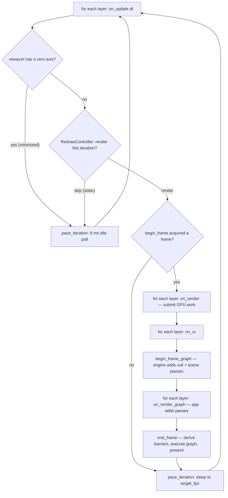

+++
title = 'Main loop'
weight = 1
+++

# Main loop

The main loop is the one function that owns a program's window and renderer and repeats a fixed
sequence of work each frame until the program exits. In Anima that function is `run` in the
`saffron-app` crate. A client fills an `AppConfig` and calls `run`; `run` drives everything and
calls back into the client's layers at fixed points.

The shape is a config and a call, not a base class. There is no application type to subclass; the
loop calls back through the [`Layer` trait](../layer-system/) the client attached.

```rust
pub struct AppConfig {
    pub window: WindowConfig,
    pub on_create: Box<dyn FnOnce(&mut App)>,  // runs once, after window + renderer exist
    pub on_exit: Box<dyn FnOnce(&mut App)>,    // runs during teardown
}

pub fn run(config: AppConfig) -> i32;          // returns a process exit code
```

## Two modes, one loop

`run` serves two hosts from one body. The windowed standalone host opens a
[winit](https://docs.rs/winit/latest/winit/) window and a surface-bound renderer that presents
through a real swapchain. The headless editor host runs windowless on a no-surface offscreen
device (`SurfaceSource::Offscreen`) and publishes frames to shared memory. `HostMode::from_env`
picks the mode from `SAFFRON_EDITOR_NATIVE_VIEWPORT`: present in the environment means headless,
absent means windowed.

The two drivers differ only in who owns the loop. Headless uses a plain `while` loop (`drive`).
Windowed hands off to winit's
[`ApplicationHandler`](https://docs.rs/winit/latest/winit/application/trait.ApplicationHandler.html)
(`run_windowed` / `WindowedApp`), because winit 0.30 owns its event loop and creates the window
from inside it. Both share the bring-up half (`start`), the per-frame body (`step_frame`), and
the teardown half (`finish`), so the hook order and shutdown ordering are identical across modes.

## Startup

Headless bring-up builds the offscreen renderer in `run_inner`; windowed bring-up builds the
window and renderer inside `WindowedApp::resumed`, the first callback winit fires. Either failure
is a typed `Error` per the [error-handling](../../core-and-conventions/error-handling/) pattern;
`run` logs it and returns exit code `1`.

`start` runs `on_create` next. That is where the client attaches its layers and wires window
signals. Every layer's `on_attach` fires after that, then `start` latches `app.running = true`.
In windowed mode the close path runs through winit: `WindowedApp::window_event` flips
`app.running` to `false` on `WindowEvent::CloseRequested`.

## One iteration

The loop body (`step_frame`) is the contract every feature plugs into, and its order is fixed.
Logic comes first, then the GPU frame. Inside the frame the `on_ui` phase runs before the graph
is built, so anything it records is ready when the frame executes.



`begin_frame` returns `false` when the swapchain image cannot be acquired (a resize made it out
of date), and the loop skips rendering that iteration rather than erroring. A `viewport_size`
with a zero axis means the host is minimized; the minimized guard short-circuits before the
redraw controller is even consulted. `dt` is a wall-clock `TimeSpan` between iteration starts,
passed to every `on_update`.

Around the render, `step_frame` splits the iteration's CPU time in two: the fence block inside
`begin_frame` is the wait share, the rest of the update-plus-render span is the busy share. Both
feed the renderer's smoothed `cpuFrameMs` / `cpuWaitMs`, part of
[performance telemetry](../../frame-and-render-graph/performance-telemetry/). Only rendered
frames advance the telemetry, so idle iterations do not dilute the fps readout.

## Reactive pacing

The loop does not render every iteration. During `on_update` the host sets per-frame activity on
the `RedrawController`, and the controller returns a render-or-skip verdict. Three inputs drive
it: `set_continuous` while some state evolves on its own (a play sim, an edit smoothing, a clip
advancing), `request_redraw` as a one-shot when a mutating control command lands, and
`set_temporal_active` while [TAA](../../screen-space-and-post/taa/) or SSGI history is
accumulating.

After activity stops, the controller keeps rendering until two windows close. The wall-clock
keep-warm window (`KEEP_WARM`, 600 ms) covers post-interaction smoothness and GPU downclock
stutter. The convergence window (`CONVERGE_FRAMES`, 24 rendered frames) applies only while a
temporal effect accumulates, so the viewport idles on the converged image rather than a noisy
mid-accumulation one. At a low target fps the frame-count window outlasts the wall-clock one; at
a high fps the keep-warm dominates.

An idle iteration skips the render and holds the last published frame, so a static viewport
drops the GPU to idle. `on_update` still runs every iteration, and the host drains its control
socket there; `pace_iteration` sleeps an idle iteration for `IDLE_POLL_INTERVAL` (8 ms), so a
command wakes the viewport within one poll. A rendered iteration paces to the renderer's
`target_fps` (`FrameHost::pace_target_fps`). The controller defaults to continuous, so a
layer-less app and the GPU-free test host render every frame; only a host that opts in ever
idles.

The editor reports window visibility over the control plane (`set-viewport-power-state` with
`focused`, `unfocused`, or `occluded`). An occluded viewport suppresses rendering entirely
(`RedrawController::set_suppressed`). An unfocused one still renders on demand but caps pacing at
`UNFOCUSED_FPS_CAP` (6 fps), so an animating viewport stops pinning the GPU while the user works
elsewhere. The whole verdict (`idle`, `converged`, the active `redrawReasons`, the `powerState`)
surfaces in `render-stats` for the CLI, the stats HUD, and the e2e suite.

```sh
sa render-stats   # → { "idle": true, "converged": true, "redrawReasons": [], "powerState": "focused", ... }
```

The two render hooks record work at different levels. `on_render` is the immediate
[submit seam](../the-submit-and-rendergraph-seams/): it records commands into the current frame.
`on_render_graph` hands the layer the live `RenderGraph` so it can add passes, which is how an
app-authored post-process step slots in between the scene and the present. The engine's cull and
scene passes are already in the graph by the time layers see it.

## Shutdown order

When the loop ends, `finish` calls `wait_gpu_idle` before anything is torn down. This is the
resource-lifetime contract: `on_detach` and `on_exit` are where the client drops its GPU
resources, and a resource must not be freed while an in-flight command buffer still references
it. `App`'s field order also encodes teardown; the frame host (renderer) drops before the window.

```rust
app.frame_host.wait_gpu_idle();           // finish all in-flight GPU work first
run_hook(app, |layer, app| layer.on_detach(app));
on_exit(app);
```

## Headless runs

`SAFFRON_EXIT_AFTER_FRAMES=N` makes `run` scriptable for verification: the loop counts iterations
(rendered and idle alike) and exits cleanly after `N`. The value parses strictly; a malformed
value logs and is ignored. There is no environment knob for the render rate — it comes from the
reactive pacing above. See [headless runs](../headless-and-capture/).

## In the code

| What | File | Symbols |
|---|---|---|
| Config + types | `app/src/lib.rs` | `AppConfig`, `App`, `Layer`, `attach_layer` |
| The loop | `app/src/lib.rs` | `run`, `run_inner`, `drive`, `run_windowed`, `WindowedApp`, `start`, `step_frame`, `run_frame`, `finish` |
| Frame host trait | `app/src/lib.rs` | `FrameHost`, `begin_frame`, `begin_frame_graph`, `end_frame`, `wait_gpu_idle`, `pace_target_fps` |
| Reactive pacing | `app/src/lib.rs` | `RedrawController`, `pace_iteration`, `KEEP_WARM`, `CONVERGE_FRAMES`, `IDLE_POLL_INTERVAL` |
| Power states | `rendering/src/reactive.rs` | `PowerState`, `UNFOCUSED_FPS_CAP` |
| Mode selection | `app/src/lib.rs` | `HostMode`, `HostMode::from_env` |
| Frame knobs | `app/src/lib.rs` | `frame_limit_from_env`, `LoopLimits` |

## Related

- [Layers as a trait of hooks](../layer-system/) — the hook set the loop dispatches
- [Render seams](../the-submit-and-rendergraph-seams/) — `on_render` vs `on_render_graph` in depth
- [Render graph](../../frame-and-render-graph/render-graph-overview/) — what `begin_frame_graph`/`end_frame` drive
- [Headless runs](../headless-and-capture/) — driving the loop for verification
