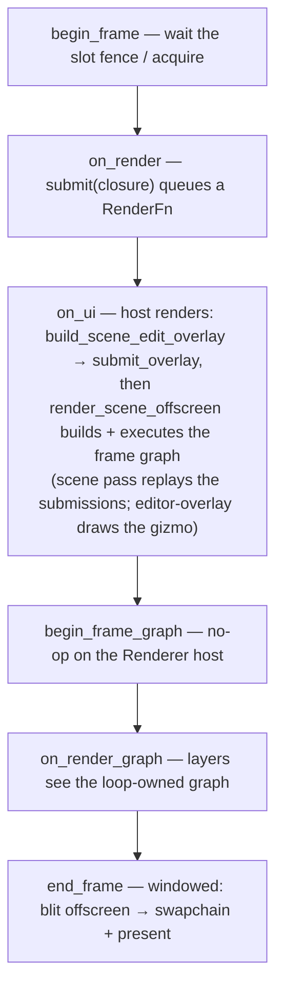

+++
title = 'Render seams'
weight = 3
+++

# Render seams

A render seam is a hook through which a layer contributes GPU work to a frame. The
[`Layer`](../layer-system/) trait carries two: `on_render`, from which a layer records commands
into the scene pass via `Renderer::submit`, and `on_render_graph`, which hands the layer the
loop-owned `RenderGraph`. A third, purpose-built entry, `submit_overlay`, carries the editor's
gizmo geometry into a dedicated overlay pass.

## Submit seam: recording into the scene pass

`on_render` fires first among the frame hooks, after `begin_frame` waits the frame slot's fence.
From it a layer reaches the renderer through `app.frame_host.renderer_mut()` and calls `submit`:

```rust
pub fn submit(&mut self, body: impl FnOnce(vk::CommandBuffer) + 'static) {
    self.submissions.push(Box::new(body));
}
```

Nothing executes at the call. The closure is stored as a `RenderFn`, and when the renderer builds
the frame graph, the scene pass body replays every stored closure in its `scene-submissions`
scope: after the batched opaque draw list, before the translucent draws.

The closure receives the frame's `vk::CommandBuffer` (Vulkan via the
[`ash`](https://github.com/ash-rs/ash) bindings) inside a rendering scope the graph has opened
onto the scene color and depth. It records draw calls only. The scene pass's derived barriers and
attachments cover it, so the closure opens no rendering scope and writes no barrier of its own.

Capture by value. The closure is `'static` and runs on the render thread while the scene pass
records, not at submit time, so everything it references must still be valid then — resolved
handles, not borrows of the submitting layer.

## Overlay seam: gizmo geometry

The editor gizmo does not go through `submit`. In `on_ui` the host builds an `OverlayVertex`
stream (`build_scene_edit_overlay`) and hands it to `Renderer::submit_overlay` as two ranges: a
`depth_tested` range (camera frustums, colliders, the skeleton) that scene geometry occludes, and
an `on_top` range (gizmo handles, entity billboards) that always shows. The vertices draw in the
dedicated `editor-overlay` graphics pass at the end of the frame graph, after the tonemap,
loading the 1× scene depth read-only so occlusion tests against the finished frame. The
[gizmo page](../../ui-and-editor/gizmo/) covers the geometry itself.

## Render-graph seam: the loop's graph pass

`on_render_graph` is the loop's pass-authoring hook. Each frame, `run_frame` builds a fresh
`RenderGraph`, lets the frame host fill it, hands it to every layer, then moves it into
`end_frame`:

```rust
let mut graph = RenderGraph::new();
app.frame_host.begin_frame_graph(&mut graph);
run_hook(app, |layer, app| layer.on_render_graph(app, &mut graph));
app.frame_host.end_frame(graph)   // an error here stops the loop
```

A layer adds a pass with the same builder the engine's own passes use: `RgPass::graphics` or
`RgPass::compute`, `.access(resource, RgUsage::…)` declarations, color/depth attachments, and a
body closure, appended via `RenderGraph::add_pass`. The graph derives every barrier and layout
transition from those declarations; see the
[render graph](../../frame-and-render-graph/render-graph-overview/) for the model.

The `FrameHost` contract leaves it to the host how the loop's graph maps onto GPU work, and the
`Renderer` host renders earlier in the frame. The host layer's `on_ui` calls
`render_scene_offscreen`, whose `record_scene_graph` builds the whole frame graph (light cull,
deform, shadows, depth pre-pass, scene, post, overlay) as an internal `RenderGraph` and executes
it in the same call.

`<Renderer as FrameHost>::begin_frame_graph` therefore adds nothing to the loop's graph, and
`end_frame` blits the finished offscreen to the swapchain when a window exists; the headless
host publishes its frame to shared memory from `on_ui` instead.

> [!NOTE]
> On the `Renderer` host the loop's graph reaches `end_frame` unexecuted, so a pass added in
> `on_render_graph` records nothing on the GPU there. Frame-visible layer work goes through
> `submit` or `submit_overlay`; engine passes join the frame inside `record_scene_graph`.

## Where the seams land in a frame



## In the code

| What | File | Symbols |
|---|---|---|
| The layer hooks + loop order | `app/src/lib.rs` | `Layer::on_render`, `Layer::on_render_graph`, `run_frame`, `run_hook` |
| Frame-host contract | `app/src/lib.rs` | `FrameHost::begin_frame_graph`, `FrameHost::end_frame` |
| Submit seam | `rendering/src/renderer.rs` | `Renderer::submit`, `RenderFn`, `submissions` |
| Replay inside the scene pass | `rendering/src/renderer.rs` | `record_scene_graph` (the `scene-submissions` scope) |
| Overlay seam | `rendering/src/renderer.rs`, `rendering/src/overlay.rs` | `Renderer::submit_overlay`, `OverlayState`, `record_overlay` |
| Overlay geometry builder | `host/src/overlay.rs` | `build_scene_edit_overlay` |
| Pass declaration | `rendering/src/render_graph.rs` | `RenderGraph::add_pass`, `RgPass`, `RgUsage`, `RgAttachment` |

## Related

- [Layers as a trait of hooks](../layer-system/) — where `on_render`/`on_render_graph` come from
- [Main loop](../main-loop-and-run/) — the order the seams fire in
- [Render graph](../../frame-and-render-graph/render-graph-overview/) — the pass and barrier model
- [Gizmo](../../ui-and-editor/gizmo/) — the geometry the overlay seam carries
