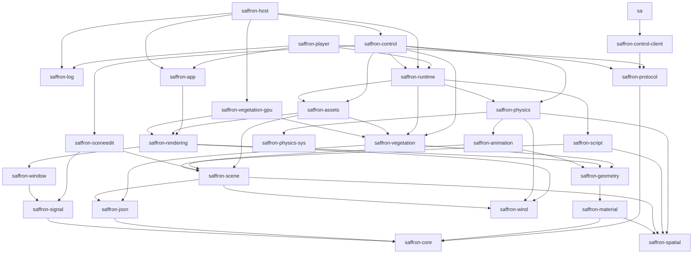

+++
title = 'Crate DAG'
weight = 4
+++

# Crate DAG

The crate DAG is the workspace's dependency structure: every crate depends only on crates below
it, and no dependency path forms a cycle. Cargo enforces the acyclic property mechanically (a
cycle between workspace members does not compile), so the DAG is a build guarantee, not a
convention.

A crate's position in the graph fixes what its code may reach and where a new piece of code
belongs. The edges are the
[`path` dependencies](https://doc.rust-lang.org/cargo/reference/specifying-dependencies.html#specifying-path-dependencies)
in each crate's `Cargo.toml`; reading them is reading the architecture.

## The graph

The diagram is the [transitive reduction](https://en.wikipedia.org/wiki/Transitive_reduction) of
the manifests: an arrow means "depends on", and a direct dependency already implied by a longer
path is omitted. Most crates also list `saffron-core` directly; that edge is drawn only where no
longer path implies it.



Four crates in the diagram have no Saffron dependency at all: `saffron-core` (the
`Result`/`Error` model, `Uuid`, `Ref = Arc`), `saffron-log` (the tracing subscriber stack behind
`init_logging`), `saffron-spatial` (world coordinates and deterministic numerics), and
`saffron-physics-sys` (the vendored-Jolt FFI). Most other crates reach `saffron-core` transitively.

Three workspace members are tooling and stay out of the runtime graph: `saffron-test-support`
(shared test helpers, consumed as a dev-dependency), `saffron-e2e` (the `tests/e2e` driver, on
`saffron-control-client` + `saffron-protocol`), and `xtask` (the build-task runner, on
`saffron-protocol` + `saffron-script` for the protocol codegen).

## Reading the layers

- **Vocabulary crates** (`saffron-signal`, `saffron-json`, `saffron-spatial`, `saffron-material`,
  `saffron-geometry`, `saffron-window`) define contracts without depending on product glue.
- **Domain crates** (`saffron-scene`, `saffron-rendering`, `saffron-animation`,
  `saffron-physics`, `saffron-script`, `saffron-vegetation`, `saffron-assets`,
  `saffron-sceneedit`) see only the domains they consume. `saffron-rendering` consumes geometry,
  material, spatial, window, and wind contracts but neither scene nor vegetation. The
  `saffron-vegetation-gpu` adapter joins renderer compute facilities to vegetation graph programs
  above both crates.
- **`saffron-runtime`** bundles the simulation crates into the shared play-mode spine. It has no
  window, renderer, or control-plane dependency; drawing and editing live above it.
- **The apexes** are the two product binaries, `saffron-host` and `saffron-player`.

## The wire chain links no engine code

`saffron-protocol` → `saffron-control-client` → `sa` is a side chain that never touches the
engine: the DTO crate defines the wire types, the client crate speaks the unix socket, and the
`sa` CLI links exactly those two. Building the CLI compiles no rendering, scene, or physics
code, and `saffron-e2e` drives a running host through the same pair.

## Why saffron-host sits on top

The host glue (the `HostLayer` callbacks, the thumbnail worker, the shm publish wiring, the
once-per-frame control-socket drain) calls into `saffron-app`, `saffron-control`,
`saffron-runtime`, and most of the rest at once. Its manifest lists 16 direct dependencies, the
widest in the workspace.

That glue cannot live in a mid-graph crate. `saffron-control` depends on `saffron-sceneedit`, so
glue inside `saffron-sceneedit` that called back into `saffron-control` would form a cycle,
which Cargo rejects. The glue lives in a crate above both:

```rust
// crates/host/src/lib.rs
pub fn run_host(title: impl Into<String>, width: u32, height: u32) -> i32 {
    saffron_log::init_logging();
    // build the host app, attach HostLayer, drive saffron_app::run to completion
}
```

`saffron-host` is both a library (`saffron_host`: `run_host` plus the `HostLayer` that
implements [`Layer`](../../app-lifecycle-and-window/layer-system/)) and a binary whose `main.rs`
calls `run_host` and converts the returned `i32` into the process exit code. `saffron-player`,
the exported-game binary, is the second apex: it shares `saffron-app` and `saffron-runtime` with
the host but depends on neither `saffron-control` nor `saffron-sceneedit`, because an exported
game carries no editor.

## In the code

| What | File | Symbols |
|---|---|---|
| Workspace members | `engine/Cargo.toml` | `[workspace] members = ["crates/*", "xtask"]` |
| The edges of one crate | `crates/control/Cargo.toml` | the `path = "../…"` dependency block |
| Root crate | `crates/core/src/lib.rs` | `Error`, `Result`, `Ref`, `Uuid` |
| Logging root | `crates/log/src/lib.rs` | `init_logging` |
| Play-mode spine | `crates/runtime/src/lib.rs` | `RuntimeSession` |
| Material vocabulary | `crates/material/src/lib.rs` | `MaterialSurface`, `CoverageSource` |
| Vegetation Vulkan adapter | `crates/vegetation-gpu/src/lib.rs` | `VulkanGraphComputeExecutor`, `capture_compute_conformance` |
| Top-of-graph glue | `crates/host/src/lib.rs` | `run_host`, `HostLayer` |
| Binary entry points | `crates/host/src/main.rs`, `crates/player/src/main.rs` | `saffron_host::run_host`, `fn main` |

## Related

- [Cargo workspace and crate model](../cargo-workspace/) — the workspace mechanism itself
- [How a crate organizes its modules](../module-partitions/) — files inside one crate
- [Layers](../../app-lifecycle-and-window/layer-system/) — the hooks `HostLayer` implements
- [Main loop](../../app-lifecycle-and-window/main-loop-and-run/) — what `saffron_app::run` drives
