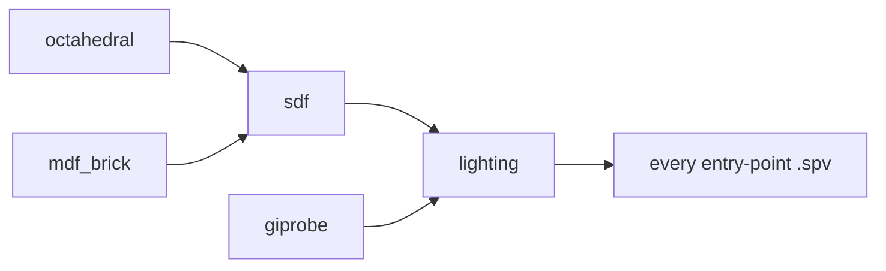

+++
title = 'Shader compilation'
weight = 6
+++

# Shader compilation

Shader compilation turns shader source into [SPIR-V](https://www.khronos.org/spir/), the Khronos
intermediate form Vulkan drivers ingest. Anima writes every shader in
[Slang](https://shader-slang.org/). The `xtask` build-task runner compiles the engine's static
entry points ahead of time, while non-foldable material graphs invoke the same compiler when the
material is authored or cooked. Each static entry-point `.slang` file under
`engine/assets/shaders/` becomes a `.spv` beside the host binary.

## One pipeline run

```sh
cargo run -p xtask -- shaders                  # debug profile
cargo run -p xtask -- shaders --profile release
```

`Config::resolve` locates the source tree, the `target/<profile>/` runtime dir, and the `slangc`
executable; `run` then rebuilds only what is stale and reports what it did. A no-change rerun
compiles nothing:

```
xtask shaders: using slangc /usr/local/bin/slangc
xtask shaders: 0 compiled, 52 up to date, lighting module up to date -> engine/target/debug/shaders
```

A run also installs every `.slang` file under `shaders/source/`. The
[node-graph codegen](../../materials-and-pipelines/node-graph-codegen/) splices material graphs
into that copy of `mesh.slang` and resolves imports from the source-only tree. Keeping those sources
separate from the static `.slang-module` files ensures feature defines propagate through imported
lighting code. The `models/`, `fonts/`, and `icons/` asset trees are copied beside the host binary
so `engine_asset_path(...)` resolves them.

## The flag set

Every per-shader `slangc` invocation uses one constant flag set, so the drift-guard test
(`spv_flag_set_is_frozen`) can assert against a single source of truth:

```rust
// xtask/src/shaders.rs
pub const SLANGC_SPV_FLAGS: &[&str] = &[
    "-profile", "glsl_450",
    "-target", "spirv",
    "-emit-spirv-directly",
    "-fvk-use-entrypoint-name",
    "-matrix-layout-column-major",
    "-capability", SLANGC_CAPABILITIES,
];
```

`spv_arg_vector` assembles the full invocation: `<src>`, these flags, `-I <shader_dir>`,
`-o <out>`, and one `-D<name>` per feature define.

- `-emit-spirv-directly` emits SPIR-V from Slang's own IR instead of routing through GLSL.
- `-fvk-use-entrypoint-name` preserves entry-point names, so one `mesh.spv` serves
  `vertexMainExecutor`, `meshMainExecutor`, `fragmentMain`, and `depthPrepassFragment` to
  different PSOs.
- `-matrix-layout-column-major` matches glam's column-major matrices; a CPU-side transform
  arrives in the shader unchanged.
- `-capability` declares everything the shaders use beyond `glsl_450` (bindless non-uniform
  indexing, inline ray query, the `VK_EXT_mesh_shader` stages, sparse-residency sampling), so
  Slang does not implicitly upgrade the profile and print a warning per entry point.

## Shared modules

Five sources declare no entry points and emit no `.spv`. Each precompiles once to a Slang IR
`.slang-module` file via `slangc <src> -emit-ir -o <module>`; entry-point shaders `import` the
precompiled module instead of recompiling the shared code. A sixth entry-free source,
`tonemap_ops.slang`, is imported from source through the `-I` include path and needs no module.



The static modules compile leaf-first: `octahedral` and `giprobe` and `mdf_brick` have no imports, `sdf`
imports `octahedral` plus `mdf_brick`, and `lighting` imports `sdf` plus `giprobe`. The modules
have consumers beyond `lighting` too: `sdf` feeds `ddgi_trace`, `giprobe` feeds `gi_resolve`, and
`mdf_brick` feeds the Global-SDF `gdf_cull` / `gdf_composite` passes.

Generated material shaders import the equivalent `.slang` sources from `shaders/source/`. They do
not load the precompiled modules, because a precompiled import would freeze the module before the
generated shader's feature defines are applied.

Every entry-point `.spv` carries all six shared sources in its dependency set, so touching any of
them rebuilds every shader. `is_stale` decides by mtime: an output is rebuilt when it is missing
or older than any dependency. All copies go through `copy_if_different`, which leaves identical
files untouched, so a no-op run churns no mtimes.

## The RT-off übershader variant

Every mesh übershader compiles twice. For the static shader, the second output,
`mesh_nort.spv`, is built with
`-DSAFFRON_NO_RT=1`, which strips the ray-tracing descriptor sets 6 and 7 so the shader's declared
interface matches the PSO layout on a device without ray tracing. Strict argument-buffer backends
such as [MoltenVK](https://github.com/KhronosGroup/MoltenVK) reject the mismatch, so at pipeline
build `nort_variant_path` swaps in the `_nort` sibling when the device lacks ray tracing.

Material codegen applies the same rule to `<uuid>_mesh.spv` and `<uuid>_mesh_nort.spv`. Both
variants compile from the source-only import tree, so `SAFFRON_NO_RT` reaches `lighting.slang` and
removes its ray-query declarations.

No other shader needs a variant.

## Finding slangc

`find_slangc` resolves the compiler in order: a `PATH` lookup, then `SAFFRON_SLANG_DIR/bin/slangc`,
then the toolbox cache at `$HOME/.cache/saffron-slang/slang/bin/slangc`. A missing `slangc` is a
hard error. The `saffron-build` toolbox provisions the pinned version (`2026.10`); the task never
fetches a prebuilt compiler at build time.

> [!NOTE]
> `just engine` and `just run` invoke `cargo run -p xtask -- shaders` after `cargo build`, so the
> `.spv` files beside the host binary the editor spawns are always current.

## In the code

| What | File | Symbols |
|---|---|---|
| Task entry point | `xtask/src/main.rs` | `run_shaders` |
| Pipeline + asset copy | `xtask/src/shaders.rs` | `Config::resolve`, `run`, `compile_spv` |
| Flag set + drift guard | `xtask/src/shaders.rs` | `SLANGC_SPV_FLAGS`, `SLANGC_CAPABILITIES`, `spv_arg_vector` |
| Module precompiles | `xtask/src/shaders.rs` | `compile_module`, `LIGHTING_STEM`, `SDF_STEM` |
| Staleness + copies | `xtask/src/shaders.rs` | `is_stale`, `copy_if_different` |
| RT-off variants | `xtask/src/shaders.rs`, `crates/assets/src/codegen.rs`, `crates/rendering/src/pipelines.rs` | `NO_RT_DEFINE`, `compile_material_mesh_shader`, `nort_variant_path` |
| Locating the compiler | `xtask/src/shaders.rs` | `find_slangc`, `SLANG_VERSION` |
| Shader sources | `assets/shaders/` | `mesh.slang`, `lighting.slang`, `sdf.slang`, … |

## Related

- [Build environment](../build-environment/) — the toolbox that provisions `slangc`
- [Übershader and specialization](../../materials-and-pipelines/ubershader-and-specialization/) — what `mesh.spv`'s entry points build
- [Node-graph codegen](../../materials-and-pipelines/node-graph-codegen/) — how generated materials compile from the staged source tree
