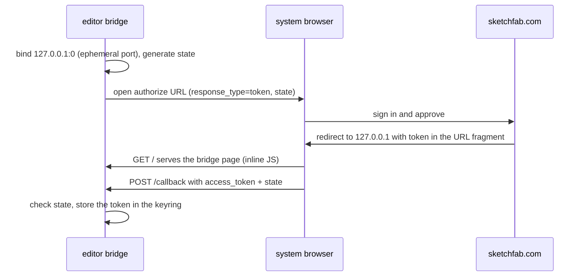

+++
title = 'OAuth loopback and Sketchfab'
weight = 2
+++

# OAuth loopback and Sketchfab

Most connectors authenticate with nothing beyond a `User-Agent`, or with a pasted API key.
Sketchfab requires a real browser sign-in, so the [connector framework](../connector-framework/)
carries a provider-agnostic loopback OAuth login: a connector declares an `OAuthLoopbackConfig`
and `run_loopback_login` runs the whole flow. The Sketchfab connector is the `AuthKind::OauthLoopback`
provider that uses it.

## Why the implicit grant

[Sketchfab's OAuth service](https://sketchfab.com/developers/oauth) offers the Authorization Code,
Implicit, and Username/Password grants. Authorization Code needs a client *secret*, which an
open-source desktop app cannot keep, and Sketchfab does not support
[PKCE](https://datatracker.ietf.org/doc/html/rfc7636), the secretless code exchange that would fix
that. The remaining fit is the implicit grant
([RFC 6749 §4.2](https://datatracker.ietf.org/doc/html/rfc6749#section-4.2)), which returns the
access token directly in the redirect.

The redirect target is a loopback listener, the native-app pattern of
[RFC 8252](https://datatracker.ietf.org/doc/html/rfc8252) that `gh` and `gcloud` also use.
Sketchfab explicitly allows `http://127.0.0.1:<port>` redirect URIs, so the editor never needs a
hosted callback page.

## The loopback flow



`run_loopback_login` binds a TCP listener on `127.0.0.1:0`, letting the OS pick the port, and
refuses to continue if the bound address is not loopback. It builds the authorize URL with
`response_type=token`, the redirect URI, and an unpredictable `state`, then opens it in the system
browser. The listener waits up to five minutes (`LOGIN_TIMEOUT`) for the callback; on success the
token goes to the OS keyring under the connector id.

The implicit grant puts the token in the URL *fragment*, which a browser never transmits to a
server. The landing page the listener serves is functional rather than decorative: its inline JS
reads `location.hash` and posts the token back to `/callback` on the same loopback origin.

```js
var p = new URLSearchParams(location.hash.replace(/^#/, ""));
fetch("/callback", {
  method: "POST",
  headers: { "Content-Type": "application/x-www-form-urlencoded" },
  body: "access_token=" + encodeURIComponent(p.get("access_token")) +
        "&state=" + encodeURIComponent(p.get("state") || ""),
});
```

The `POST` handler compares `state` against the value the flow generated; a mismatch is
`OAuthError::StateMismatch`, the CSRF case. Exactly one callback is accepted, then the listener
closes. The page itself is self-contained, with inline CSS and no external fetches, and is styled
to match the editor.

The client id is read from `SAFFRON_SKETCHFAB_CLIENT_ID`; no secret ships with the editor, and an
empty id fails at once with `OAuthError::NotConfigured`. The webview never sees the token:
`connector_login` is a shell command that runs the flow on a blocking worker thread and returns
only success or a typed bridge failure.

## The Sketchfab connector

Search calls the Data API v3 `/search` endpoint with `type=models&downloadable=true` and 24
results per page, authorized by the bearer token. Paging follows the opaque `cursors.next` token
each response echoes back. The connector serves only models; a query for another `StoreKind`
returns an empty, exhausted page.

Download uses the [Download API](https://sketchfab.com/developers/download-api):
`GET /v3/models/{uid}/download` returns per-format URLs, and the connector prefers a
self-contained `glb`, then `gltf`, then `usdz`. Those URLs are signed and ephemeral, so the
archive is cached in the shared `ResourceCache` under the stable key `sketchfab-{uid}-{ext}`
rather than by URL. A repeat import reuses the cached file.

Sketchfab access tokens last one month, and the implicit grant issues no refresh token (RFC 6749
forbids one). An expired token surfaces as a `401`, which both search and download map to
`ConnectorError::NotConfigured`, the same state as never having signed in, so the editor offers
the login again.

## Attribution follows the asset

`license_from` maps Sketchfab's license object onto the structured `StoreLicense`: `cc0` requires
no attribution, and every other slug sets `requiresAttribution` (a missing slug defaults to
`cc-by`, the attribution-safe choice). Import carries that as an `AssetAttributionDto` — license
id and URL, author, source URL, store id — on the `import-model` / `material-import` params, and
the catalog records it on the asset's entry, where `list-assets` returns it.

The Store's Credits view reads the catalog and lists every imported asset whose license requires
attribution: name, license badge, originating store, author, and a link to the source page. Most
downloadable Sketchfab content is CC-BY, so this view is where a shipping project collects its
credits.

## In the code

| What | File | Symbols |
|---|---|---|
| Loopback login | `oauth_loopback.rs` | `run_loopback_login`, `OAuthLoopbackConfig`, `OAuthError` |
| Fragment bridge + callback | `oauth_loopback.rs` | `handle_conn`, `page` |
| Login command | `editor/shell/src/store_commands.rs` | `connector_login` |
| Sketchfab connector | `sketchfab.rs` | `Sketchfab`, `license_from` |
| Attribution DTO | `engine/crates/protocol/src/dto.rs` | `AssetAttributionDto`, `AssetEntryDto` |
| Credits view | `StoreCredits.tsx` | `StoreCredits` |

## Related

- [Connector framework](../connector-framework/) — the trait, `AuthKind`, and the import path this plugs into
- [Asset commands](../../tooling-and-control/asset-commands/) — `list-assets` and the import commands on the control plane
- [Asset server and catalog](../../geometry-and-assets/asset-server-and-catalog/) — where the catalog entry lives
