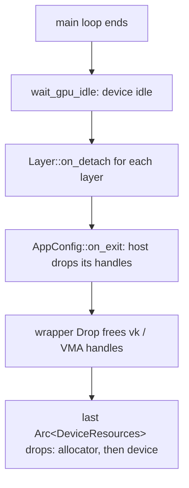

+++
title = 'Ownership and RAII'
weight = 4
+++

# Ownership and RAII

A GPU resource must be freed exactly once, after the GPU has finished with it and before the
device that created it is destroyed. The engine encodes those rules in Rust ownership: each
resource is a struct that frees its Vulkan handles in `Drop` (the
[RAII](https://en.wikipedia.org/wiki/Resource_acquisition_is_initialization) idiom), and shared
access goes through `Arc<T>`.

There are no integer handles into a manager and no GPU-resource base class. Four rules cover the
whole scheme: `Drop` frees the handle, an `Arc<DeviceResources>` clone keeps the device alive,
`Arc<T>` shares reads, and `run` idles the GPU before teardown.

## Drop frees the handle

A logical resource (a pipeline, a mesh, a texture) is a move-only struct that holds its Vulkan
handles and frees them in [`Drop`](https://doc.rust-lang.org/std/ops/trait.Drop.html).
`Pipeline` is the simplest:

```rust
pub struct Pipeline {
    resources: Arc<DeviceResources>,
    pipeline: vk::Pipeline,
    layout: vk::PipelineLayout,
}

impl Drop for Pipeline {
    fn drop(&mut self) {
        unsafe {
            self.resources.device().destroy_pipeline(self.pipeline, None);
            self.resources.device().destroy_pipeline_layout(self.layout, None);
        }
    }
}
```

The struct is not `Clone`: ownership of the handle is unique, and a move transfers it. Rust does
not run `Drop` on a moved-from value, so there is no double-free hazard and no moved-from
cleanup to write. `Buffer`, `Image`, `Image3D`, `GpuTexture`, `GpuMesh`, `GpuSdf`, and
`AccelerationStructure` all follow this shape.

## The device outlives every resource

Every wrapper holds an `Arc<DeviceResources>`, the reference-counted bundle of the `ash::Device`
and the [VMA](https://github.com/GPUOpen-LibrariesAndSDKs/VulkanMemoryAllocator) allocator. A
resource clones the `Arc` at construction, so keeping the resource alive keeps the bundle alive
and it can never free its handle through a dead allocator. The guarantee is structural, not a
field-ordering convention.

The bundle's own `Drop` runs only after every resource that referenced it has dropped. It destroys
the allocator first and the device second, because VMA frees its `VkDeviceMemory` through the
live device.

## Arc is the shared-read default

When a value is built once and then only read through many handles (a loaded mesh, a cached PSO,
a material), it is shared as
[`Arc<T>`](https://doc.rust-lang.org/std/sync/struct.Arc.html). `saffron-core` names this the
`Ref` policy alias:

```rust
/// A shared, read-only reference to a logical resource.
pub type Ref<T> = Arc<T>;
```

`Ref` is a readability alias only, marking "constructed once, read through every clone". A
shared-*mutable* site does not use `Ref`; it spells `Arc<Mutex<T>>` (or `Arc<RwLock<T>>`)
explicitly at its declaration, so the exception is visible where it occurs.

Both sides of the policy appear in the renderer. The read side is the PSO cache: `Pipelines`
keeps a `HashMap<PsoKey, Arc<Pipeline>>`, clones cross the upload and render threads, and the
pipeline lives until the last clone drops. The mutable side is the bindless texture free list,
`BindlessFreeList = Arc<Mutex<Vec<u32>>>`, which collects returned slot indices for reuse.

The two meet in `GpuTexture`. A texture uploaded on a worker thread may drop on that thread; its
`Drop` locks the free list, pushes its bindless slot back for the next upload, then frees the
view and image. The mutex makes the off-thread slot return safe, and the wrapper's
`Arc<DeviceResources>` clone makes the off-thread free legal.

## Teardown order

A GPU resource cannot be freed while an in-flight command buffer still references it, and it
must not outlive the allocator or device. `run`'s shared teardown half, `finish`, enforces the
order: `FrameHost::wait_gpu_idle` blocks on the device, each layer's `on_detach` runs, then
`AppConfig::on_exit` lets the host drop the handles it held. Every wrapper `Drop` after that
point frees against an idle GPU.



> [!NOTE]
> An `Arc` clone stashed outside the engine (a layer field, a closure capture) keeps the
> resource alive and can outlive the device. Release host-held clones in `on_detach` /
> `on_exit`; `run` has already idled the GPU by then.

## In the code

| What | File | Symbols |
|---|---|---|
| The `Ref` policy alias | `crates/core/src/lib.rs` | `Ref` |
| The shared device bundle | `crates/rendering/src/resources.rs` | `DeviceResources` |
| Drop-based wrappers | `crates/rendering/src/resources.rs` | `Pipeline`, `Buffer`, `Image`, `GpuTexture`, `GpuMesh`, `AccelerationStructure` |
| The shared-mutable site | `crates/rendering/src/resources.rs` | `BindlessFreeList`, `GpuTexture::drop` |
| The PSO cache | `crates/rendering/src/pipelines.rs` | `Pipelines`, `PsoKey` |
| The idle barrier | `crates/app/src/lib.rs` | `FrameHost::wait_gpu_idle` |
| The teardown order | `crates/app/src/lib.rs` | `run`, `finish` |

## Related

- [Rust house style](../go-flavored-design/) — Drop-based wrappers in the wider style
- [Error handling](../error-handling/) — fallible factories return `Result<…>`
- [Type aliases](../type-aliases-and-primitives/) — `Ref` lives alongside the primitive newtypes
