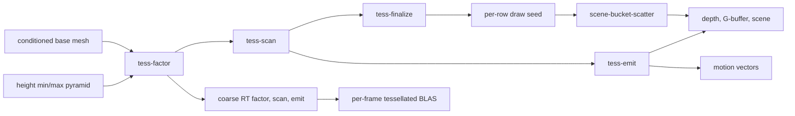

+++
title = 'Compute displacement'
weight = 11
+++

# Compute displacement

Compute displacement turns a material height field into generated micro-geometry. The renderer dices conditioned base triangles, displaces the resulting vertices, and writes the frame's amplification arena: a vertex stream, a previous-frame vertex stream, an index stream, and one draw seed per displaced instance. The arena is a geometry source the visibility traversal names in a draw record, so displaced geometry reaches the raster passes through the same binned counted-indirect draws as every other representation.

This path changes the silhouette and supplies real triangles to ray queries. Bump mapping changes only the shading normal, while parallax mapping offsets texture coordinates on an unchanged surface.

## Frame flow



`gather_instance_deformation` creates one `TessBucket` for each displaced instance the scene driver submits through `Renderer::submit_gpu_scene_deformations`, provided its `GpuMesh` carries conditioning data. The renderer accepts at most `TESS_MAX_INSTANCES = 64` buckets per frame. A bucket contains the base mesh, object transform, texture slots, UV transform, height scale, and tessellation quality controls.

The primary chain contains five compute passes:

1. `tess-factor` writes one fractional factor per unique base edge.
2. `tess-scan` calculates each base triangle's exact output counts and atomically assigns packed offsets.
3. `tess-finalize` writes one draw seed per displaced instance: the exact packed index count plus the row's slice bases, in `VkDrawIndexedIndirectCommand` order.
4. `tess-args` converts the global micro-vertex total into a `VkDispatchIndirectCommand`.
5. `tess-emit` dispatches one 64-lane workgroup per base triangle and writes current vertices, previous vertices, and indices.

The renderer submits `tess-emit` with direct dispatches. The command written by `tess-args` has no consumer in this chain.

## Adaptive factors and budget

The factor kernel measures the angular screen extent of an edge from its two welded endpoints. If either endpoint crosses the near-plane guard, it uses a finite length-over-distance fallback. Both forms divide the projected extent by the target pixels per micro-edge.

Displacement detail also affects the factor. Each displacement height texture owns an `R32G32_SFLOAT` min/max pyramid at bindless binding 4. The kernel chooses a mip from the edge's tiled UV span, reads a conservative local height range, projects `height_range * height_scale`, and uses the larger of base-edge and displacement extents.

The calculation uses mesh-local endpoints and a camera position transformed into local space. It is exact for uniform object scale; non-uniform scale distorts the angular metric.

The default quality tuple is:

```text
factor cap:        256
minimum factor:     1
micro-edge target:  4 px
```

`budget_scaled_caps` reduces per-instance caps when their combined worst-case reservation exceeds `TESS_MICRO_VERTEX_BUDGET`, which is 2,097,152 vertices. It scales caps approximately with the square root of the available fraction and never lowers one below its minimum factor.

## Split, dice, and emit

A leaf grid is limited to `TESS_MAX_DICE_FACTOR = 11`, which yields at most 121 triangles and 78 vertices. A driving factor above 11 recursively splits the base triangle into four child patches per level. Each child is then diced on an integer barycentric grid.

For a factor cap of 256, `dice_plan` returns 1,024 subpatches at leaf level 8. `tess_worst_case` uses that same plan to reserve the transient slices, while `tess_scan.slang` reproduces it to compute packed output counts.

The emit kernel evaluates a [Phong-tessellated](https://perso.telecom-paristech.fr/boubek/papers/PhongTessellation/) base surface, samples the height map at a density-matched mip, and derives normal and tangent from finite differences on the displaced surface. Scalar displacement moves along the interpolated normal. A vector displacement map applies tangent-space XYZ offsets.

## Watertight edges and geomorphing

Mesh import welds vertices and writes unique edge IDs plus per-triangle edge references into the `.smesh` conditioning data. Adjacent base triangles read the same factor slot. Boundary micro-vertices snap to a segment grid derived only from that shared edge and factor.

The fractional factor also drives a geomorph. Boundary points blend between floor and ceiling segment placements. Interior points blend from their containing coarse-grid triangle to the fine displaced position with `smoothstep01`. Successive integer barycentric grids are distinct, so interior continuity is bounded by the coarse facet approximation rather than bit-exact nesting.

## Raster and motion consumers

The arena is addressed through the frame's GPU-scene address block, and every displaced instance owns a row in a slot-sorted row table published there. A view that consumes the arena walks the hierarchy as usual until it reaches an instance holding a row; that instance emits one draw record whose representation is `GPU_REPRESENTATION_DISPLACED_MICRO` and whose content index is the row. There is no cut to descend — the amplification already covers the whole base mesh in one packed slice.

`scene-bucket-scatter` builds that record's command from the row's draw seed: the seed's index count, first index, and vertex offset, with the record index in `firstInstance`. The record's `psoBin` names the displaced representation, so it lands in its own draw bucket and the pass binds the arena's index stream for that bucket in place of the pages arena. Each executor vertex path reads the micro-vertex at `SV_VulkanVertexID` through the arena address; its position and normal are already displaced.

The index values the emit kernel writes are relative to the row's reserved vertex slice, and the draw's `vertexOffset` supplies the base — which is why the vertex entries read the Vulkan vertex index rather than Slang's D3D-flavoured `SV_VertexID`, since that one subtracts the base back out and every row past the first would fetch the previous row's vertices. The mesh executor adds the same base by hand, because a mesh stage pulls indices itself and no fixed-function stage applies the offset for it.

A view reading the undisplaced surface — a shadow page, the global-illumination reach walk — leaves the row lookup off and walks the base pages instead. Those views also bind no arena, so a displaced draw bucket there falls back to the pages arena rather than fetching a stream the view never allocated.

The emit kernel also writes the previous-frame vertex stream. It evaluates the current grid with the previous frame's per-edge factors, stored in a persistent two-slot ping-pong. A changed edge-count layout falls back to current factors so previous and current positions match. The motion pass reads that stream at the same micro-vertex slot, which captures camera-driven geomorph motion as well as object motion.

## Ray-tracing geometry

An RT-consumed displaced instance runs a second factor, scan, and emit chain. `TESS_RT_COARSEN = 2` doubles the micro-edge target and divides the factor cap by two. The result remains displaced and edge-welded, but it contains fewer triangles than the raster surface.

`Rt::plan_tessellated_blas_builds` performs a full `MODE_BUILD` each frame because the generated topology can change. The acceleration structure is sized for the coarse chain's worst case and reused while that bound stays unchanged. The index reservation is cleared before emission, so unused tail triangles are degenerate and can remain in the worst-case build range without a GPU count readback.

## Synchronization

The amplification chain is recorded before the visibility chain, because the frame's address block carries the arena's addresses and both the traversal and the binner resolve displaced rows through them. Every consumer declares its read: `scene-bucket-scatter` declares the draw seeds, and each raster pass declares the vertex and index streams, so the graph derives the compute-to-fetch dependencies rather than the chain asserting them.

The coarse RT vertex and index buffers do enter the graph. `tess-emit-rt` declares `StorageWriteCompute`, and `tlas-build` declares `AccelStructBuildRead`; the graph derives that compute-to-acceleration-structure dependency.

## Control

`sa set-displacement {0|1}` toggles the compute path. `sa set-tessellation-quality` accepts optional factor cap, minimum factor, and edge-length target values. The renderer rounds and clamps the cap to `1..=2048`, clamps the minimum to the cap, and floors the edge target at one pixel.

```sh
sa set-tessellation-quality 128 1 6
```

This selects a 128 factor cap, a minimum factor of 1, and a six-pixel micro-edge target.

## In code

| What | File | Symbols |
|---|---|---|
| Tessellation model and budgets | `engine/crates/rendering/src/tessellation.rs` | `TessBucket`, `dice_plan`, `tess_worst_case`, `budget_scaled_caps`, `TESS_MICRO_VERTEX_BUDGET` |
| Factor kernel | `engine/assets/shaders/tess_factor.slang` | `localHeightRange`, `computeMain` |
| Count and offset pass | `engine/assets/shaders/tess_scan.slang` | `dicePlan`, `computeMain` |
| Draw command | `engine/assets/shaders/tess_finalize.slang` | `computeMain` |
| Amplifying kernel | `engine/assets/shaders/tessellate.slang` | `emitLeafVertex`, `emitLeafTriangle`, `computeMain` |
| Pass recording | `engine/crates/rendering/src/renderer/` | `Renderer::record_tess_prep` |
| Arena addressing and the displaced record | `engine/assets/shaders/global_gpu_data.slang`, `engine/assets/shaders/scene_traversal.slang` | `gpuSceneDisplacedRow`, `gpuSceneDisplacedVertex`, `emitDisplacedRecord` |
| Displaced command and bucket bind | `engine/assets/shaders/scene_bin_scatter.slang`, `engine/crates/rendering/src/scene_pass.rs` | `gpuSceneDisplacedDraw`, `bucket_index_buffer` |
| Ray-tracing build | `engine/crates/rendering/src/rt/` | `TessellatedBlas`, `Rt::plan_tessellated_blas_builds` |
| Material feature | `engine/crates/rendering/src/instancing.rs` | `FEATURE_DISPLACE`, `resolve_material_params` |
| Control commands | `engine/crates/control/src/commands_render/` | `set-displacement`, `set-tessellation-quality` |

## Related

- [Compute skinning](../compute-skinning/)
- [Barrier derivation](../usage-and-barrier-derivation/)
- [The `.smesh` format](../../geometry-and-assets/smesh-format/)
- [Native materials](../../materials-and-pipelines/native-materials/)
