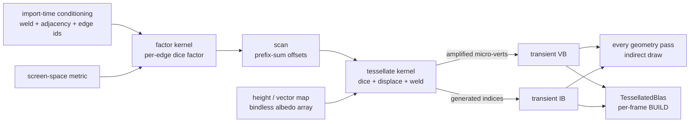

+++
title = 'Compute displacement'
weight = 11
+++

# Compute displacement

A displacement material moves a surface's real geometry by a height map — a true silhouette, not the
flattened illusion of parallax-occlusion mapping. The tempting place to do that is the graphics vertex
shader: sample the height in the vertex stage and push each vertex along its normal. That has the same
hidden cost [compute skinning](compute-skinning/) already diagnosed, and two extra traps. First, every
geometry pass would have to displace identically or the surface would disagree with itself between passes
— and the shadow passes do **not** all share the main vertex path (the point-shadow cube has its own), so
a vertex-shader displacement casts shadows from the *undisplaced* mesh, and a ray-traced BLAS built from
the base vertices never sees the displaced shape at all. Second, pushing the *base* vertices only relocates
the coarse silhouette — real relief needs *more* triangles where the height field is high-frequency, and a
vertex shader cannot create geometry.

Saffron Anima solves both with **one** mechanism: a compute prepass that **adaptively tessellates** each
displaced base triangle into a per-frame micro-mesh — dicing to a screen-space factor, displacing every
micro-vertex, welding shared edges watertight, and emitting the result into transient vertex + index
buffers. Every later consumer — the depth pre-pass, the main view, *every* shadow map, the G-buffer, the
motion pass, and the ray-traced acceleration structure — reads *those same buffers* as ordinary indexed
geometry. There is exactly one displaced surface, and it is watertight by construction, so the rasterized
silhouette and the ray-traced silhouette are the same geometry, not two approximations that drift apart.

## The flow

The prepass is a short chain of compute passes in the deform scope, one instance at a time:

1. **Factor** (`tess_factor.slang`) — for each unique base edge, computes a dice factor from a screen-space
   metric (projected edge length against the target, clamped to the min factor and the hard cap). Both
   triangles sharing an edge read the *same* per-edge factor, which is what makes the seam watertight.
2. **Scan** (`tess_scan.slang`) — prefix-sums the per-triangle vertex/index counts into the offsets each
   triangle writes at, packing the amplified geometry densely inside a worst-case reservation.
3. **Finalize / args** (`tess_finalize.slang`, `tess_args.slang`) — seed the indirect-draw argument buffer
   (index count, `firstInstance`) so the raster passes draw exactly the emitted triangles with no CPU
   readback of the GPU-decided count.
4. **Tessellate** (`tessellate.slang`) — one workgroup per base triangle: dices the triangle into a
   barycentric micro-grid at its level `L`, evaluates a **Phong-smoothed** base position (an endpoint-only
   edge curve, so a shared edge is bit-identical from both sides), displaces each micro-vertex, re-derives
   the normal + tangent from the full displaced-surface Jacobian, snaps boundary micro-vertices onto the
   edge's shared segment grid (the weld), and writes the micro-vertices + a generated index stream into the
   transient buffers at the scanned offsets.

The displacement itself branches, exactly as a material's height mode dictates:

- **Scalar** (a height map) — samples the height at the tiled UV and offsets along the interpolated normal.
- **Vector** (a tangent-space XYZ map) — offsets by `t·v.x + b·v.y + n·v.z`, so the surface can push
  sideways into overhangs and undercuts a scalar height cannot express.

Output is mesh-**local** (no instance model matrix), so the graphics passes still apply `model` /
`normalMatrix` and the BLAS places the instance at its node matrix, exactly as for a static mesh. The maps
are read straight from the bindless albedo array (set 0, shared with the übershader) by the indices the
push constant carries — no per-instance image descriptor.

## Watertight by construction

The base mesh is **conditioned at import** ([the `.smesh` format](../geometry-and-assets/smesh-format/)):
vertices are welded, per-triangle adjacency is built, and every unique edge gets a stable id plus a seam
classification. The factor kernel keys on that edge id, so the two triangles across a seam compute a
bit-identical factor from the two shared endpoints only; the tessellate kernel snaps their boundary
micro-vertices to the same shared segment grid. No crack can open along an edge, in either the rasterized
silhouette or the ray-traced one — the same failure class parallax mapping and naïve vertex displacement
both leave exposed.

## Continuous factor — no dolly pop

A triangle dices at the integer level `L = ceil(maxFactor)`, so as the camera dollies in and the
screen-space factor sweeps past an integer, `L` jumps and a whole diced row of micro-vertices appears at
once. Left raw that is a facet pop. The emit kernel instead **geomorphs** the transition into a smooth
motion, driven by `frac`, the fractional part of the factor:

- **Boundary micro-vertices** blend between the floor and ceil shared-edge *segment* placements
  (`snapEdgeParam`): as a shared edge's factor sweeps `N → N+1`, the boundary point slides continuously
  from the `N`-segment weld to the `N+1`-segment one. Both incident triangles read the same shared per-edge
  factor, so they compute the bit-identical blended position — watertight *through* the transition, not
  only at rest.
- **Interior micro-vertices** blend from the coarser `L-1` approximation toward the fine `L` displaced
  surface by `smoothstep01(frac)` (`geomorphedPosition`). The coarse-parent position is the linear
  interpolation across the `L-1` micro-triangle that contains the vertex's barycentric point — the kernel
  locates that micro-triangle and evaluates the displaced surface at its three `L-1`-grid corners
  (`coarseParentPosition`, at the `L-1` height-map LOD so the coarse facet prefilters identically). As
  `frac → 0` a freshly appearing row sits on the coarse facet (no pop); as `frac → 1` it reaches full
  detail. The finite-difference normal + tangent are recomputed from the geomorphed positions, so shading
  tracks the morph. Interior verts are unshared, so there is no cross-triangle constraint — only the
  boundary must stay identical, and it is excluded from the interior blend (its weld is untouched).

The blend is written to the **shared** amplified VB, so the raster passes and the ray-traced BLAS read the
same geomorphed surface and their silhouettes match through a transition. Because successive integer dice
levels are distinct barycentric grids rather than nested refinements, the interior morph is
sub-facet-continuous (bounded by per-facet curvature, vanishing as `L` grows), not bit-exact — visually
pop-free, which is the goal.

## Every geometry pass reads the amplified buffers

`Instancing` gathers a `TessBucket` for each displacement-enabled instance whose mesh carries conditioning,
and marks its `DrawBatch` with a `TessDraw` — the transient VB/IB handles plus the indirect-args handle —
resolved mid-frame by `Renderer::record_tess_prep` once the transients exist. `record_batch_submeshes` and
`bind_batch_vertices` then bind those buffers and issue a `cmd_draw_indexed_indirect` over the seeded
argument buffer. So the depth pre-pass, the directional/spot/**point** shadow passes, and the G-buffer all
draw the amplified, displaced silhouette with no per-pass re-dice — a per-pass re-dice is impossible,
because they consume the single buffer written once in the deform scope. A displaced surface self-shadows
against its true relief, and the übershader does **no** displacement of its own; the vertices arrive
already displaced (the fragment still reads the height map for a per-pixel bump normal on top).

## Ray tracing traces the same triangles

Because the ray-traced surface must be the surface that rasterizes, the BLAS is built over the *same*
transient buffers. `rt.rs` keeps a `TessellatedBlas` per displaced instance: unlike the skinned refit (a
fixed-topology 1:1 remap that `UPDATE`s in place), a tessellated instance mints variable topology every
frame, so its BLAS is a full `MODE_BUILD` over the amplified VB/IB. The build runs the **worst-case**
primitive count — the emit kernel degenerate-pads the index tail, so the extra triangles collapse to points
the builder discards — which makes the whole thing a portable, cross-vendor floor with no GPU-count
readback. The `tlas-build` pass's `AccelStructBuildRead` on the transient buffers orders the build after the
emit pass automatically. A displaced surface therefore casts ray-traced shadows and occludes GI against the
exact relief it shows on screen.

## Motion vectors

The height field is static, so a displaced surface moves only as a rigid object. The motion pass binds the
amplified VB as *both* the current and previous position stream, so [the one motion
shader](compute-skinning/#motion-vectors) reprojects pure object motion (`model` vs `prev_model`) with a
zero deformation delta — no displaced-mesh special case, no TAA ghosting. The [continuous-factor
geomorph](#continuous-factor--no-dolly-pop) already moves the surface smoothly on the cur stream;
reconstructing a per-vertex *previous* position for an *animated* height field, and re-running the same
blend against the previous frame's factor so the geomorph's own per-frame motion is captured for TAA, are
the temporal refinements above this floor (`geomorph_weight` / `smoothstep01` are the shared kernel/CPU
contracts already in place).

## Tunable quality

The **amplitude is object-space** (the Blender / Arnold / RenderMan / Nanite convention): a material's
height scale is a local length that rides the instance's transform like every other vertex, so
gizmo-scaling a displaced object scales its relief proportionally — bumps never shred a shrunk mesh or
flatten a grown one.

The dice budget is runtime-tunable over the control plane: `set-tessellation-quality` sets the per-instance
factor cap (integer, up to 2048 — generous by design: the split pass expresses it, and the **micro-vertex
budget, not the cap, is the real bound** that coarsens dense scenes), the minimum edge factor, and the
target screen-space edge length (default 4 px per micro-edge),
so the running editor can trade micro-triangle density against cost live. A lower cap coarsens every
displaced instance; a smaller edge-length target densifies them.

## Barriers

The tessellation passes sit in the deform scope beside `skin`/`morph`, declaring the transient VB/IB
`StorageWriteCompute`; every geometry consumer declares them `VertexInputRead` / `IndirectCommandRead` and
the TLAS pass `AccelStructBuildRead`. The [render graph](usage-and-barrier-derivation/) derives the
compute-write → consumer barrier — the tessellator adds no hand-written barrier. The per-frame transient
pool is acquired at fixed keys (the emit output, the factor/scan scratch) so its cursor never desyncs
against the other transient consumers.

## What this does not do yet

The screen-space factor uses a uniform per-instance scale metric (v1); a fully fractional per-edge stitch
(fan/staircase, no degenerate slivers) is the next refinement. An **editor-only, live-edit** approximate
preview — an analytic-prism inline ray-query march that keeps only coarse base prisms in an AABB BLAS and
marches the height field per ray, so dragging an amplitude updates ray-traced shadows with *zero* BLAS
rebuild — is a deliberately-approximate satellite (exact on commit, when the baked `TessellatedBlas` takes
over); it is never the shipping scene path.

## In the code

| What | File | Symbols |
|---|---|---|
| Amplifying emit kernel | `tessellate.slang` | `computeMain` (dice + Phong + displace + weld + emit), `snapEdgeParam` (boundary geomorph), `geomorphedPosition` / `coarseParentPosition` (interior geomorph) |
| Prep chain | `tess_factor.slang`, `tess_scan.slang`, `tess_finalize.slang`, `tess_args.slang` | per-edge factor → prefix-sum → indirect args |
| Subsystem (layouts + pools + sizing) | `tessellation.rs` | `Tessellation`, `TessBucket`, `tess_worst_case`, `geomorph_weight`, `coarse_parent_bary` |
| Prep-pass recording + handle resolve | `renderer.rs` | `record_tess_prep` |
| Raster consumption (indirect draw) | `scene_pass.rs`, `draw_list.rs` | `TessDraw`, `DrawBatch.tessellated`, `record_batch_submeshes` |
| RT BLAS over the amplified buffers | `rt.rs` | `TessellatedBlas`, `plan_tessellated_blas_builds`, `TessRtSlice` |
| Import-time conditioning | `smesh.rs` | weld + adjacency + per-edge ids (watertight source) |
| Quality control command | `commands_render.rs`, `renderer.rs` | `set-tessellation-quality`, `set_tessellation_quality` |
| Displacement material feature | `instancing.rs`, `lighting.slang` | `FEATURE_DISPLACE`, `resolve_material` |

> [!NOTE]
> There is exactly one displacement mechanism. The amplified transient vertex + index buffers are the
> single source both the raster passes (indirect draw) and the ray-traced BLAS read, so "what you see is
> what the rays trace" is true by construction, not by keeping two representations in sync.

## Related

- [Compute skinning](compute-skinning/) — the deform-once apparatus and the motion path this shares
- [Barrier derivation](usage-and-barrier-derivation/) — how the compute→vertex/index/BLAS barrier is derived
- [The `.smesh` format](../geometry-and-assets/smesh-format/) — the import-time watertight conditioning
- [Native materials](../materials-and-pipelines/native-materials/) — where the displacement flag + height map live
