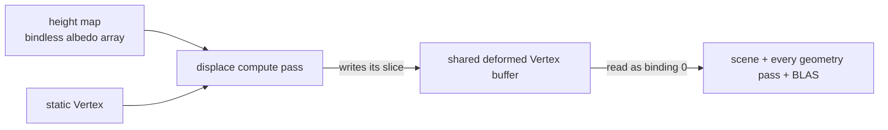

+++
title = 'Compute displacement'
weight = 11
+++

# Compute displacement

A displacement material moves a surface's real geometry by a height map — a true silhouette, not the
flattened illusion of parallax-occlusion mapping. The tempting place to do that is the graphics vertex
shader: sample the height in the vertex stage and push each vertex along its normal. That has the same
hidden cost [compute skinning](compute-skinning/) already diagnosed, and one extra trap. Every geometry
pass would need to displace identically or the surface would disagree with itself between passes — and
the shadow passes do **not** all share the main vertex path (the point-shadow cube has its own), so a
vertex-shader displacement casts shadows from the *undisplaced* mesh. A ray-traced BLAS built from the
base vertices never sees the displaced shape at all.

Compute displacement solves it the same way skinning does: displace **once, up front**, into a buffer
laid out exactly like a static mesh. Every later pass reads that buffer as ordinary geometry, so the
displaced silhouette is identical in the main view, the depth pre-pass, *every* shadow map, the G-buffer,
and the ray-traced acceleration structure. It is the compute-skinning apparatus pointed at a height
field instead of a joint palette — and it shares the very same deformed buffer.

## The flow

`displace.slang`'s `computeMain` runs one thread per vertex: it reads the static `Vertex`
(position/normal/uv), samples the height map at the tiled UV, offsets the position along the normal by
`height_scale`, derives a coarse normal from the height gradient, and writes a deformed `Vertex` —
**without** the instance model matrix, so the graphics passes still apply `model` / `normalMatrix`
exactly as for a static mesh. The height map is read straight from the bindless albedo array (set 0,
shared with the übershader) by the index the push constant carries; no per-instance image descriptor.

## One shared deformed buffer

Displacement does not own a buffer. It writes into the **same** per-frame deformed buffer
[`Skinning`](compute-skinning/#the-deformed-buffer) owns: both stamp non-overlapping `deformed_offset`
slices from one per-frame cursor, so a scene can mix skinned and displaced instances freely and every
consumer still binds a single deformed handle. `Displacement` owns only its descriptor-set layout (base
vertices in, deformed out) and a per-frame pool; the buffer's grow-only sizing and RT usage flags come
from `Skinning`. Because each displaced instance writes a distinct slice, a displaced draw is **not
instanced** — it is one indexed draw whose vertex offset points at its region.

## Every geometry pass reads it

`Instancing` marks a bucket displaced when its material carries the displacement flag with a height map,
then — exactly like a skinned bucket — never merges it and routes it through `bind_batch_vertices`,
which already picks the deformed buffer over the static stream. So the depth pre-pass, the
directional/spot/**point** shadow passes, and the G-buffer all draw the displaced silhouette with no new
code. This closes the gap a vertex-shader displacement leaves open: the point-shadow cube reads the same
displaced vertices as the main view, so a displaced surface self-shadows correctly.

Because the deformed buffer feeds every pass, the übershader does **no** displacement of its own — the
vertices arrive already displaced. The fragment still reads the height map for a height-gradient bump
normal, adding per-pixel detail on top of the per-vertex silhouette.

## Motion vectors

Displacement is static — the height field does not animate — so a displaced mesh moves only as a rigid
object (`model` vs `prev_model`). The displace pass still runs a **previous** dispatch into the
prev-deformed buffer with the identical displacement, so the motion pass reads a zero deformation delta
and reprojects pure object motion, through the [same one motion shader](compute-skinning/#motion-vectors)
skinned meshes use. No displaced-mesh special case, no TAA ghosting.

## Ray tracing

The displaced buffer carries acceleration-structure build usage (it *is* the skinning deformed buffer),
so ray tracing is free: `Instancing` appends each displaced instance to the frame's deformed-RT list
with its slice offset and the node model matrix (its displaced vertices are mesh-local). The
[skinned-BLAS refit](compute-skinning/#ray-tracing) is agnostic to how a slice was deformed — it reads a
device-address range of the shared buffer — so a displaced instance gets a first-frame `BUILD` then
in-place per-frame `UPDATE`, and the `tlas-build` pass's `AccelStructBuildRead` on the shared buffer
orders it after the displace pass automatically. A displaced surface casts ray-traced shadows and
occludes GI against its true relief.

## Barriers

The `displace` pass sits in the deform scope beside `skin`/`morph`, declaring the deformed and
prev-deformed buffers `StorageWriteCompute`; every geometry consumer already declares them
`VertexInputRead` and the TLAS pass `AccelStructBuildRead`. The
[render graph](usage-and-barrier-derivation/) derives the compute-write → consumer barrier — displacement
adds no hand-written barrier. Writing the same resources as skin/morph, the graph serialises the deform
dispatches (write-after-write); the disjoint offset slices make that ordering harmless.

## What this does not do yet

The pass displaces the **base** vertices — it does not subdivide. On a densely tessellated base (the
preview sphere, a terrain grid) that reads well; screen-space adaptive tessellation and watertight seam
welding are the layer above this baseline. Tangent-space **vector** displacement (overhangs/undercuts)
needs a UV-aligned per-vertex tangent the engine's `Vertex` does not carry yet. Both are tracked in
`plans/displacement/`.

## In the code

| What | File | Symbols |
|---|---|---|
| Compute kernel | `displace.slang` | `computeMain` |
| Subsystem (layout + pools + wiring) | `displacement.rs` | `Displacement`, `DisplaceBucket`, `record_displace` |
| Dispatch records | `draw_list.rs` | `DisplaceDispatch` |
| Detect + wire displaced buckets | `instancing.rs` | `displace_info_for`, `submit_draw_list` |
| Shared deformed buffer | `skinning.rs` | `Skinning::ensure_deformed_buffers`, `deformed_buffer` |
| The compute pass + toggle | `renderer.rs` | the `displace` `RgPass` (`do_displace`), `set_displacement` |
| Displacement material feature | `instancing.rs`, `lighting.slang` | `FEATURE_DISPLACE`, `resolve_material` |

> [!NOTE]
> Displacement reuses skinning's deformed buffer, motion path, and BLAS refit wholesale — the only new
> GPU code is the `displace.slang` kernel and its dispatch wiring. That is why in-scene displacement,
> consistent shadows, correct motion vectors, and ray-traced relief all landed together.

## Related

- [Compute skinning](compute-skinning/) — the deform-once apparatus this shares
- [Barrier derivation](usage-and-barrier-derivation/) — how the compute→vertex barrier is derived
- [Native materials](../materials-and-pipelines/native-materials/) — where the displacement flag + height map live
