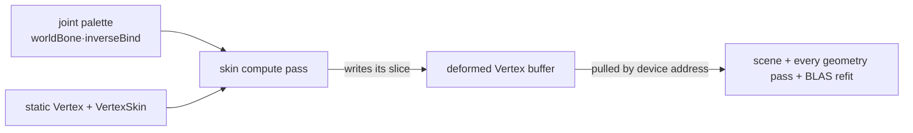

+++
title = 'Compute skinning'
weight = 10
+++

# Compute skinning

A skinned mesh deforms its vertices by a per-joint matrix palette using
[linear blend skinning](https://skinning.org/): each vertex blends four bone matrices by weight. The
obvious place for that blend is the graphics vertex shader, but the cost hides in the pipeline
count: every geometry pass then needs a skinned permutation (depth pre-pass, each shadow map, the
G-buffer, motion vectors), and a ray-traced
[BLAS](../../global-illumination-and-raytracing/raytracing-foundation/) built from the bind pose
never sees the animated shape. Skipping skinned meshes in those passes means characters that cast
no shadows and ghost under [TAA](../../screen-space-and-post/taa/).

Compute skinning deforms once, up front, into a buffer laid out exactly like a static mesh. Every
later pass reads that buffer as ordinary geometry, so no skinned pipeline permutation exists
anywhere and the ray-traced acceleration structure follows the pose.

## The flow



`skin.slang`'s `computeMain` runs one thread per vertex. It reads the static `Vertex` (position,
normal, UV, tangent) and the parallel `VertexSkin` stream (four `u16` joint indices plus four
weights), then blends the palette:

```hlsl
const float4x4 skin = weights.x * jointMatrices[base + joints.x]
                    + weights.y * jointMatrices[base + joints.y]
                    + weights.z * jointMatrices[base + joints.z]
                    + weights.w * jointMatrices[base + joints.w];
```

The kernel writes a deformed `Vertex`: the skin matrix applied to the bind pose, without the
instance model matrix. The graphics passes still apply `model` / `normalMatrix` exactly as for a
static mesh, so skinned and static geometry shade through one path. The tangent rotates with the
skin matrix and keeps its ±1 handedness sign, so normal mapping stays valid on the deformed
surface.

Both streams are bound as raw byte buffers and loaded at the engine's tight strides (48 bytes per
`Vertex`, 24 per `VertexSkin`). A typed `StructuredBuffer<Vertex>` would impose std430's 16-byte
`float3` alignment and misplace every field past the position.

## The deformed buffer

The deformed vertices live in a per-frame-in-flight, grow-only device buffer that `Skinning` owns,
with `STORAGE` (compute writes it) and shader-device-address usage (the frame's GPU-scene address
block publishes its address to every geometry pass). It grows by powers of two from a 4096-vertex
seed and never shrinks. On a ray-tracing device it also carries acceleration-structure-build-input
usage for the BLAS refit.

The buffer is shared across the deform passes: skin and [morph](../../animation/morph-targets/)
stamp disjoint slices from one per-frame cursor, and each skinned mesh-instance gets a base offset
(`SkinBucket::deformed_offset`) into it, patched each frame into its GPU-scene deformation
provider. The executor vertex path resolves a draw record's deformation index to that base and
pulls position and normal from the slice by device address; UVs stay in the static stream.

A frame budgets `SKIN_MAX_SETS_PER_FRAME` (64) skinned instances; instances past the budget are
clamped and logged rather than failing the frame.

## The compute dispatch

The scene driver (`render_scene`) submits one `DeformationWork` per deforming instance through
`Renderer::submit_gpu_scene_deformations`; the deformation wiring records a `SkinDispatch` per
skinned mesh-instance and allocates its descriptor set from a per-frame pool that is reset
wholesale each frame. The set binds four storage buffers: the static vertex stream, the skin stream, the joint
palette, and the deformed output. A 16-byte push constant carries
`{vertexCount, jointOffset, deformedOffset}`.

The palette itself is `worldBone · inverseBind` per joint, concatenated across skinned instances
and uploaded with the frame's deformation wiring (set 2, binding 1); the
[animation runtime](../../animation/playback-runtime/) produces the bone world matrices. The `skin`
compute pass replays the dispatches inside the deform scope with `morph`,
`ceil(vertexCount / 64)` groups per instance. Morph runs before skin, so a skinned-morph instance's
morphed base is skinned in place.

## Every geometry pass reads it

Every geometry pass reads skinned instances the same way, through the record-driven executor
vertex path (`vertexMainExecutor`): a draw record whose deformation index matches its instance
pulls position and normal from the deformed slice by device address instead of from the static
stream. The depth pre-pass, the
directional/spot/point shadow passes, the [thin G-buffer](../../screen-space-and-post/thin-gbuffer/),
and the scene pass all draw skinned geometry with no pass-specific code, so an animated character
gets early-Z, casts and receives shadows, and shows AO.

The whole path hangs off one runtime toggle:

```sh
sa set-skinning 0   # drop the skinned deformation work: no deform pass, no skinned pose
sa set-skinning 1   # the compute path returns, every consumer picks the pose back up
```

## Motion vectors

A skinned mesh moves two ways at once: the whole entity translates or rotates (object motion) and
a bone bends between frames (deformation motion). The [motion pass](../../screen-space-and-post/motion-vectors/)
reprojects both, so it needs last frame's model matrix and last frame's deformed position for every
vertex.

Object motion is one matrix: a dynamic GPU-scene instance record stores its current and previous
world transforms (`GpuSceneDynamicTransform`), and the motion pass reprojects through the previous
columns. A brand-new instance starts stationary (`previous = current`), so its first frame emits
zero velocity instead of a flash.

Deformation motion reuses the deform-once machinery instead of skinning twice in a shader. The
`skin` pass runs a second dispatch per instance with last frame's palette
(`Skinning::swap_palette`) into a parallel prev-deformed buffer. `motion.slang`'s
`vertexMainExecutor` pulls the current position from the deformed slice and the previous position
from the prev-deformed slice through their device addresses — no skinning math in the vertex
shader. A static record reads the static stream for both positions, so `prevPosition == position`
and only object motion contributes; one shader covers both cases.

## Ray tracing

A ray query traces the acceleration structure, not the rasterized vertex stream, so a skinned
character occludes ray-traced effects only if its BLAS follows the pose. A static mesh builds its
BLAS once from object-space bind-pose vertices, and the TLAS instance carries `model`. That is
wrong for a skinned mesh twice over: the bind pose is frozen, and the deformed vertices are already
in world space (the palette bakes `worldBone · inverseBind` and the kernel omits the model matrix),
so any instance transform would double-apply the placement.

Each skinned instance therefore gets its own BLAS, refit every frame from its slice of the deformed
buffer, and the TLAS references it with an identity transform. Topology never changes (only
positions move), so the entity's first frame is a full `BUILD` (with `ALLOW_UPDATE`) and every
later frame an in-place `UPDATE`, which is far cheaper than a rebuild. The refit BLAS map is per
frame-in-flight, keyed by entity uuid; the frame loop's per-slot fence wait keeps one slot's refit
from rewriting an AS the GPU may still trace.

The refit rides the `DeformedRtInstance` list, which covers every deformed instance: a skinned (or
skinned-morph) instance enters the TLAS at identity, an unskinned-morph instance at its node world
matrix (its deformed vertices stay mesh-local). The refits record into the `tlas-build` pass,
immediately before the TLAS build itself.

## Barriers

The `skin` pass declares the deformed and prev-deformed buffers `StorageWriteCompute`; each
geometry consumer declares `ShaderDeviceAddressRead` (the motion pass on both buffers), and the
`tlas-build` pass declares `AccelStructBuildRead`. The [render graph](../usage-and-barrier-derivation/)
derives every compute-write → consumer barrier from those usages, and the later reads are
read-after-read, so no extra barrier follows the first.

The acceleration-structure builds self-manage the rest inside `record_tlas_build_plan`: a
scratch-reuse barrier between consecutive refits (they share one scratch region) and an
AS-build → AS-build-read barrier handing the finished BLASes to the TLAS build.

## In the code

| What | File | Symbols |
|---|---|---|
| Compute kernel | `skin.slang` | `computeMain` |
| State + grow-only buffers | `skinning.rs` | `Skinning`, `SkinBucket`, `SKIN_MAX_SETS_PER_FRAME`, `record_skin` |
| Dispatch + RT records | `draw_list.rs` | `SkinDispatch`, `SkinnedDeformation`, `DeformedRtInstance` |
| Deformation gather + palette wiring | `instancing.rs` | `DeformationWork`, `gather_instance_deformation` |
| The submit seam, compute pass + toggle | `renderer.rs` | `Renderer::submit_gpu_scene_deformations`, `Renderer::record_scene_graph` (the `skin` `RgPass`, `do_skin`), `set_skinning` |
| Executor vertex pull | `mesh.slang`, `scene_pass.rs` | `vertexMainExecutor`, `record_executor_buckets`, `record_executor_depth_family` |
| Derived buffer usages | `render_graph.rs` | `RgUsage::StorageWriteCompute`, `RgUsage::ShaderDeviceAddressRead`, `RgUsage::AccelStructBuildRead` |
| Skinned motion vectors | `motion.slang`, `persistent_gpu_scene.rs`, `skinning.rs` | `vertexMainExecutor`, `GpuSceneDynamicTransform`, `Skinning::prev_deformed_buffer`, `swap_palette` |
| Skinned BLAS refit | `rt.rs` | `Rt::prepare_tlas_build`, `plan_skinned_blas_refits`, `SkinnedBlas`, `record_tlas_build_plan` |

## Related

- [Compute displacement](../compute-displacement/) — the sibling deform path, through the amplification arena
- [Morph targets](../../animation/morph-targets/) — blend shapes writing the same buffer before skin
- [Barrier derivation](../usage-and-barrier-derivation/) — how the compute→vertex barrier is derived
- [Motion vectors](../../screen-space-and-post/motion-vectors/) — the pass that reads both deformed buffers
- [Animation playback](../../animation/playback-runtime/) — where the pose (and thus the palette) comes from
- [GPU mesh upload](../../geometry-and-assets/gpu-mesh-upload/) — the static `Vertex` / `VertexSkin` streams
