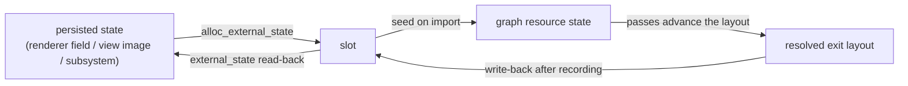

+++
title = 'Cross-frame layouts'
weight = 4
+++

# Cross-frame layouts

A cross-frame image state describes the layout, queue owner, and synchronization scope a long-lived
image carries between graph instances. The [render graph](../render-graph-overview/) is rebuilt from
scratch every frame, so this state is persisted outside the graph and threaded back through an
external-state slot. Without it, the first barrier could use a wrong layout or queue owner.

## Images are imported

Every target is a renderer-owned Vulkan handle registered with `import_image`; 3D volumes use
`import_image_3d`. Buffers have a separate import and graph-allocation path described in the
[API reference](../../../reference/render-graph-api/).

```rust
pub fn import_image(
    &mut self,
    image: vk::Image,
    view: vk::ImageView,
    aspect: vk::ImageAspectFlags,
    initial_layout: vk::ImageLayout,
    external: Option<usize>,
) -> RgResource;
```

Most imports pass `initial_layout = UNDEFINED` and `external = None`: the depth buffer, the MSAA
targets, the scene scratch, the G-buffer. These images are produced and consumed inside one frame,
so their entry layout is meaningless and their exit layout can be forgotten without harm. An image
whose layout must mean something next frame passes `Some(slot)` instead.

## The slot round-trip

A graph lives one frame, so it cannot be the durable home of a layout. The durable copy lives with
the image's owner: a renderer field such as `directional_shadow_layout`, the `layout` on a view
target's `Image` (the TAA history), or a subsystem setter (`Ddgi::set_irradiance_layout`,
`GlobalSdf::set_cascade_layout`).

Each frame the renderer threads that value through the graph.
`alloc_external_state(RgExternalState::new(persisted_layout))` reserves a slot. Passing
`Some(slot)` to `import_image` seeds the resource from it. After the graph records, it writes the
resolved state back:

```rust
let slot = graph.alloc_external_state(RgExternalState::new(persisted_layout));
let image = graph.import_image(handle, view, aspect, persisted_layout, Some(slot));
// Declare passes that access `image`, then compile and record the graph.
let resolved = graph.external_state(slot);
```

The renderer reads `external_state(slot)` back into the persisted owner, closing the loop for the
next frame. The slot is an index, not a raw pointer.



The shadow maps show why the loop matters. The directional map rests in
`SHADER_READ_ONLY_OPTIMAL`; a frame that redraws it derives ShaderReadOnly → DepthWrite for the
depth pass and DepthWrite → ShaderReadOnly for the scene's sample. A frame with nothing pending
never imports the map at all, and the persisted field keeps the resting value while the scene
samples the cached map. `Targets::new` init-transitions both maps to ShaderReadOnly, so the
constructor seeds the fields to match.

## Seeding synchronization and ownership

The entry layout alone is not enough. To order the first barrier against an imported image, the
graph also needs a source stage and access mask (the
[synchronization2](../../vulkan-foundation/synchronization2-and-barriers/) scopes), and a freshly
imported resource has no in-frame predecessor to read them from. `seed_image_state` reconstructs
them from the entry layout:

```rust
fn seed_image_state(r: &mut RgResourceState) {
    if r.layout == vk::ImageLayout::SHADER_READ_ONLY_OPTIMAL {
        r.last_stage = vk::PipelineStageFlags2::FRAGMENT_SHADER;
        r.last_access = vk::AccessFlags2::SHADER_SAMPLED_READ;
    } else {
        r.last_stage = vk::PipelineStageFlags2::TOP_OF_PIPE;
        r.last_access = vk::AccessFlags2::empty();
    }
}
```

An image that enters as `SHADER_READ_ONLY_OPTIMAL` was last sampled by a fragment shader. The first
write therefore uses `FRAGMENT_SHADER` / `SHADER_SAMPLED_READ` as its write-after-read source scope.
The external state also records the last queue and queue family. A first access on another queue can
therefore compile a release/acquire pair and timeline wait. That seeded state feeds straight into
[barrier derivation](../usage-and-barrier-derivation/) as if a prior pass had produced it.

> [!NOTE]
> `seed_image_state` special-cases only `SHADER_READ_ONLY_OPTIMAL`. Every other entry layout seeds
> `TOP_OF_PIPE` with an empty access mask, so the first barrier against such an image installs only
> its destination scope.

## Which images ride a slot

| Image | Durable layout lives in | Cross-frame role |
|---|---|---|
| Directional + spot [shadow maps](../../shadows-and-culling/directional-shadows/) | renderer fields | redrawn only when pending, sampled every frame |
| [TAA](../../screen-space-and-post/taa/) history + pixel-lock pairs | view-target `Image::layout` | ping-pong: sample one parity, write the other |
| GTAO + contact-shadow maps | view-target `Image::layout` | compute-written results sampled by the scene |
| [SSGI](../../screen-space-and-post/ssgi/) / DFAO history pairs, resolved maps, SSR map | view-target `Image::layout` | temporal accumulation and scene sampling |
| [DDGI](../../global-illumination-and-raytracing/ddgi-overview/) ray image + [probe atlases](../../global-illumination-and-raytracing/irradiance-and-moment-atlases/) | `Ddgi` layout setters | one frame's blend is the next frame's history |
| [GDF](../../global-illumination-and-raytracing/software-ray-trace/) cascade + albedo volumes | `GlobalSdf` layout setters | toroidal clipmap, recomposited incrementally |
| [ReSTIR](../../global-illumination-and-raytracing/restir-overview/) radiance image | per-view ReSTIR state | scene-sampled, reused temporally |
| Froxel scatter, history, integration + aerial volume | subsystem layout setters | temporal fog reprojection and scene composition |
| Offscreen color | `view.offscreen.layout` | exit tracking for the read-back (below) |

The history images earn their slots because their resting layout genuinely alternates: the graph
transitions the write parity ShaderReadOnly → General for the storage write and the read parity
General → ShaderReadOnly for the sample, every frame. A fixed seed would be wrong half the time.

## Offscreen: tracking the exit only

The offscreen color rides a slot for a different reason. Its contents are regenerated every frame
(the sky or scene pass clears it), so its slot is seeded `UNDEFINED` and no entry layout crosses
the boundary. What the slot captures is the exit: `COLOR_ATTACHMENT_OPTIMAL` after the post
chain's grid and overlay passes, written back into `view.offscreen.layout` after execute.

That value matters because the offscreen's consumer records outside the graph. The editor host's
shared-memory read-back (`record_shm_copy`) and the windowed host's swapchain blit
(`record_present_blit`) both transition the offscreen to `TRANSFER_SRC_OPTIMAL` by hand, and they
take the tracked layout as the transition's `old_layout` with a matching source scope. A stale
value there trips validation (`VUID-vkCmdDraw-None-09600`) on the next submit.

## Resting layouts without a slot

A slot is only needed when the layout varies. `prev_color`, the previous-frame color that SSGI,
SSR, and ray-traced reflections gather from, rests in ShaderReadOnly by construction: it imports
with that fixed `initial_layout` and `external = None`. After the `ssgi-history` copy writes it in
General, a barrier-only `ssgi-history-restore` pass declares one final `SampledReadCompute` so the
graph transitions it back to the resting layout before the frame ends.

The virtual-shadow atlas rests the same way: it imports in ShaderReadOnly, the page passes write it
as a depth attachment, and the scene pass's declared `SampledRead` returns it to the resting layout.
The swapchain image never enters the scene graph; the present blit is a separate submission with
explicit barriers.

## In the code

| What | File | Symbols |
|---|---|---|
| Reserve + read a slot | `render_graph.rs` | `RenderGraph::alloc_external_state`, `external_state`, `RgExternalState` |
| Import + entry-state seed | `render_graph.rs` | `RenderGraph::import_image`, `import_image_3d` |
| Reconstruct the source scope | `render_graph.rs` | `seed_image_state` |
| Exit write-back loop | `render_graph.rs` | `RenderGraph::record_submission_plan_profiled`, `write_external_states` |
| Per-frame round-trip in practice | `renderer.rs` | `Renderer::record_scene_graph`, `directional_shadow_layout`, `writeback_history_layout` |
| Exit-layout consumers | `renderer.rs`, `present.rs` | `Renderer::record_shm_copy`, `record_present_blit` |

## Related

- [Render graph](../render-graph-overview/) — why the graph is rebuilt every frame
- [Barrier derivation](../usage-and-barrier-derivation/) — how the seeded state feeds the first barrier
- [Passes](../passes-and-attachments/) — the attachments these imported images back
- [TAA](../../screen-space-and-post/taa/) — the history ping-pong that rides four slots
- [Synchronization2 and barriers](../../vulkan-foundation/synchronization2-and-barriers/) — the stage/access scopes the seed reconstructs
