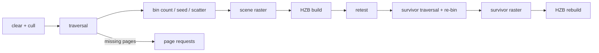

+++
title = 'Hierarchical visibility'
weight = 46
+++

# Hierarchical visibility

The persistent GPU scene selects what to draw on the GPU: a per-view compute chain culls
instances, walks each visible prototype's page hierarchy to an appearance-error cut, and
bins the resulting semantic records into indirect draw commands. The CPU never sees the
visible set.

## Occlusion pyramid

Each view owns two full-mip R32F max pyramids (the HZB) at input extent, swapped every
frame. After the scene pass, a compute copy seeds mip 0 from the resolved 1x depth and
one reduce per level folds a conservative MAX — the depth convention is LESS with far
1.0, so a box whose nearest depth exceeds the covering tile's stored value is provably
hidden.

Odd source extents fold their trailing row and column into the last destination texel,
so no source texel escapes the reduction. A resize or history invalidation clears
pyramid validity and tests bypass it.

## Instance classification

One parameterized compute pipeline classifies every occupied instance slot. The world
sphere (the prototype's local sphere through the instance transform) projects as an
eight-corner box; anything crossing the near plane passes conservatively. Frustum-culled
instances clear their history word and stop.

Instances visible last frame test their PREVIOUS transform's bounds against the previous
pyramid — an occluded one moves to a retest list instead of dying. New or history-invalid
instances bypass the stale pyramid. After the current pyramid builds, the retest pass
re-tests the list with current transforms and merges survivors.

A survivor traversal + re-bin then walks the merged tail (counter snapshots mark the
provisional boundary), and a survivor raster redraws it over the provisional scene with
loaded attachments, so a disoccluded instance reappears in the same frame. A final pyramid
rebuild over the survivor-updated depth publishes the complete cut as next frame's
occlusion source, and a full re-bin restores every bucket count for the passes that follow.

## Traversal and binning

One thread per visible instance walks the page hierarchy from the prototype's guaranteed
root. A node refines into its children while its projected appearance error (the cooked
Q15.16 total scaled by instance scale and projection, divided by distance) exceeds the
threshold and every child page payload is resident. A missing child appends a
[missing-page request](../page-residency/) and the resident parent stays drawable — the
cut cannot hole.

Nodes on the cut emit one semantic `GpuDrawRecord` per triangle cluster (or one for a
voxel brick), with the material resolved through the instance's sparse overrides and the
prototype defaults.

## Representation crossfade

A cross-frame state table keyed on (instance slot, page) remembers each flip node — a
node that moved between drawing itself and descending. On the flip frame both
representations draw for `GPU_TRANSITION_FRAMES` frames, each record carrying a
transition word: a phase, a direction bit, and a 16-bit flip id shared by both sides.

Every raster pass tests the same frame-free per-pixel dither against the phase: the
incoming side keeps pixels below the threshold, the outgoing side keeps the complement.
The two shares partition every pixel exactly, so the crossfade never holes and never
double-draws, and each pixel flips representation exactly once per sweep.

Transitioning records also draw into the
[TAA](../../screen-space-and-post/taa/) reactive mask, which damps stale history over
exactly those pixels. The table advances a flip's phase once per frame (stamp-guarded,
so the survivor pass never double-steps); a full table raises the pressure flag and the
node draws settled.

Three binning kernels turn the record stream into execution: per-PSO-bin counts, a
one-workgroup exclusive scan, and a scatter that writes each record's
`VkDrawIndexedIndirectCommand` into its bin's contiguous range. The pages arena itself is
the executor's index buffer — a cluster's `firstIndex` addresses its page payload's index
blob — and `firstInstance` carries the record index.

The executor vertex shader pulls vertices through buffer device addresses (the geometry
record's range for clusters, the page's own vertex block for voxel surfaces), so no
vertex input bindings exist. The draw is `vkCmdDrawIndexedIndirectCount` with the record
counter as the count buffer; a device without `drawIndirectCount` draws a fixed maximum
over zero-filled no-op commands.

Every bounded buffer carries overflow flags in the counters — a full visible list,
retest list, or record stream reports pressure instead of truncating silently. The
counters also carry the diagnostic matrix `gpu-scene-stats` reports: per-representation
record counts, the deepest emitted hierarchy level, frustum and occlusion cull tallies,
crossfading records, and the triangles of records projecting under one 2×2 quad (the
quad-utilization pressure of sub-quad geometry).

## In the code

| What | File | Symbols |
|---|---|---|
| HZB pyramids and build passes | `hzb.rs`, `hzb_copy.slang`, `hzb_reduce.slang` | `Hzb`, `HzbPyramid`, `add_build_passes` |
| Instance cull and retest | `visibility.rs`, `scene_visibility.slang` | `SceneVisibility`, `SceneVisibilityView`, `SceneVisibilityPush` |
| Hierarchy traversal | `scene_traversal.slang` | `add_traversal_pass`, `SceneTraversalPush`, `GpuDrawRecord` |
| Binning and the executor draws | `scene_bin_count.slang`, `scene_bin_seed.slang`, `scene_bin_scatter.slang`, `scene_pass.rs` | `add_binning_passes`, `record_executor_buckets`, `record_executor_depth_family`, `ExecutorDrawInputs` |
| Survivor chain | `visibility.rs`, `hzb.rs` | `add_survivor_snapshot_pass`, `add_bucket_count_clear_pass`, `HzbPyramid::add_rebuild_passes` |
| Frame integration | `renderer.rs` | `Renderer::page_demand_view`, the cull/retest/traversal blocks in `record_scene_graph` |

## Related

- [Page residency](../page-residency/) — the payload streaming the traversal demands from
- [Persistent GPU scene](../persistent-gpu-scene/) — the tables the classification reads
- [Render graph](../render-graph-overview/) — the pass ordering and barriers the chain rides on
