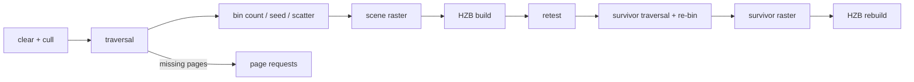

+++
title = 'Hierarchical visibility'
weight = 46
+++

# Hierarchical visibility

The persistent GPU scene selects what to draw on the GPU: a per-view compute chain culls
instances, walks each visible prototype's page hierarchy to an appearance-error cut, and
bins the resulting semantic records into indirect draw commands. The CPU never sees the
visible set.

## Occlusion pyramid

Each view owns two full-mip R32F max pyramids (the HZB) at input extent, swapped every
frame. After the scene pass, a compute copy seeds mip 0 from the resolved 1x depth and
one reduce per level folds a conservative MAX — the depth convention is LESS with far
1.0, so a box whose nearest depth exceeds the covering tile's stored value is provably
hidden.

Odd source extents fold their trailing row and column into the last destination texel,
so no source texel escapes the reduction. A resize or history invalidation clears
pyramid validity and tests bypass it.

## Instance classification

One parameterized compute pipeline classifies every occupied instance slot. The world
sphere (the prototype's local sphere through the instance transform) projects as an
eight-corner box; anything crossing the near plane passes conservatively. Frustum-culled
instances clear their history word and stop.

Two runtime terms widen that sphere before it is tested, because both move geometry the
cook never saw. A wind-deformed instance adds the prepass record's world-space sway slack.
A [displaced](../compute-displacement/) instance adds its row's local relief bound — a
scalar height reaches one local unit of amplitude along the normal, a vector map reaches
the amplitude's cube half-diagonal — because the cooked sphere describes the *undisplaced*
surface, and relief poking outside it would otherwise be culled at the screen edge.

Instances visible last frame test their PREVIOUS transform's bounds against the previous
pyramid — an occluded one moves to a retest list instead of dying. New or history-invalid
instances bypass the stale pyramid. After the current pyramid builds, the retest pass
re-tests the list with current transforms and merges survivors.

A survivor traversal + re-bin then walks the merged tail (counter snapshots mark the
provisional boundary), and a survivor raster redraws it over the provisional scene with
loaded attachments, so a disoccluded instance reappears in the same frame. A final pyramid
rebuild over the survivor-updated depth publishes the complete cut as next frame's
occlusion source, and a full re-bin restores every bucket count for the passes that follow.

## The reach view

Global illumination is not a camera. A march gathers from behind the eye, and a reflection
shows a surface the camera cannot see at all, so both the frustum test and the depth
pyramid are unsound rejections for it: either one would drop an occluder that shadows
something visible.

The reach pass is a third pass kind over the same instance sweep. It keeps every instance
whose world sphere meets a world box and rejects the rest — no projection, no pyramid, no
retest list, because there is nothing for a later pass to reconsider. The box is
`gi_occluder_bounds(eye)`: the coarsest [distance-field](../../global-illumination-and-raytracing/distance-field-reflection-occlusion/)
cascade window dilated by one cascade-0 extent, so an occluder outside it cannot influence
any march. The CPU occluder gate calls the same function, so the two cannot drift.

The reach view runs whenever a gather does — the distance field or the DDGI near-field
march — and reports its own counters:
`giReachVisible` against `giReachCulled` is the fraction of the scene a gather is charged
for. It walks the hierarchy in demand-only mode — the same descent, the same missing-page
requests, no draw records — because what it reads has to stay resident whether or not it
is what the image is made of. Its visible list has one consumer: the
[occluder scatter](../../global-illumination-and-raytracing/distance-field-reflection-occlusion/),
which turns it into the frame's SDF occluder instances on device.

## Traversal and binning

One thread per visible instance walks the page hierarchy from the prototype's guaranteed
root. A node refines into its children while its projected appearance error (the cooked
Q15.16 total scaled by instance scale and projection, divided by distance) exceeds the
threshold and every child page payload is resident. A missing child appends a
[missing-page request](../page-residency/) and the resident parent stays drawable — the
cut cannot hole.

Nodes on the cut emit one semantic `GpuDrawRecord` per triangle cluster (or one for a
voxel brick), with the material resolved through the instance's sparse overrides and the
prototype defaults.

## The swept-bounds cull

Instance classification tests one sphere for a whole prototype, which is the coarsest
bound available: a plant that clips the frustum edge passes as a unit, and every node
beneath it emits records whether or not its geometry is on screen. The walk therefore
repeats the frustum test per node, on the node's swept world bounds, and a rejected node
takes its whole subtree with it. Under an assembly the test runs once per use, so a plant
can have one part rejected while its siblings draw.

The same test then runs again at cluster granularity, on each surviving node's individual
triangle clusters. A node's bounds close over its whole subtree and so are as wide as the
family; a cluster's are the part's own, which is the granularity at which one branch
leaves the frame while the trunk beside it draws. Both granularities share one function,
so widening the box or changing the slack moves them together.

Two properties make descending on one node's bounds safe. The cooker closes each node's
bounds over its subtree, because simplification derives a coarse parent's bounds from the
simplified geometry and can shrink them inside the children's silhouette; an artifact
where a child escapes its parent is rejected at validation. The box the cull uses is the
*deformed* one, the cooked swept extent, widened by the wind prepass's world-space slack,
since runtime wind is not cooked.

That slack is the box's own, not the whole instance's. The vertex path scales sway by the
square of a vertex's root-anchored height weight and the interaction push by the weight
itself, so a cluster at a tree's foot barely moves while its crown carries the full
displacement. The cull reads each box's greatest instance-local height, derives the same
weight, and widens by each term at that weight — a branch mode only where an assembly use
declares a moving structural semantic, flutter only for a leaf one. Handing every box the
whole instance's slack would give a metre of margin to geometry that moves a centimetre,
and undo the tightness the per-cluster boxes bought. The instance sphere, which has no
local box to weigh, keeps the whole-instance total.

Counter words 16 and 17 report node rejections and reached nodes, and word 23 the cluster
rejections underneath them. `SAFFRON_NODE_CULL=off` walks every node and emits every
cluster instead; the cull is a pure reduction over geometry the frame cannot see, so both
hosts render the same image, which `tests/e2e/node-cull-parity.test.ts` measures across a
sweep of poses.

## Representation crossfade

A cross-frame state table keyed on (instance slot, page) remembers each flip node — a
node that moved between drawing itself and descending. On the flip frame both
representations draw for `GPU_TRANSITION_FRAMES` frames, each record carrying a
transition word: a phase, a direction bit, and a 16-bit flip id shared by both sides.

Every raster pass tests the same frame-free per-pixel dither against the phase: the
incoming side keeps pixels below the threshold, the outgoing side keeps the complement.
The two shares partition every pixel exactly, so the crossfade never holes and never
double-draws, and each pixel flips representation exactly once per sweep.

Transitioning records also draw into the
[TAA](../../screen-space-and-post/taa/) reactive mask, which damps stale history over
exactly those pixels. The table advances a flip's phase once per frame (stamp-guarded,
so the survivor pass never double-steps); a full table raises the pressure flag and the
node draws settled.

Three binning kernels turn the record stream into execution: per-PSO-bin counts, a
one-workgroup exclusive scan, and a scatter that writes each record's
`VkDrawIndexedIndirectCommand` into its bin's contiguous range. The pages arena itself is
the executor's index buffer — a cluster's `firstIndex` addresses its page payload's index
blob — and `firstInstance` carries the record index.

The executor vertex shader pulls vertices through buffer device addresses (the geometry
record's range for clusters, the page's own vertex block for voxel surfaces), so no
vertex input bindings exist. The draw is `vkCmdDrawIndexedIndirectCount` with the record
counter as the count buffer; a device without `drawIndirectCount` draws a fixed maximum
over zero-filled no-op commands.

### The mesh executor

A second executor reaches the same records through `VK_EXT_mesh_shader`. A device takes it when
its mesh feature bits and per-workgroup output limits qualify: `meshShader` enabled, and enough
invocations, output vertices, output primitives, and dispatch width for the 62 triangles one
workgroup emits. MoltenVK has no mesh stage, and a driver may advertise the extension for the task
stage alone, so the limits are checked one at a time rather than through the extension. The indexed
executor is what a frame runs otherwise, at full quality rather than as a reduced fallback.
`set-mesh-executor` switches a running host between the two — reading it back through
`render-stats` is how the parity suite proves both were exercised — and asking for the mesh stage
on a device that does not qualify leaves the indexed path in force.

What keeps the two honest is that the mesh path consumes the binner's command stream **as data
rather than as draw arguments**. Workgroup and draw are recovered from `SV_DrawIndex` and the
group id, so the cluster cut is shared rather than independently selected — a divergence would
mean one executor ignored records the binner emitted, which is a different bug from the two
disagreeing about geometry.

Every kernel that fills a command slot writes that draw's `VkDrawMeshTasksIndirectCommandEXT`
beside its indexed command — the scatter for the binner's bucket slices, the transparent reorder
for the sorted ones — sizing the group count from that draw's own index count. That matters
because the stream carries three representations whose bounds differ (triangle clusters, micro
blades, aggregate voxels), and a group count sized for clusters would silently drop the others.
A masked slot's zero index count yields zero groups, which is how it dispatches nothing.

One workgroup emits 62 triangles. The cap is the 256-vertex output limit rather than the
primitive one: a cluster carries no local vertex table, only a flat index range, so three
vertices go out per triangle and 62 × 3 = 186 fits. Two groups cover a full 124-triangle cluster.

Every bounded buffer carries overflow flags in the counters — a full visible list,
retest list, or record stream reports pressure instead of truncating silently. The
counters also carry the diagnostic matrix `gpu-scene-stats` reports: per-representation
record counts, the deepest emitted hierarchy level, frustum and occlusion cull tallies,
reached and rejected node counts, crossfading records, and the triangles of records
projecting under one 2×2 quad (the quad-utilization pressure of sub-quad geometry).



## Looking at the cut

`plant-hierarchy` returns a cooked family's cut node by node — representation, primitive count, page,
depth, and the five-component declared error the selector compares. `set-hierarchy-cut` pins what one
view draws: `auto` follows projected error as a shipped frame does, `coarse` never refines, and
`fine` always does. Each view class carries its own pin — `camera`, `shadow`, `gi` — so pinning the
one you are comparing leaves the others where they were, and the camera is the default.

Pinning matters because a representation comparison needs the cut to move while the camera holds
still. Flying out to reach the aggregate shrinks the subject at the same time, so any difference you
see conflates the two changes. `SAFFRON_CUT_OVERRIDE` sets the same field before the first frame,
which is what a comparison test needs; the command moves it afterwards.

```sh
sa set-hierarchy-cut --cut coarse
sa plant-hierarchy '{"plant":"Silver birch"}' -o json | jq '.nodes[] | {id, representation, appearanceError}'
sa set-hierarchy-cut --cut auto
sa set-hierarchy-cut --cut fine --view shadow    # the shadow atlas only
```

A declared error that saturates means the node is never selected while anything finer is resident.
For a comb of thin separated blades that is the correct outcome — the aggregate reads as a slab where
the triangles read as a comb — and it is invisible until you can read the number.

## In the code

| What | File | Symbols |
|---|---|---|
| Cut inspection + pinning | `control/src/commands_asset.rs`, `commands_render.rs`, `renderer.rs` | `plant-hierarchy`, `set-hierarchy-cut`, `HierarchyCutViewDto`, `Renderer::set_cut_override` |
| HZB pyramids and build passes | `hzb.rs`, `hzb_copy.slang`, `hzb_reduce.slang` | `Hzb`, `HzbPyramid`, `add_build_passes` |
| Instance cull and retest | `visibility.rs`, `scene_visibility.slang` | `SceneVisibility`, `SceneVisibilityView`, `SceneVisibilityPush` |
| The reach view | `visibility.rs`, `scene_visibility.slang`, `global_sdf.rs`, `renderer.rs` | `SCENE_VISIBILITY_PASS_REACH`, `SCENE_VISIBILITY_COUNTER_CULLED_REACH`, `gi_occluder_bounds`, `Renderer::gi_view` |
| Per-view tuning | `visibility.rs`, `renderer.rs` | `SceneViewClass`, `TraversalTuning`, `Renderer::traversal_tuning` |
| Hierarchy traversal | `scene_traversal.slang` | `add_traversal_pass`, `SceneTraversalPush`, `GpuDrawRecord` |
| The swept-bounds cull | `scene_traversal.slang`, `virtual_hierarchy/cook.rs`, `page_payload.rs` | `sweptBoxCulled`, `nodeCulled`, `close_subtree_bounds`, `GpuPageClusterRecord`, `SCENE_VISIBILITY_COUNTER_CULLED_NODES`, `SCENE_VISIBILITY_COUNTER_CULLED_CLUSTERS` |
| Height-weighted wind slack | `global_gpu_data.slang`, `wind_deform.slang`, `visibility/tests/traversal.rs` | `gpuSceneWindBoxSlack`, `GpuWindInstanceRecord::sway_slack`, `a_cluster_takes_the_wind_slack_its_own_height_earns` |
| The mesh executor | `mesh.slang`, `visibility/executor.rs`, `pipelines/build.rs`, `scene_pass.rs` | `meshMainExecutor`, `record_executor_bucket_draw_mesh`, `PsoKey::mesh_shader`, `mesh_executor_supported` |
| Binning and the executor draws | `scene_bin_count.slang`, `scene_bin_seed.slang`, `scene_bin_scatter.slang`, `scene_pass.rs` | `add_binning_passes`, `record_executor_buckets`, `record_executor_depth_family`, `ExecutorDrawInputs` |
| Survivor chain | `visibility.rs`, `hzb.rs` | `add_survivor_snapshot_pass`, `add_bucket_count_clear_pass`, `HzbPyramid::add_rebuild_passes` |
| Frame integration | `renderer.rs` | `Renderer::page_demand_view`, the cull/retest/traversal blocks in `record_scene_graph` |

## Related

- [Page residency](../page-residency/) — the payload streaming the traversal demands from
- [Persistent GPU scene](../persistent-gpu-scene/) — the tables the classification reads
- [Render graph](../render-graph-overview/) — the pass ordering and barriers the chain rides on
