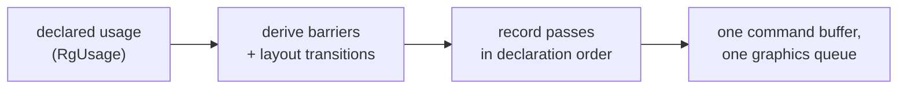

+++
title = 'Limits'
weight = 6
+++

# Limits

The render graph derives barriers and layout transitions from declared usage, and that is the whole
job: it does not allocate memory, pick queues, cull passes, or reorder work. Each boundary below is
a design fact, and each one shapes how the renderer is built around the graph.



## One graphics queue

`Device` creates a single queue, `graphics_queue`, from one graphics-capable family, and
`RenderGraph::execute` records every pass into one command buffer in the order the passes were
added. `RgPass::kind` distinguishes `Graphics` from `Compute`, but the distinction only controls
whether the graph opens a `cmd_begin_rendering` scope around the body. Both kinds record on the
same timeline.

Compute passes such as `light-cull`, `skin`, and `ddgi-trace` run inline between graphics passes,
ordered by the same derived barriers as everything else. There is no
[async compute](https://gpuopen.com/learn/concurrent-execution-asynchronous-queues/), where compute
work fills utilization gaps on a dedicated queue while the graphics queue draws. Every barrier the
graph emits sets `QUEUE_FAMILY_IGNORED` on both sides; with one queue there is no ownership
transfer to derive.

## Import-only resources, one allocation each

The graph owns no memory. Every resource enters through `import_image` or `import_buffer` each
frame: an existing renderer-owned handle wrapped in fresh tracked state. There are no graph-created
resources and no memory aliasing, the technique
[Frostbite's FrameGraph](https://www.gdcvault.com/play/1024612/FrameGraph-Extensible-Rendering-Architecture-in)
is built around, where one allocation backs two resources whose lifetimes never overlap.

The cost is memory. The view's `g_normal` target, the AO maps, the motion target, and the TAA
history images each hold their own allocation for the whole frame, even though several are live
for only a slice of it.

Scratch resources follow the same rule. `TransientResources` is a renderer-owned pool of grow-only
allocations keyed per frame-in-flight; anything acquired from it enters the graph through the same
import calls, as an imported resource with fresh state. A frame slot's allocations are recycled
only after that slot's fence has signalled, so an acquired transient outlives the GPU work that
reads it.

Import-only is dimension-agnostic: barrier derivation reasons about a whole image, never its
dimensionality, so a 3D image tracks exactly like a 2D one. `import_image_3d` delegates to
`import_image` with a `COLOR` aspect, `acquire_image_3d` returns a keyed, grow-only `TYPE_3D` pool
image, and a compute pass dispatches over all three dimensions through the `groups_z` argument of
`add_compute_pass`. The froxel-fog grid is the concrete case: a per-frame `rgba16f` frustum volume
acquired from the pool, written and sampled by a 3D compute grid, imported each frame.

Import-only is also what lets state persist across frames: the renderer owns each image beyond the
graph's per-frame lifetime, so the graph can write an image's exit layout back to an external slot
and read it as the next frame's entry layout. [Cross-frame layouts](../cross-frame-layouts/)
covers that write-back.

## Every declared pass records, in order

The graph records every pass it is handed, front to back. It runs no reachability analysis to drop
a pass whose outputs nothing reads, and it never reorders passes to shorten barrier chains.
`apply_access` keeps one running summary per resource (last stage, access, layout, write flag),
and that summary is a valid hazard model precisely because the recorded order equals the declared
order.

Pruning happens at construction instead. `Renderer::record_scene_graph` adds each pass
conditionally: the shadow passes only when `shadow_pending()` reports a stale map, the G-buffer
prepass and screen-space chain only when an active effect requests them, the deform passes only
when their dispatch lists are non-empty. A pass that would record nothing is never declared, so
there is nothing for the graph to cull. Pass order is likewise the constructor's responsibility.

## One mip, one layer per barrier

The graph tracks a single layout per resource, and `apply_access` emits every image barrier
against a fixed subresource range:

```rust
.subresource_range(vk::ImageSubresourceRange {
    aspect_mask: r.aspect,
    base_mip_level: 0,
    level_count: 1,
    base_array_layer: 0,
    layer_count: 1,
})
```

An image whose mips or layers need different layouts at the same time cannot be declared. The
point-shadow cube, six layers rendered face by face, is the concrete case: it enters the graph as
a `Compute`-kind pass (`point-shadow-static` / `point-shadow-dynamic`) whose body opens its own
per-face rendering scopes and transitions the cube's layout itself via `record_point_shadow`. The
graph still orders the pass — the dynamic cube declares a `VertexInputRead` on the deformed
buffer, placing it after the skin dispatch — but the cube's layout is the body's job.

The graph is a correctness tool. It removes the error-prone part of Vulkan, hand-written barriers
and layout transitions, and leaves allocation with the renderer's target and pool owners and
ordering with the pass constructor.

## In the code

| What | File | Symbols |
|---|---|---|
| Single-queue recording | `render_graph.rs` | `RenderGraph::execute`, `execute_profiled`, `RgPassKind` |
| The one queue | `device.rs` | `Device::graphics_queue`, `find_graphics_queue_family` |
| Import-only resources | `render_graph.rs` | `RenderGraph::import_image`, `import_buffer`, `RgResourceState` |
| Scratch pool | `transient.rs` | `TransientResources`, `acquire_buffer`, `acquire_image`, `begin_frame` |
| 3D transient volumes | `transient.rs`, `render_graph.rs` | `acquire_image_3d`, `TransientImage3D`, `import_image_3d` |
| 3D compute dispatch | `renderer.rs`, `froxel_fog.rs` | `add_compute_pass` (`groups_z`), `FROXEL_GRID_X`, `FogGridParams` |
| Single-subresource barrier | `render_graph.rs` | `apply_access` |
| Conditional construction | `renderer.rs` | `Renderer::record_scene_graph` |
| Self-managed cube layout | `scene_pass.rs` | `record_point_shadow`, `PointShadowTarget` |

## Related

- [Render graph](../render-graph-overview/) — the model these boundaries belong to
- [Barrier derivation](../usage-and-barrier-derivation/) — how `apply_access` turns usage into barriers
- [Cross-frame layouts](../cross-frame-layouts/) — the layout write-back import-only enables
- [Adding passes](../who-can-add-passes/) — who constructs the graph each frame
