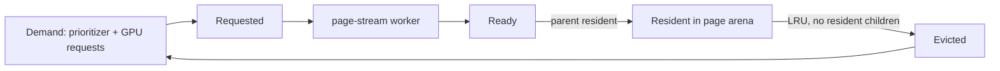

+++
title = 'Page residency'
weight = 45
+++

# Page residency

Hierarchy page payloads stream to the GPU on demand instead of living permanently in
mesh memory. A page holds one drawable hierarchy node with its clusters or voxel brick;
it is loaded from its source artifact by a worker thread, published into the global page
arena when its parent is resident, and evicted leaf-first under a byte budget.

## The payload

Every mesh cook produces a parent-before-child page directory; each page's device payload
is byte-locked: a `GpuPageNodeRecord` header (representation, bounds, appearance and
transition error totals), the node's child pages as resident page-table handles, one
`GpuPageClusterRecord` per triangle cluster, an optional voxel-surface vertex block, and a
u32 index blob.

Triangle indices are geometry-relative — the cook's cluster vertices resolved back to
source vertex indices — so a cluster draws over the geometry's resident vertex range with
no per-page vertex upload. `build_page_payload` builds the bytes deterministically; the
mirror patches the child table with live page-table handles before upload.

## Streaming and publication

The asset server records a payload source for every mirrored mesh: the artifact byte
slice for a `.smesh`/`.smodel` mesh, or the retained cooked hierarchy for a generated
one. The `page-stream` worker thread reads the artifact, decodes the embedded hierarchy
envelope (cached per mesh while its pages stream), and builds payloads off the frame
loop.

Each frame the mirror drains completed loads and the renderer publishes ready payloads
into the page arena: a page publishes only after its parent's payload is resident, so the
GPU never observes a child without its drawable ancestor. Publication rewrites the
resident `GpuPageRecord` with the payload's byte span and a bumped resident generation;
the record travels in the same frame's transfer passes as the bytes.

Guaranteed roots are demanded the moment a mesh's pages register, publish past the byte
budget, and are never evicted — a prototype always has a drawable coarse root. Eviction
picks least-recently-demanded pages that have no resident children, retires their arena
ranges (reused only after every in-flight frame's fence completes), and clears the record's span with another
generation bump.

## Demand

Demand is priority-scored, never distance alone. The CPU prioritizer scores the
refinement frontier (unloaded pages whose parent is resident) by projected transition
error: the page's cooked error total (Q15.16) scaled to pixels through the view's
projection and the nearest instance distance, reduced for instances outside the frustum
and boosted for instances that moved this frame.

A worked example: a page with a 0.02 m transition error on an instance 10 m away under a
1080-pixel viewport at 60° vertical field of view projects to `0.02 × 935 / 10 ≈ 1.9`
pixels — above the quarter-pixel threshold, so the page is demanded.

Shaders append misses to a per-frame request buffer through `gpuSceneRequestPage` (an
atomic counter plus slot entries, addressed via the frame's
[address block](../persistent-gpu-scene/)); the CPU drains the slot's requests once its
fence completes and folds them into the same demand path at high priority.

`gpu-scene-stats` reports the counters (registered, resident, resident bytes, budget,
requested, loading, ready, evictions) over the control plane and the `sa` CLI.

## In the code

| What | File | Symbols |
|---|---|---|
| Locked payload layout and builder | `page_payload.rs` | `GpuPageNodeRecord`, `GpuPageClusterRecord`, `build_page_payload` |
| Residency state machine, budget, eviction | `page_residency.rs` | `PageResidency`, `PageResidencyBudgets`, `PageDemandView` |
| Worker thread and payload sources | `page_stream.rs` | `PageStreamWorker`, `PagePayloadSource` |
| Frontier scoring and worker drive | `gpu_scene_mirror.rs` | `GpuSceneMirror::drive_page_streaming` |
| Page arena, request ring, shader readers | `gpu_scene_upload.rs`, `global_gpu_data.slang` | `GpuArenaUploadRequest::PageBytes`, `drain_page_requests`, `gpuScenePageNode`, `gpuSceneRequestPage` |
| Stats surface | `commands_render.rs` | `gpu-scene-stats`, `PageResidencyStatsDto` |

## Related

- [Persistent GPU scene](../persistent-gpu-scene/) — the tables and address block the pages publish into
- [Virtual geometry](../../geometry-and-assets/virtual-geometry/) — the cooked hierarchy the pages carry
- [Render graph](../render-graph-overview/) — the transfer passes payload bytes ride in
