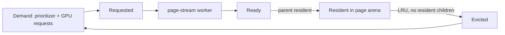

+++
title = 'Page residency'
weight = 45
+++

# Page residency

Hierarchy page payloads stream to the GPU on demand instead of living permanently in
mesh memory. A page holds one drawable hierarchy node with its clusters or voxel brick;
it is loaded from its source artifact by a worker thread, published into the global page
arena when its parent is resident, and evicted leaf-first under a byte budget.

## The payload

Every mesh cook produces a parent-before-child page directory; each page's device payload
is byte-locked: a `GpuPageNodeRecord` header (representation, bounds, appearance error
total), the node's child pages as resident page-table handles, one `GpuPageClusterRecord`
per triangle cluster, an optional voxel-surface vertex block, and a u32 index blob.

Triangle indices are geometry-relative — the cook's cluster vertices resolved back to
source vertex indices — so a cluster draws over the geometry's resident vertex range with
no per-page vertex upload. `build_page_payload` builds the bytes deterministically; the
mirror patches the child table with live page-table handles before upload.

## Streaming and publication

The asset server records a payload source for every mirrored mesh: the artifact byte
slice for a `.smesh`/`.smodel` mesh, or the retained cooked hierarchy for a generated
one. The `page-stream` worker thread reads the artifact, decodes the embedded hierarchy
envelope (cached per mesh while its pages stream), and builds payloads off the frame
loop.

Each frame the mirror drains completed loads and the renderer publishes ready payloads
into the page arena: a page publishes only after its parent's payload is resident, so the
GPU never observes a child without its drawable ancestor. Publication rewrites the
resident `GpuPageRecord` with the payload's byte span and a bumped resident generation;
the record travels in the same frame's transfer passes as the bytes.

Guaranteed roots are demanded the moment a mesh's pages register, publish past the byte
budget, and are never evicted — a prototype always has a drawable coarse root. Eviction
picks pages that have no resident children, least-recently-demanded first and then by the
cheapest reader among pages demanded on the same frame, retires their arena ranges (reused
only after every in-flight frame's fence completes), and clears the record's span with
another generation bump.

Recency comes first because a page nobody has asked for in a hundred frames is dead weight
whoever last wanted it. The reader only breaks the tie — which is the case that matters,
since anything still being read is re-demanded every frame and so ties on recency
constantly. There the order is the image, then its shadows, then the gathers.

## Demand

Demand is priority-scored, never distance alone. The CPU prioritizer scores the
refinement frontier (unloaded pages whose parent is resident) by projected transition
error: the page's cooked error total (Q15.16) scaled to pixels through the view's
projection and the nearest instance distance, reduced for instances outside the frustum
and outside the reach of any gather. That total is the error of the representation the
page displaces — its parent node's — which is exactly what resolving the page buys back. It walks placed vegetation alongside scene instances:
plants never enter the ECS, and they are where most of the paged geometry actually is, so a
prioritizer that skipped them would be scoring the smaller half of the scene.

Two terms make the score a request rather than a report. The **distance is the closest
approach over a half-second horizon**, not the frame's standing distance: the eye's smoothed
velocity and each instance's own `previous`→`current` travel both lead half a second, and the
nearer of the two readings wins. A payload takes several frames to arrive, so a page scored only
where things stand is asked for once the camera is already on it, and a page scored only where
things will be would abandon what is in front of the viewer now. The **payload source** multiplies
the result: a cooked hierarchy is already in memory, while an artifact page is a file read plus an
envelope decode on the stream worker, so the slower source is asked for further out to land at the
same time.

A worked example: a page with a 0.02 m transition error on an instance 10 m away under a
1080-pixel viewport at 60° vertical field of view projects to `0.02 × 935 / 10 ≈ 1.9`
pixels — above the quarter-pixel threshold, so the page is demanded.

Shaders append misses to a per-frame request buffer through `gpuSceneRequestPage`,
addressed via the frame's [address block](../persistent-gpu-scene/). The buffer is
**partitioned by view class**: a count word per class, then one region each. Every view in
the frame appends — the camera, each shadow-atlas page, the reach view — and a shared queue
would let whichever won the atomic race crowd out the others, which is the wrong outcome
whenever the loser is the camera. Owning a region means a class's drops follow from its own
volume and nothing else. The class is the region, so the entry is just the page slot; the
CPU drains the regions most-urgent-first once the slot's fence completes.

A full region drops the request. That costs no geometry — the page faults again next frame —
but it is latency nobody asked for, so it is counted rather than swallowed: the count word
keeps counting past the ceiling, and the drain reports the difference as `requestsDropped`
with a bit per class in `requestOverflowClasses`. Which class overflowed is the whole
diagnostic; the camera's is a stall in the image and the gather's is a slightly thinner
gather.

Filling a 4096-entry region takes more faults in one frame than any test scene produces, so
`page-request-budget` lowers the effective per-class ceiling — the same reason
`vsm-page-budget` exists. It changes only the bound; the regions are addressed off the
allocated capacity, because a base that moved with the budget would leave the two halves
reading different memory.

```sh
sa page-request-budget --entries 1     # make the overflow path reachable
sa gpu-scene-stats -o json | jq '.pageResidency | {requestsDropped, requestOverflowClasses}'
sa page-request-budget --entries 4096  # back to the full region
```

A miss and a prediction are not the same claim. A miss is a hole in a read that already
happened, so every class band sits above the prioritizer's whole predicted range, and the
bands then order the classes against each other. A page several views missed is demanded
once, at the most urgent of their bands — one page cannot stream twice, and the cheapest
reader must not be what its priority is set from.

A page's priority describes the frame it was recorded in rather than accumulating over the
page's life. A running maximum would let one camera glance mark a page as the camera's
forever, and eviction would then protect it over every page the image is actually made of.



`gpu-scene-stats` reports the counters (registered, resident, resident bytes, budget,
requested, loading, ready, evictions) over the control plane and the `sa` CLI.

## In the code

| What | File | Symbols |
|---|---|---|
| Locked payload layout and builder | `page_payload.rs` | `GpuPageNodeRecord`, `GpuPageClusterRecord`, `build_page_payload` |
| Residency state machine, budget, eviction | `page_residency.rs` | `PageResidency`, `PageResidencyBudgets`, `PageDemandView`, `PAGE_DEMAND_PREDICTED_CEILING` |
| Per-class demand bands | `visibility.rs` | `SceneViewClass::page_demand_priority`, `SceneViewClass::bit` |
| Request partition + drop accounting | `gpu_scene_upload.rs`, `global_gpu_data.slang` | `PageRequestDrain`, `PAGE_REQUEST_CAPACITY`, `gpuSceneRequestPage` |
| The budget knob | `commands_render.rs`, `renderer.rs` | `page-request-budget`, `Renderer::set_page_request_budget` |
| Worker thread and payload sources | `page_stream.rs` | `PageStreamWorker`, `PagePayloadSource` |
| Frontier scoring and worker drive | `gpu_scene_mirror.rs` | `GpuSceneMirror::drive_page_streaming` |
| Page arena, request ring, shader readers | `gpu_scene_upload.rs`, `global_gpu_data.slang` | `GpuArenaUploadRequest::PageBytes`, `drain_page_requests`, `gpuScenePageNode`, `gpuSceneRequestPage` |
| Stats surface | `commands_render.rs` | `gpu-scene-stats`, `PageResidencyStatsDto` |

## Related

- [Persistent GPU scene](../persistent-gpu-scene/) — the tables and address block the pages publish into
- [Virtual geometry](../../geometry-and-assets/virtual-geometry/) — the cooked hierarchy the pages carry
- [Render graph](../render-graph-overview/) — the transfer passes payload bytes ride in
