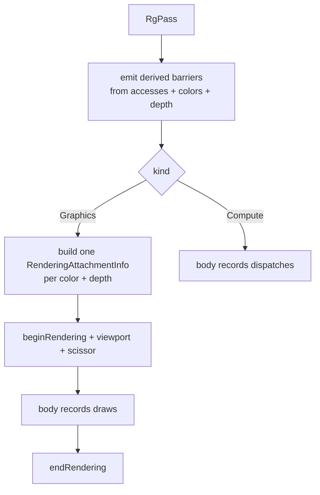

+++
title = 'Passes'
weight = 2
+++

# Passes

A pass is the unit the render graph schedules: a name, a kind, the resources it reads and writes,
the attachments it renders into, and a closure that records the draws or dispatches. It is plain
data. The pass states what it touches, and the [graph](../render-graph-overview/) derives the
synchronization from that.

```rust
pub struct RgPass {
    pub name: String,
    pub kind: RgPassKind,          // Graphics or Compute
    pub accesses: Vec<RgAccess>,   // non-attachment reads/writes
    pub colors: Vec<RgAttachment>, // MRT: index 0 is location 0
    pub depth: Option<RgAttachment>,
    pub render_area: vk::Extent2D,
    pub execute: Option<PassBody>, // FnOnce(vk::CommandBuffer, &mut NestedScopeRecorder)
}
```

A pass is built with chained constructors: `RgPass::graphics(name, render_area)` or
`RgPass::compute(name)`, then `.access(resource, usage)`, `.color(att)`, `.depth_attachment(att)`,
and `.body(closure)`. The body is `FnOnce` — it runs exactly once on the render thread while the
command buffer records. Besides the command buffer it receives a `NestedScopeRecorder`, which lets
it open [profiler sub-scopes](../renderer-profiling/) around its own phases.

## How a pass runs

The `kind` decides what the graph wraps around the body. A `Graphics` pass gets a
[dynamic-rendering](../../vulkan-foundation/dynamic-rendering/) scope plus a viewport and scissor
covering `render_area`; a `Compute` pass gets only its barriers. Both run the same way: emit the
barriers the declarations imply, then call the body. The closure does ordinary recording — bind a
pipeline and descriptor sets, push constants, draw or dispatch — and never writes a barrier or
transitions a layout.



The image views bound by the rendering scope come from the graph's tracked resource state, not
from the attachment struct. An attachment names only an `RgResource` handle; the graph holds the
`vk::ImageView` the resource was imported with. Past the import, the pass declaration carries no
Vulkan handles.

## Accesses versus attachments

A pass declares its resource use in two places. `accesses` lists the non-attachment reads and
writes: the shadow maps the scene fragment shader samples (`SampledRead`), the deformed buffer a
skinned batch reads as its vertex stream (`VertexInputRead`), an image a post pass reads and writes
in place. Each entry is an `RgAccess`, a resource handle plus one `RgUsage` that says what the pass
does with it.

`colors` and `depth` are the render targets of a graphics pass. They are not in `accesses` because
their usage is implied: `derive_pass_barriers` applies `ColorWrite` to every entry in `colors` and
`DepthWrite` to `depth`. A pass author never repeats them.

```rust
pub struct RgAttachment {
    pub resource: RgResource,
    pub load_op: vk::AttachmentLoadOp,
    pub store_op: vk::AttachmentStoreOp,
    pub clear_value: vk::ClearValue,
    pub resolve: Option<RgResource>,
}
```

The common case has a constructor: `RgAttachment::clear_store(resource)` builds a
`CLEAR`-then-`STORE` attachment with a zero clear value and no resolve. An attachment therefore
declares only its load, store, and clear. Whether it needs a barrier, which layout it transitions
to, and how it orders against the previous pass all follow from the implied usage.

> [!NOTE]
> A render target is never also listed in `accesses`. That would apply `ColorWrite` twice and emit
> a spurious write-after-write barrier. Render targets go in `colors`/`depth`; `accesses` holds
> only the non-attachment reads and writes.

## Multiple render targets

`colors` is a vector, so one pass can write several color attachments in a single rendering scope.
The [G-buffer](../../screen-space-and-post/thin-gbuffer/) prepass uses this: it writes the
view-normal target (view normal in `rgb`, view-Z in `a`) and a roughness target, and lays down its
own depth, in one pass.

```rust
let mut pass = RgPass::graphics("gbuffer", extent)
    .color(RgAttachment::clear_store(g_normal))
    .color(RgAttachment::clear_store(g_roughness))
    .depth_attachment(depth_clear_store(g_depth));
```

Index order matters: `colors[0]` is shader output location 0, `colors[1]` is location 1, and
`record_graphics` builds one `vk::RenderingAttachmentInfo` per entry. Most passes bind a single
color target.

## Load, store, clear

The three attachment ops control data flow into and out of the pass:

- **load_op** — `CLEAR` starts from `clear_value`; `LOAD` keeps what is there. The scene pass
  clears its color, except when the sky pass already drew the background: then it loads that
  result. The same switch applies to depth when a depth pre-pass ran.
- **store_op** — `STORE` writes the result back; `DONT_CARE` discards it. With MSAA the scene
  color uses `DONT_CARE` because the multisampled samples are thrown away once resolved.
- **clear_value** — what `CLEAR` writes. `depth_clear_store` clears depth to `1.0`, the far plane
  under a `LESS` depth test; the scene color clears to the frame's clear color.

## The resolve target

An `RgAttachment` can carry an optional `resolve` resource, the [MSAA](../../anti-aliasing/msaa/)
path. The pass renders into a multisampled attachment, and at end-of-pass the hardware resolves it
into the single-sample `resolve` image. The graph treats the resolve target as a second write of
the matching kind: a color resolve derives another `ColorWrite`, a depth resolve another
`DepthWrite`, so the target gets its own barrier and layout transition.

`record_graphics` wires a color resolve with `ResolveModeFlags::AVERAGE` and a depth resolve with
`SAMPLE_ZERO`. Under MSAA the scene pass sets `store_op = DONT_CARE` on both multisampled
attachments, points the color's `resolve` at the offscreen output, and points the depth's at the
1× depth target. The clean images land there, and the graph derives every transition.

## In the code

| What | File | Symbols |
|---|---|---|
| Pass shape | `render_graph.rs` | `RgPass`, `RgPassKind`, `PassBody`, `RgPass::graphics`, `RgPass::compute` |
| Attachment shape | `render_graph.rs` | `RgAttachment`, `RgAttachment::clear_store` |
| Non-attachment access | `render_graph.rs` | `RgAccess`, `RgUsage`, `RgPass::access` |
| Implied attachment usage | `render_graph.rs` | `RenderGraph::derive_pass_barriers` |
| Recording a pass | `render_graph.rs` | `RenderGraph::execute_profiled`, `record_graphics` |
| MRT in practice | `renderer.rs` | `Renderer::add_screen_space_passes` (the `gbuffer` `RgPass`) |
| MSAA resolve in practice | `renderer.rs` | `Renderer::record_scene_graph` (the scene `RgPass`, its `resolve`) |

## Related

- [Render graph](../render-graph-overview/) — the model these passes live in
- [Barrier derivation](../usage-and-barrier-derivation/) — how `ColorWrite` becomes a barrier
- [Adding passes](../who-can-add-passes/) — where these passes get built each frame
- [Renderer profiling](../renderer-profiling/) — the sub-scopes a pass body can open
- [MSAA](../../anti-aliasing/msaa/) — the resolve the `resolve` target serves
- [G-buffer](../../screen-space-and-post/thin-gbuffer/) — the MRT pass in practice
