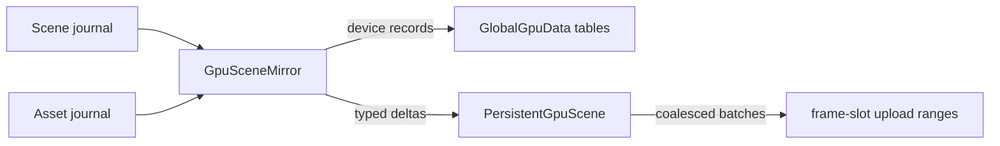

+++
title = 'Persistent GPU scene'
weight = 12
+++

# Persistent GPU scene

The persistent GPU scene is the renderer's derived mirror of render-relevant state: prototypes,
materials, pages, per-world instances, and punctual lights, each behind a stable generational
handle. A journal-driven adapter keeps it in sync with the authoritative scene and asset state,
so per-frame render preparation scales with what changed, never with scene size.

## Records and worlds

`PersistentGpuScene` state splits into shared immutable tables
(prototypes, materials, deformation providers, SDFs, hierarchy pages) and caller-keyed per-world
stores (instances and lights). A world is a `GpuSceneWorldId`; each renderer view maps to one
world and one `GpuSceneViewId`, so the scene, asset-preview, and thumbnail views mirror
independent content while sharing every immutable record. Per-view visibility, HZB, history, and
command revisions live on the view state, outside the shared records.

Every mutation is a typed, validated delta. Creates return a handle; updates and removals verify
the handle's generation and reject anything stale. A removed slot's index is not reused until
every in-flight frame passes its fence, and reuse bumps the generation, so a dangling handle can
never alias new content. Applied deltas coalesce per slot and drain as bounded per-frame upload
batches; a complete snapshot can rebuild the whole structure and queues a full re-upload.

The mirror is disposable by design. Scene entities, project data, and vegetation state stay
canonical; discarding and rebuilding the GPU scene loses nothing.

## The journal-driven mirror

`GpuSceneMirror` bridges canonical state to the render mirror. Each frame it reads the
[scene mutation journal](../../scene-and-ecs/scene-mutation-journal/) and the
[asset mutation journal](../../geometry-and-assets/asset-mutation-journal/) from retained
cursors and applies only the resulting deltas:



An entity with a `Mesh` or `SkinnedMesh` component and a published world transform becomes an
instance; `PointLight` and `SpotLight` components become world lights packed in the same
`GpuLight` layout the clustered-light path consumes. A mesh asset resolves once into shared
records: vertex and index ranges in the [global geometry arenas](../../geometry-and-assets/virtual-geometry/),
a geometry-table record, one page record per cooked hierarchy page (parents precede children,
guaranteed roots flagged), and a prototype whose default material list covers every submesh slot.

Material variants intern by content identity: the referenced `.smat` id plus the canonical
sorted form of the per-object JSON overrides. Two entities sharing a material share one record;
an entity's `MaterialSet` becomes a sparse, strictly slot-ordered override list on its instance.
Each variant's device records include its texture-table entries, its coverage record for masked
and thin-sheet surfaces, and a parameter slot in the material-parameter arena, all reference-counted
and released when the last user disappears.

World-transform edits publish `WorldTransform` journal entries only for entities whose value
changed, and the mirror compares cached current and previous revisions before touching a record.
A journal cursor that falls out of retained history, a replaced catalog, or a different `Scene`
instance bound to a world (a play duplicate, a preview scene, a thumbnail scene, detected by
`Scene::instance_id`) triggers the matching complete rebuild from live state.

`sa gpu-scene-stats` reports the mirror's population and rebuild counters:

```console
$ sa gpu-scene-stats
{
  "meshes": 3,
  "materials": 2,
  "textures": 4,
  "instances": 128,
  "lights": 6,
  "unresolvedInstances": 0,
  "retainedMeshBytes": 5330944,
  "sharedRebuilds": 0,
  "worldRebuilds": 3
}
```

## Upload translation

The persistent scene's records reach the GPU through slot-indexed device tables that mirror
the CPU tables one to one. Each slot is a 16-byte occupancy header (generation plus an
occupied flag) followed by the record body in a locked std430 layout, so a shader validates
a packed handle against the header before trusting the slot. Variable-length data — a
prototype's material list, an instance's sparse overrides — lives in element arenas that the
fixed records reference by range.

`GpuSceneUploader` drains the scene's coalesced writes each frame into graph-owned transfer
passes: it reserves slot capacity, enqueues any buffer growth (a preserving copy that runs
before writes targeting the grown buffer), serializes every record, and stages the bytes
through the shared frame upload ring. Every arena byte reads as zero until a staged write
covers it: a fresh table clears before its first use and growth zero-fills the tail beyond the
preserved prefix, because the address block advertises physical capacity and capacity-wide
dispatches read every slot header — recycled device memory under an unwritten slot would
otherwise read as a garbage occupancy word whose record walks off into a wild device address. A slot's header travels in the same write as its
record, so a partially published slot is never observable. Removals write the header with
the occupied flag cleared. The companion `GpuScenePendingUploads` queue carries the asset
mirror's resident-table stages, retirements, vertex and index streams, and packed material
parameter blocks into the same frame's passes.

Shaders reach every table through one per-frame `GpuSceneAddressBlock`: a uniform block of
buffer device addresses and capacities, bound on the instance set and rewritten each frame
for the active view's world. Growth swaps a buffer and the next frame's block carries the
new address, so no descriptor is ever rewritten for capacity. The slang module
`global_gpu_data.slang` declares the block plus typed pointer accessors
(`gpuSceneLoadInstance`, `gpuSceneLoadPrototype`, …) that walk the
instance → prototype → material chain from the packed handles.

> [!NOTE]
> Mirrored scene instances carry no deformation or SDF reference; skinned deformation flows
> through the per-frame `DeformationWork` submissions described in
> [Compute skinning](../compute-skinning/), and SDF occluders through the global-SDF lighting
> pages.

## Deformation providers

A deforming instance references one composed provider chain in the shared arena.
`GpuDeformationProviderRecord` names the composed providers in `provider_mask` — the
`GPU_DEFORMATION_PROVIDER_*` bits cover skinning, morph, displacement, wind, and the
interaction field — and points at their parameter words in mask-bit order.

The contract every provider meets: current and previous outputs (vertices or transforms)
so motion vectors read exactly the deformation the passes draw, cluster-tight swept
bounds for visibility, and optional BLAS inputs for the ray-traced mirror. Skinned
instances compose the skinning provider through this chain; one provider record serves
every pass, so no shader re-evaluates a deformation independently.

Wind fills its bit through a prepass rather than per-entity vertex copies, since
thousands of plant instances share one prototype's arena vertices. Each frame one
compute dispatch samples the shared [wind field](../../scene-and-ecs/wind-field/)
once per wind-flagged instance and writes a `GpuWindInstanceRecord` — the sway at
the instance's bounds top for the current and the previous frame's time, plus a
cull slack — into a per-world buffer the address block exposes as `windRecords`.

Raster vertex paths apply the stored sway through `gpuSceneWindSway`, scaled by a
squared root-anchored height weight; the motion pass applies the previous words;
the visibility cull inflates the instance sphere by the slack. The field is a pure
function of position and time, so the previous sway is recomputed exactly instead
of carried across frames.

The interaction bit fills through the same prepass. A per-world field of
damped-oscillator texels (two camera-centred cascades storing horizontal push and
ground depression) steps once per frame: scrolled texels reset by their stored
world coordinate, staged impulses splat into texel velocity, and the oscillator
springs back to rest. The prepass samples it at each instance root into the
record's interaction words, applied with a linear height weight so stems lean
from the root; those words carry forward frame to frame in the record, since the
interaction field is stateful.

## Ray candidates

Each TLAS instance carries its GPU-scene instance slot as `instanceCustomIndex`, so an inline
ray query maps a candidate hit straight back into the scene tables. An instance whose
materials are all opaque sets the force-opaque flag and skips candidate processing entirely;
deformed instances, whose vertices live outside the mirrored arenas, carry a sentinel index
and are likewise forced opaque.

Non-opaque candidates confirm through `gpuSceneRayCandidateCovered` before the query commits
the hit. `gpuSceneResolveCandidate` walks slot → prototype → geometry, reads the triangle's
indices and vertices from the global arenas, interpolates the object-space anchor and UV from
the candidate barycentrics, scans the submesh records for the material slot, and applies the
instance's sparse override before falling back to the prototype default.

The resolved coverage record then feeds the same `classifyCanonicalCoverage` call every
raster pass uses, with zero alpha width and the address block's temporal phase — so a cutout
texel is transparent to shadow, reflection, and ReSTIR visibility rays exactly where the
raster passes discard it. The mesh-family queries pass their module bindings; the ReSTIR
resolve pipeline binds the address block and bindless array itself.

A MoltenVK compute fixture (`gpu_scene_candidate_test.slang`) drives the full chain —
tables, arena interpolation, submesh scan, override resolution, classification — and the
`ray_candidate_classification_matches_the_cpu_classifier` test compares every resolved word
against the CPU classifier byte-exactly, including the object-anchored hash threshold.

## In the code

| What | File | Symbols |
|---|---|---|
| Records, handles, deltas, upload batches | `persistent_gpu_scene.rs` | `PersistentGpuScene`, `GpuSceneSharedDelta`, `GpuSceneWorldDelta`, `GpuSceneUploadBatch` |
| Device tables and arenas the records reference | `global_gpu_data.rs` | `GlobalGpuData`, `ResidentGpuTable`, `GpuHandle` |
| Journal-driven synchronization | `gpu_scene_mirror.rs` | `GpuSceneMirror`, `GpuSceneMirrorTarget`, `GpuSceneMirrorStats` |
| Frame upload translation and device scene tables | `gpu_scene_upload.rs` | `GpuSceneUploader`, `GpuSceneTableStorage`, `GpuScenePendingUploads` |
| Address-block vocabulary and shader accessors | `gpu_scene_upload.rs`, `global_gpu_data.slang` | `GpuSceneAddressBlock`, `gpuSceneLoadInstance`, `gpuSceneLoadPrototype` |
| Locked device slot layouts | `global_gpu_data.rs`, `global_gpu_data.slang` | `GpuSceneInstanceGpuRecord`, `GpuScenePrototypeGpuRecord`, `GpuTableSlotHeader` |
| Renderer ownership and view identity | `renderer.rs` | `ViewId::gpu_scene_world`, `Renderer::gpu_scene_parts_mut` |
| Ray-candidate references and coverage confirmation | `rt.rs`, `global_gpu_data.slang` | `RtInstanceInput`, `RT_UNMIRRORED_INSTANCE`, `gpuSceneResolveCandidate`, `gpuSceneRayCandidateCovered` |
| Candidate parity fixtures | `gpu_scene_upload.rs`, `gpu_scene_candidate_test.slang` | `ray_candidate_classification_matches_the_cpu_classifier`, `resident_table_strides_lock_the_slang_pointer_constants` |
| Scene instance identity for rebinds | `scene.rs` | `Scene::instance_id` |
| Stats command | `commands_render.rs` | `gpu-scene-stats`, `GpuSceneMirrorStatsDto` |

## Related

- [Scene mutation journal](../../scene-and-ecs/scene-mutation-journal/) — the scene-side change feed the mirror consumes
- [Asset mutation journal](../../geometry-and-assets/asset-mutation-journal/) — the asset-side change feed the mirror consumes
- [Virtual geometry](../../geometry-and-assets/virtual-geometry/) — the global arenas and tables the device records live in
- [Render graph](../render-graph-overview/) — the frame the upload batches record into
