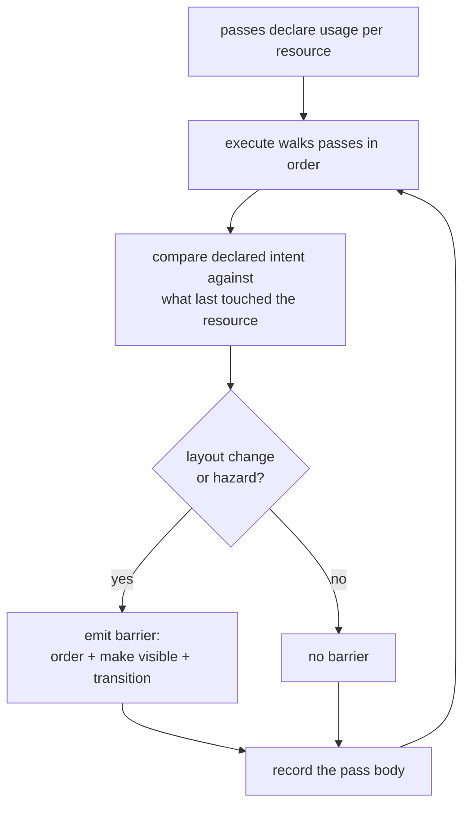

+++
title = 'Render graph'
weight = 1
+++

# Render graph

A render graph (also called a *frame graph*) describes one frame of GPU work as a directed graph:
the passes are the nodes, and the images and buffers they read and write are the edges. Each pass
declares the resources it consumes and produces, and the graph derives what connects the passes —
their dependencies and the synchronization that makes one pass's output safe for the next to read.
The design comes from
[Frostbite's FrameGraph](https://www.gdcvault.com/play/1024612/FrameGraph-Extensible-Rendering-Architecture-in)
(O'Donnell, GDC 2017) and is standard in engines built on explicit graphics APIs.

## Why Vulkan needs it

Vulkan performs almost no synchronization on the application's behalf. The GPU pipelines commands,
so a pass that writes an image and a later pass that samples it can overlap unless something orders
them. A missing barrier is a data race, not a compile error: the symptom is a corrupted frame, a
hang, or a validation message, and only sometimes.

Ordering that work means recording a
[pipeline barrier](../../vulkan-foundation/synchronization2-and-barriers/), which bundles three
concerns:

- **Execution dependency** — work in one set of pipeline stages finishes before work in another
  begins.
- **Memory dependency** — the first work's writes become visible to the second, flushing and
  invalidating GPU caches as needed.
- **Layout transition** (images only) — the image's memory layout changes to match its next use;
  the layout optimal for a color attachment differs from the one a shader samples.

The barriers to reason about multiply as passes are added, and each one must name the exact stages
and access masks on both sides. Hand-written per-pass barriers are the part of a Vulkan renderer
that breaks first. The graph eliminates the category: no pass in the engine records a barrier by
hand.

## Declare, then derive

The graph runs in two phases each frame. First every pass is added with its declared usage; no GPU
command executes. Then `execute` walks the passes in the order they were added, derives the
barriers each transition needs, and records each pass body into the frame's command buffer.



A pass (`RgPass`) is a name, a kind (`Graphics` or `Compute`), a list of declared accesses, its
attachments, and a closure that records the actual draws or dispatches. Each access pairs a
resource with one `RgUsage` value (`ColorWrite`, `SampledRead`, `StorageWriteCompute`, …), and the
`usage_info` table maps every variant to the pipeline stage, access mask, and image layout a
barrier needs.

The compute-skinning chain shows the shape. The skin pass declares a write; the scene pass declares
a read of the same buffer:

```rust
let deformed = graph.import_buffer(deformed_handle);
let pass = RgPass::compute("skin")
    .access(deformed, RgUsage::StorageWriteCompute)
    .body(move |cmd, _scopes| { /* bind the skin PSO, dispatch */ });
graph.add_pass(pass);

// Later, while building the scene pass:
scene = scene.access(deformed, RgUsage::VertexInputRead);
```

When `execute` reaches the scene pass it sees a read of a buffer last written by a compute shader —
a read-after-write hazard — and emits one memory barrier, `COMPUTE_SHADER` / `SHADER_STORAGE_WRITE`
to `VERTEX_ATTRIBUTE_INPUT` / `VERTEX_ATTRIBUTE_READ`. Neither pass mentions the other.
[Barrier derivation](../usage-and-barrier-derivation/) walks the hazard rules in full.

## Resources are imported

The graph allocates nothing. `import_image` and `import_buffer` wrap an existing renderer-owned
Vulkan handle in fresh tracked state and return an `RgResource` index the passes refer to. The
graph itself is rebuilt from scratch every frame, which costs little and keeps the per-frame state
simple to reason about.

Scratch resources follow the same rule: `TransientResources` is a renderer-owned, grow-only pool
keyed per frame-in-flight, and anything acquired from it enters the graph through the same import
calls. An image whose layout must survive the frame boundary rides an external slot that the graph
writes back after execute; [cross-frame layouts](../cross-frame-layouts/) covers the write-back.

Graphics passes bind their attachments through
[dynamic rendering](../../vulkan-foundation/dynamic-rendering/) (Vulkan 1.3 core, and the engine
requests a 1.3 instance): there are no `VkRenderPass` or `VkFramebuffer` objects. The graph opens
`cmd_begin_rendering` around each graphics pass body with the declared color and depth attachments,
including MSAA resolve targets.

## One graph, one queue

`Renderer::record_scene_graph` assembles and executes the frame's graph. Every engine pass — light
culling, morph/skin, shadows, the scene pass, the post chain — is added conditionally, so the graph
contains only the passes the frame needs; [adding passes](../who-can-add-passes/) covers who
declares what. Compute and graphics passes record into one command buffer on the single graphics
queue, ordered by the same derived barriers.

Declared usage could also drive memory aliasing, pass culling, and async-compute scheduling. This
graph derives barriers and layout transitions and stops there; [limits](../limits-and-seams/)
states each boundary and what the renderer does instead.

## In the code

| What | File | Symbols |
|---|---|---|
| Usage vocabulary | `render_graph.rs` | `RgUsage`, `usage_info` |
| Pass + attachment data | `render_graph.rs` | `RgPass`, `RgPassKind`, `RgAttachment`, `RgAccess`, `RgResource` |
| Import resources | `render_graph.rs` | `RenderGraph::import_image`, `import_buffer`, `add_pass` |
| Barrier derivation | `render_graph.rs` | `apply_access`, `RgResourceState`, `derive_pass_barriers` |
| Execution | `render_graph.rs` | `RenderGraph::execute`, `execute_profiled`, `record_graphics` |
| Scratch pool | `transient.rs` | `TransientResources`, `acquire_buffer`, `acquire_image` |
| Where engine passes are added | `renderer.rs` | `Renderer::record_scene_graph` |

## Related

- [Barrier derivation](../usage-and-barrier-derivation/) — how one `RgUsage` becomes one barrier, in detail
- [Passes](../passes-and-attachments/) — MRT, resolve, load/store, the execute closure
- [Cross-frame layouts](../cross-frame-layouts/) — carrying image layouts across the frame boundary
- [Adding passes](../who-can-add-passes/) — engine passes vs. application passes
- [Limits](../limits-and-seams/) — what the graph leaves to the renderer, and why
- [Synchronization2](../../vulkan-foundation/synchronization2-and-barriers/) — the barrier primitives the graph emits
- [Dynamic rendering](../../vulkan-foundation/dynamic-rendering/) — the no-render-pass model the graph rides on
