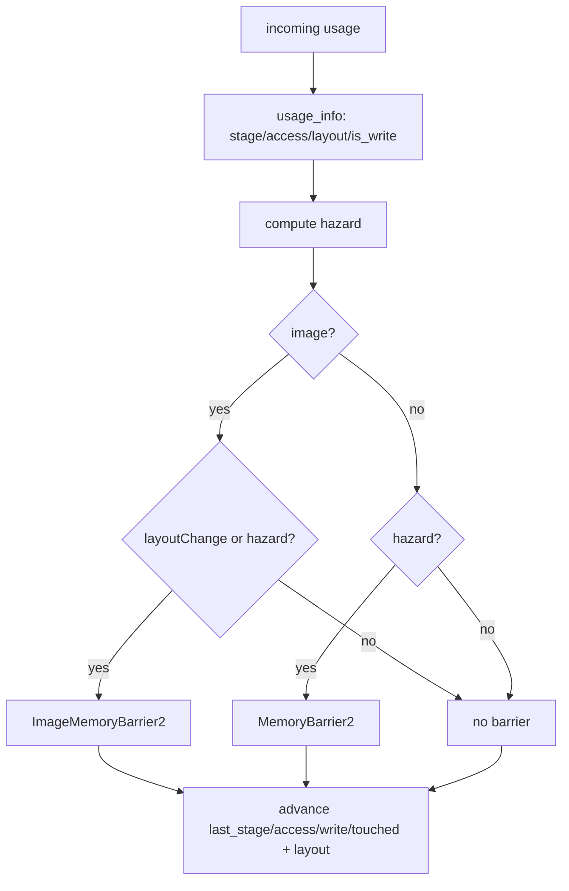

+++
title = 'Barrier derivation'
weight = 3
+++

# Barrier derivation

Barrier derivation turns a pass's declared `RgUsage` into the Vulkan barrier that orders it
against whatever touched the resource before. It is the core job of the
[render graph](../render-graph-overview/), and it rests on two functions. `usage_info` expands a
usage into its synchronization scope; `apply_access` compares that scope against the resource's
tracked state and emits a barrier only when one is required.

## Usage is the single source of truth

A pass states its intent as one `RgUsage` per resource. `usage_info` expands the enum case into
the four facts a barrier needs: `{ stage, access, layout, is_write }`. That `match` is the only
place these correspondences live, and a device-free unit test pins every row.

| `RgUsage` | Stage | Access | Layout | Write? |
|---|---|---|---|---|
| `ColorWrite` | ColorAttachmentOutput | ColorAttachmentWrite | ColorAttachmentOptimal | yes |
| `DepthWrite` | Early + LateFragmentTests | DepthStencilAttachmentWrite | DepthAttachmentOptimal | yes |
| `SampledRead` | FragmentShader | ShaderSampledRead | ShaderReadOnlyOptimal | no |
| `StorageWriteCompute` | ComputeShader | ShaderStorageWrite | (buffer) | yes |
| `StorageReadCompute` | ComputeShader | ShaderStorageRead | (buffer) | no |
| `StorageReadFragment` | FragmentShader | ShaderStorageRead | (buffer) | no |
| `StorageImageRwCompute` | ComputeShader | StorageRead + StorageWrite | General | yes |
| `SampledReadCompute` | ComputeShader | ShaderSampledRead | ShaderReadOnlyOptimal | no |
| `VertexInputRead` | VertexAttributeInput | VertexAttributeRead | (buffer) | no |
| `AccelStructBuildRead` | AccelerationStructureBuild | ShaderRead | (buffer) | no |

Several choices follow from the table. `DepthWrite` spans both fragment-test stages because depth
is read and written in both. `StorageImageRwCompute` is a combined read+write in `GENERAL`, the
layout storage-image access requires: the tonemap pass rewrites the offscreen in place under it,
and the GI and post compute passes declare it on their write targets. The buffer usages carry
`UNDEFINED` for layout because a buffer has none, and the layout logic keys off that.

## The hazard rule

`apply_access` receives the incoming usage's info and the resource's tracked state. The
dependency decision is one boolean:

```rust
let hazard = (target.is_write && r.touched) || (!target.is_write && r.last_was_write);
```

A write after any prior touch is a hazard: `target.is_write && r.touched` covers write-after-write
and write-after-read, both of which need the earlier access to finish first. A read that follows a
write is the classic read-after-write. These are the hazard classes the Khronos
[synchronization examples](https://github.com/KhronosGroup/Vulkan-Docs/wiki/Synchronization-Examples)
catalogue barrier recipes for; the graph derives the same recipes from tracked state instead of
hand-writing them.

Read-after-read appears nowhere in the line. Two reads do not conflict, so `hazard` stays false
and no barrier is emitted. That is the one case the derivation deliberately skips.

## Images get a second trigger

A buffer barriers only on a hazard. An image also barriers on a layout change: even with no data
hazard, a resource sitting in one layout while the incoming usage requires another must
transition.

```rust
if r.is_image {
    let layout_change =
        target.layout != vk::ImageLayout::UNDEFINED && r.layout != target.layout;
    if layout_change || hazard { /* ImageMemoryBarrier2 */ }
} else if hazard { /* MemoryBarrier2 (no layout) */ }
```

The image path emits a `vk::ImageMemoryBarrier2`. Its source scope is whatever last touched the
resource (`r.last_stage`, `r.last_access`); its destination scope is the incoming usage's stage
and access. `old_layout` is always the current layout, and `new_layout` differs only on a layout
change. A barrier emitted purely to order a hazard therefore has matching layouts, transitions
nothing, and still installs the execution and memory dependency.

An imported image represents the whole Vulkan image rather than one view subresource. Its barrier
starts at mip zero and array layer zero, with `VK_REMAINING_MIP_LEVELS` and
`VK_REMAINING_ARRAY_LAYERS` covering the rest. A cube, mip chain, array, or 3D image therefore
enters the declared layout as one tracked resource; a pass cannot leave untracked faces or levels
behind the view it samples.

The buffer path emits a `vk::MemoryBarrier2`, which has no layout fields. The `target.layout !=
UNDEFINED` guard keeps a buffer, whose usages all carry `UNDEFINED`, from ever entering the
layout branch.

## Advancing the state

After deciding and possibly emitting, `apply_access` rolls the tracked `RgResourceState` forward:
`last_stage`, `last_access`, `last_was_write`, `touched`, and, on a layout change, `layout`. The
state is a running summary of what last happened to the resource, so the next pass's check is
correct without any global analysis. For a freshly imported image the entry layout and source
scope are seeded from a persisted slot; [cross-frame layouts](../cross-frame-layouts/) covers the
seeding.



## One barrier batch per pass

`derive_pass_barriers` runs `apply_access` over everything a pass declares: the `accesses` list,
then each color attachment as an implied `ColorWrite`, then the depth attachment as `DepthWrite`.
An MSAA resolve target derives a second write of the matching kind (see
[passes](../passes-and-attachments/)). Every barrier the pass needs lands in one
`DerivedBarriers` collection, and `execute_profiled` records the batch as a single
`cmd_pipeline_barrier2` immediately before the pass body.

The whole derivation is plain logic over plain data with no device handle in it, so the hazard
and layout rules are unit-tested in isolation, from single accesses up to multi-pass chains such
as the skin-write, vertex-read, color-write sequence.

> [!NOTE]
> The hazard rule treats a write after any prior touch as conflicting, including write-after-read,
> which strictly needs only an execution dependency. That is conservative but never misses a
> hazard, and the cost stays bounded: each access emits at most one barrier, walked strictly in
> pass order, and read-after-read emits nothing.

## In the code

| What | File | Symbols |
|---|---|---|
| Usage → scope mapping | `render_graph.rs` | `usage_info`, `RgUsageInfo` |
| The hazard + layout decision | `render_graph.rs` | `apply_access`, `DerivedBarriers` |
| Tracked state | `render_graph.rs` | `RgResourceState` |
| Per-pass collection + emission | `render_graph.rs` | `RenderGraph::derive_pass_barriers`, `execute_profiled` |
| Device-free tests | `render_graph.rs` | `usage_info_matches_the_golden_table`, `image_barrier_on_layout_change`, `multi_pass_skin_to_vertex_to_color_sequence` |

## Related

- [Render graph](../render-graph-overview/) — the declare-then-derive model this serves
- [Passes](../passes-and-attachments/) — where the implied `ColorWrite`/`DepthWrite` come from
- [Cross-frame layouts](../cross-frame-layouts/) — how the entry layout and source scope are seeded
- [Synchronization2 and barriers](../../vulkan-foundation/synchronization2-and-barriers/) — the barrier primitives this emits
