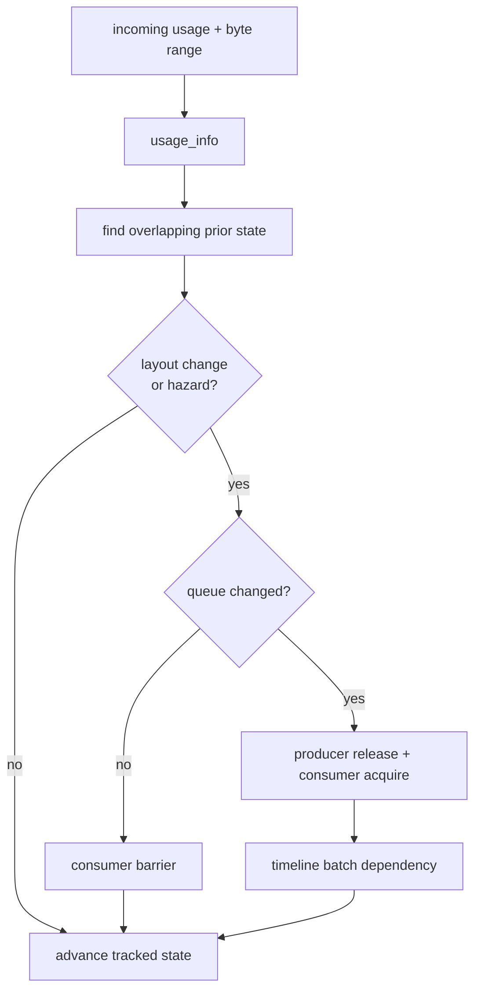

+++
title = 'Barrier derivation'
weight = 3
+++

# Barrier derivation

Barrier derivation turns a pass's `RgUsage` into the Vulkan dependency that orders it against prior
accesses. `usage_info` defines each synchronization scope. The submission compiler compares that
scope with tracked image or buffer state and emits only the barriers and queue dependencies the
access needs.

## Usage is the source of truth

A pass states its intent once. `usage_info` expands that intent into a pipeline stage, access mask,
image layout, and write flag. Device-free tests pin every row.

| `RgUsage` | Stage | Access | Layout | Write? |
|---|---|---|---|---|
| `ColorWrite` | ColorAttachmentOutput | ColorAttachmentWrite | ColorAttachmentOptimal | yes |
| `DepthWrite` | Early + LateFragmentTests | DepthStencilAttachmentWrite | DepthAttachmentOptimal | yes |
| `SampledRead` | FragmentShader | ShaderSampledRead | ShaderReadOnlyOptimal | no |
| `StorageWriteCompute` | ComputeShader | ShaderStorageWrite | buffer | yes |
| `StorageReadCompute` | ComputeShader | ShaderStorageRead | buffer | no |
| `StorageReadFragment` | FragmentShader | ShaderStorageRead | buffer | no |
| `StorageReadWriteCompute` | ComputeShader | ShaderStorageRead + Write | buffer | yes |
| `StorageImageRwCompute` | ComputeShader | ShaderStorageRead + Write | General | yes |
| `SampledReadCompute` | ComputeShader | ShaderSampledRead | ShaderReadOnlyOptimal | no |
| `TransferRead` | Copy | TransferRead | buffer | no |
| `TransferWrite` | Copy | TransferWrite | buffer | yes |
| `VertexInputRead` | VertexAttributeInput | VertexAttributeRead | buffer | no |
| `AccelStructBuildRead` | AccelerationStructureBuild | ShaderRead | buffer | no |
| `IndexInputRead` | IndexInput | IndexRead | buffer | no |
| `ShaderDeviceAddressRead` | AllCommands | ShaderRead | buffer | no |
| `IndirectCommandRead` | DrawIndirect | IndirectCommandRead | buffer | no |
| `IndirectCountRead` | DrawIndirect | IndirectCommandRead | buffer | no |

Buffer registrations also carry their Vulkan creation flags. A declaration fails fast when a usage
requires a flag the allocation does not have, such as `INDIRECT_BUFFER` for an indirect command or
`SHADER_DEVICE_ADDRESS` for an address read.

## Hazards are overlap-aware

A write conflicts with any earlier overlapping access. A read conflicts with an earlier overlapping
write. Read-after-read needs no memory dependency.

Images use one state for the complete image. Buffers use a set of half-open byte-range states.
`RgPass::access` covers the whole buffer; `access_buffer` supplies a checked `RgBufferRange`. The
compiler splits and merges tracked intervals so two disjoint regions can proceed without a false
hazard.

```rust
let commands = RgBufferRange::new(0, command_bytes)?;
let counts = RgBufferRange::new(count_offset, count_bytes)?;

let build = RgPass::compute("build-draws")
    .access_buffer(arena, commands, RgUsage::StorageWriteCompute)
    .access_buffer(arena, counts, RgUsage::StorageWriteCompute);
```

An image also barriers when its layout changes. Its `vk::ImageMemoryBarrier2` covers mip zero and
layer zero through `VK_REMAINING_MIP_LEVELS` and `VK_REMAINING_ARRAY_LAYERS`. A buffer hazard emits
`vk::BufferMemoryBarrier2` with the exact overlapping byte range.

## Queue changes add ownership and execution

A same-queue hazard becomes a barrier before the consumer. A cross-queue hazard adds a release
after the producer and a matching acquire before the consumer. When queue families differ, those
barriers transfer ownership. When the queues share a family, both use `QUEUE_FAMILY_IGNORED`, but
the consumer still waits for the producer's timeline point.

The compiler also handles a cross-frame resource whose previous owner is outside the current pass
list. It creates a synthetic entry release on that owner queue, then links it to the first consumer.
If imported state cannot identify a safe owner, queue assignment falls back to graphics.



## Per-pass barriers become submission batches

Attachments contribute implied `ColorWrite` or `DepthWrite` accesses, including MSAA resolve
targets. `barrier_schedule` returns each pass's before barriers, after barriers, selected queue, and
producer waits. `submission_plan` then groups maximal contiguous runs for the same queue and lifts
pass dependencies to batch dependencies.

`record_submission_plan_profiled` records one primary command buffer per batch. The renderer submits
those batches with timeline semaphores, preserving every dependency while allowing independent
compute and graphics work to overlap.

## In the code

| What | File | Symbols |
|---|---|---|
| Usage mapping and validation | `render_graph.rs` | `usage_info`, `required_buffer_usage`, `validate_declared_access` |
| Range state | `render_graph.rs` | `RgBufferRange`, `RgBufferAccessState`, `RgExternalBufferState` |
| Hazard and ownership derivation | `render_graph.rs` | `apply_access_queued`, `derive_pass_barriers_for` |
| Queue plan | `render_graph.rs` | `barrier_schedule`, `submission_plan`, `RgPassBarriers`, `RgPassBatch` |
| Recording | `render_graph.rs` | `record_submission_plan_profiled` |

## Related

- [Render graph](../render-graph-overview/) — the declare-then-derive model this serves
- [Passes](../passes-and-attachments/) — implied attachment writes and pass bodies
- [Cross-frame layouts](../cross-frame-layouts/) — persistent image entry and exit state
- [Synchronization2 and barriers](../../vulkan-foundation/synchronization2-and-barriers/) — the Vulkan primitives
