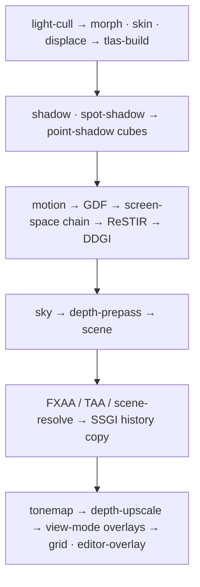

+++
title = 'Pass construction'
weight = 5
+++

# Pass construction

One function adds every pass in a frame's render graph: `Renderer::record_scene_graph`. It builds
a fresh `RenderGraph`, declares each engine pass only when the frame needs it, and executes the
result into the frame's command buffer before returning. Layer and editor work reaches the GPU
through the [render seams](../../app-lifecycle-and-window/the-submit-and-rendergraph-seams/),
which record inside these passes rather than appending passes of their own.

## One constructor, one submit

`render_scene_offscreen` is the render entry for a frame. The host layer calls it from its
`on_ui` hook, after `render_scene` has walked the scene and filled the renderer's draw list;
`saffron-player` makes the same call from its own layer.

The function begins the frame's command buffer, runs `record_scene_graph`, folds in the
shared-memory readback when the view publishes to the editor, and issues one `queue_submit2`.
The offscreen render is one primary command buffer and one submit per frame; the windowed host's
present blit is a separate second submit at `end_frame`.

Construction order is program order. The graph records passes in the order they are added, never
reordering or culling them ([limits](../limits-and-seams/)), so the sequence of `add_pass` calls
in this one function is the frame:



## Pipelines resolve first

Every pipeline the frame could need is resolved before the first pass is declared, into one
`FramePipelines` value. Each request borrows `self.pipelines` mutably, so resolving them up front
leaves the graph build free to borrow the rest of the renderer immutably. A pipeline that fails
to compile resolves to `None`; every pass gated on it drops out, and the frame degrades to the
unlit or unshadowed path instead of aborting.

## Conditional construction

A pass is added only when its pipeline resolved and its work exists this frame. The
compute-skinning gate shows the shape:

```rust
let do_skin = pipelines.skin.is_some()
    && !self.scene_draw_list.skin_dispatches.is_empty()
    && self.skinning.deformed_buffer(frame).is_some()
    && self.skinning.prev_deformed_buffer(frame).is_some();
```

| Pass | Added when |
|---|---|
| `light-cull` | a cluster dispatch is pending (`take_cluster_dispatch_pending`) |
| `morph` / `skin` / `displace` | the draw list built dispatches and the deformed buffers exist |
| `shadow` / `spot-shadow` | a casting directional / spot light is present and shadows are on (`shadow_pending`, `spot_shadow_pending`) |
| `point-shadow-static` | the cube's content key (`point_shadow_key`: light + caster transforms) or its image changed |
| `point-shadow-dynamic` | every frame a shadow-casting point light is present, so deformed casters track motion |
| G-buffer + screen-space chain | any of GTAO / contact shadows / SSGI / SSR is on, or ReSTIR / RT reflections / sky occlusion needs the thin G-buffer, and the targets are ready |
| `fxaa` / `taa` / `scene-resolve` | by AA mode; exactly one of the three resolves the scene |
| `tonemap` | every frame |

A pass that would record nothing is never declared, which keeps declared usage in lockstep with
the resources the frame imported. The scene pass declares its `SampledRead` on the directional
shadow map only when the `shadow` pass ran and imported that map this frame, so no barrier ever
references a resource the graph does not hold.

## The loop's graph window

The run loop dispatches hooks in a fixed per-frame order: `on_render`, `on_ui`, then `run_frame`
builds a loop-owned `RenderGraph`, hands it to `FrameHost::begin_frame_graph` and to each layer's
`on_render_graph`, and moves it into `FrameHost::end_frame`. The `FrameHost` trait keeps that
window testable without a GPU; the [main loop](../../app-lifecycle-and-window/main-loop-and-run/)
page covers the surrounding order.

On the `Renderer` host the frame is already rendered and submitted by then, inside `on_ui`, so
its `begin_frame_graph` adds nothing to the loop's graph. In windowed mode `end_frame` blits the
finished offscreen onto the swapchain via `present_active_view_to_swapchain`, which waits the
scene-finished semaphore the offscreen submit signalled; the headless editor host publishes its
frame over shared memory from `on_ui` instead.

A pass appended to the loop's graph is not part of the renderer's submission — layer GPU work
goes through `Renderer::submit` and `submit_overlay`, described in
[render seams](../../app-lifecycle-and-window/the-submit-and-rendergraph-seams/).

## In the code

| What | File | Symbols |
|---|---|---|
| The one constructor | `renderer.rs` | `Renderer::record_scene_graph`, `render_scene_offscreen` |
| Up-front PSO resolution | `renderer.rs` | `FramePipelines` |
| Per-pass gates | `renderer.rs`, `lighting.rs` | the `do_*` locals, `shadow_pending`, `spot_shadow_pending`, `take_cluster_dispatch_pending`, `point_shadow_key` |
| Execution | `render_graph.rs` | `RenderGraph::add_pass`, `execute_profiled` |
| The frame entry from the host | `host/src/layer.rs` | `HostLayer::on_ui`, `render_ui` |
| The loop's hook window | `app/src/lib.rs` | `run_frame`, `FrameHost::begin_frame_graph`, `FrameHost::end_frame`, `Layer::on_render_graph` |
| Present blit | `renderer.rs` | `Renderer::present_active_view_to_swapchain` |

## Related

- [Render graph](../render-graph-overview/) — the declare-then-derive model the passes join
- [Passes](../passes-and-attachments/) — what `add_pass` takes
- [Limits](../limits-and-seams/) — declaration order is recorded order; no culling, no reordering
- [Render seams](../../app-lifecycle-and-window/the-submit-and-rendergraph-seams/) — how layer work enters the frame
- [Main loop](../../app-lifecycle-and-window/main-loop-and-run/) — the hook order around the graph window
