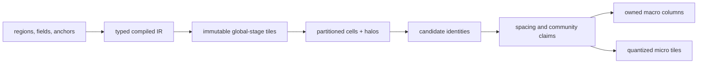

+++
title = 'Biome graph evaluation'
weight = 13
+++

# Biome graph evaluation

A biome graph turns authored regions, fields, plant families, and community rules into canonical
macro plants and quantized micro fields. Editor inspection, bounded cooking, and runtime generation
all use one compiled graph and evaluator.

## Typed compilation

Every node declares typed pins, parameters, a stable GUID, a semantic revision, seed namespaces,
spatial support, dependencies, and execution capabilities. The compiler resolves root and module
`.sbiome` assets into one topological IR. It rejects type mismatches, cycles, noncurrent document
versions, unbounded local influence, and estimates above a configured hard cap.

Module calls use typed public interfaces and stable call GUIDs. The compiled identity includes the
root document and every transitive asset, field, surface-provider, and map-layer fingerprint. A
dependency revision therefore invalidates derived cells without changing the graph format.

Each value carries an authority class:

| Class | Meaning |
|---|---|
| `Authoritative` | Checked canonical numerics may affect persistent identity, gameplay, collision, or navigation |
| `EquivalentGpu` | Slang execution is allowed only for an operator and active device profile that match the Rust reference bytes |
| `Cosmetic` | Spatially stable visual data cannot feed an authoritative sink |

Authority joins across edges. Compilation rejects a cosmetic value that reaches macro points,
stable IDs, persistent ecology, or another authoritative sink. Micro tiles keep density and typed
attributes authoritative; a renderer can reconstruct individual blades as cosmetic geometry.

## Spatial evaluation

Partitioned nodes declare a hierarchy level and finite influence radius. A cell evaluation reads an
immutable halo large enough for every local claim, then publishes only points owned by the cell's
half-open bounds. Coarse plants are produced once at their declared level, while finer cells retain
ancestor references instead of duplicating them.

Operations whose decisions propagate through an unbounded candidate neighbourhood use a finite
ancestor-cell solve domain. The compiler groups connected global nodes at one level, computes their
complete upstream closure and halo, and assigns a stable stage identity. Blue-noise Poisson,
weighted elimination, variable spacing, priority exclusion, and bounds overlap require this policy.

A graph job carries all requested output cells plus every unique global-stage tile they read. Stage
tiles execute in dependency order and become immutable before cell workers start. A dependent tile's
input identity includes its graph dependencies, canonical source data, and the exact identities of
its prerequisite tiles.

[Bridson's grid-accelerated Poisson-disk method](https://www.cs.ubc.ca/~rbridson/docs/bridson-siggraph07-poissondisk.pdf)
provides one blue-noise coverage operator. Weighted elimination, prototype-aware spacing, bounds
overlap, and crown/root competition compare stable candidate identities with exact tie-breaks.
Neighbouring jobs read the same previous-stage candidates, so completion order does not enter a
claim.



Candidate identity is assigned before acceptance from the node address, semantic revision, owner
cell, candidate ordinal, and ancestor lineage. Random samples use named counter-based streams rather
than mutable generator state. Shuffling inputs, cell requests, or worker schedules changes latency,
not result bytes or retained plant IDs.

## CPU and Slang execution

`BiomeGraphEvaluator` builds one execution plan over the compiled IR. The Rust interpreter defines
the semantics, and independent cells run across a bounded worker set before canonical sorting.
Connected compatible nodes compile into one bounded typed SSA program. The program uploads its
external pin values once, keeps intermediate registers resident for the complete chain, and reads
back only its declared boundary outputs. Unsupported topology forms a separate execution group; it
does not introduce another graph meaning or a per-operator compute path.

The Vulkan executor qualifies its active vendor, device, driver, API version, device UUID, and
driver UUID against the deterministic corpus. Evidence also binds the exact Slang compiler,
transitive source closure, compiler flags, and loaded SPIR-V bytes. An `EquivalentGpu` node runs on
Slang only when the vegetation crate has executed and verified the corpus for that complete identity.

`xtask shaders` writes `shader-artifacts.generated.json` beside the SPIR-V files. Runtime loading
checks the manifest record, source hashes, compile-input hash, and artifact hash before Vulkan module
creation. A missing or stale record is a shader-load error.

The renderer retains the executor's Vulkan pipeline, descriptor state, command state, and fence.
Dispatches share the renderer's externally synchronized graphics queue. A completed evaluation's
`summary.nodes` reports semantic candidate counts, retained values, predicted transfer, elapsed time,
and execution domain. Its `summary.gpuGroups` reports canonical node addresses, invocation count,
actual boundary traffic, retained output bytes, and elapsed time for each resident dispatch group.
Its `summary.streams` merges each user-named diagnostic output by node, label, and global-snapshot or
candidate-lineage scope. Exact candidate and scalar samples retain their cell or global-stage source,
and each rejection carries a source-scoped provenance handle.

## Atomic jobs and provenance

Hard caps cover work counts, resource bytes, worker and cell counts, global-stage tiles, input tiles,
module depth, and wall time. Exceeding a cap returns a typed error; the evaluator does not reduce
density or quality. Cooperative cancellation checks surround bounded units of work. A job publishes
its cell and global-stage results only after the complete batch succeeds.

Accepted plants and rejected candidates share a provenance decision DAG. A record connects its
subject to the map, layer, biome, graph path, candidate lineage, and plant family. Rejection records
include the operator and reason, so spacing, threshold, surface, ownership, and competition decisions
remain inspectable.

The control plane drives the same compiler and evaluator used by engine callers:

```sh
sa -o json vegetation-node-schema --operator noise
sa -o json vegetation-compile-biome \
  --target '{"scope":"asset","biome":"4101"}'
sa -o json vegetation-evaluate-region \
  --map 4103 \
  --biomeInstance 0123456789abcdef0123456789abcdef \
  --bounds '{"minTicks":["0","0","0"],"maxTicksExclusive":["262144","262144","262144"]}' \
  --level 0 --workers 8
sa -o json vegetation-evaluation-status --job 1
```

Compilation returns dependency hashes, required halo, predicted work, and hard limits. A completed
status reports cell count, global-stage count, global resident bytes, the canonical result identity,
and aggregated actual diagnostics.
`vegetation-explain-point` expands one accepted or rejected subject into its ordered provenance
decisions.

## In the code

| What | File | Symbols |
|---|---|---|
| Typed graph compiler and estimates | `engine/crates/vegetation/src/graph.rs` | `compile_biome_graph`, `CompiledBiomeGraph`, `GraphSafetyLimits` |
| Canonical and parallel evaluator | `engine/crates/vegetation/src/evaluator.rs` | `BiomeGraphEvaluator`, `GraphEvaluationJobInputs`, `GlobalStageEvaluationInputs` |
| Scheduling and qualification corpus | `engine/crates/vegetation/src/graph_gpu.rs` | `GraphExecutionPlan`, `GraphGpuProgram`, `GraphComputeExecutor`, `qualification_corpus` |
| Slang compute backend | `engine/crates/rendering/src/vegetation_compute.rs`, `engine/crates/rendering/src/shader_artifact.rs` | `VulkanGraphComputeExecutor`, `ShaderArtifactIdentity` |
| Catalog-backed input assembly | `engine/crates/assets/src/vegetation.rs` | `compile_catalog_biome_instance_graph`, `assemble_biome_graph_evaluation_job` |
| Asynchronous control surface | `engine/crates/control/src/commands_vegetation.rs`, `vegetation_jobs.rs` | `register_vegetation_commands`, `VegetationEvaluationJobs` |

## Related

- [Vegetation assets](../vegetation-assets/) — plant, biome, module, and map ownership
- [Vegetation state](../../scene-and-ecs/vegetation-state/) — stable IDs, point columns, and mutations
- [Spatial world](../../scene-and-ecs/spatial-world/) — cells, fixed numerics, surfaces, and fields
- [Shared control types](../../tooling-and-control/shared-types/) — generated command and DTO contracts
