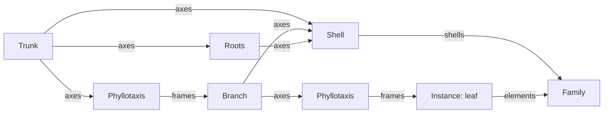

+++
title = 'Botanical graph'
weight = 21
+++

# Botanical graph

A plant family can be grown rather than imported. The botanical graph is a typed authoring IR that
lives inside `.splant` and compiles to the same normalized family an imported mesh does. Nothing
downstream can tell which source a plant came from: cooker, renderer, wind rig, collision,
navigation, and lifecycle all read one shape.

## Its own type system

`.splant` carries exactly one source: an imported recipe of references to external geometry, or this
graph. The graph shares no pin domain, operator name, or document shape with the biome graph. A biome
graph decides *where plants go*; a botanical graph decides *what one plant is*. Four domains flow
between nodes:

| Domain | Carries |
|---|---|
| `Spines` | Directed skeleton curves — trunks, branches, roots, vines |
| `Frames` | Oriented attachment points sitting on those curves |
| `Shells` | Swept surfaces with a material slot |
| `Elements` | Placed instances — leaves, needles, blades, flowers, fruit, buds, scars |

A `Drawn` operator carries a spine an artist drew, point by point, and enters the `Spines` domain
alongside a generated one. Generators produce plants that follow rules; a hero silhouette often does
not. Downstream operators cannot tell the difference, so phyllotaxis, shells, tropism, and pruning
all apply to a drawn curve as ordinary botanical structure.

Operators consume and produce those domains, and the single `Family` sink decides what is in the
compiled plant. A graph with two sinks has no defined result, so validation refuses it — along with a
mistyped edge, a cycle, a duplicate node GUID, and any parameter outside its declared bound.



## Growing is a pure function

`grow` walks the graph in topological order, in canonical GUID order among ready nodes, and each
node reads what its predecessors produced. The result is a function of the document alone: the same
graph grows the same plant on any machine, in any order.

Every value is integer-exact. Positions and radii are Q15.16 metres, angles are signed normalized
half-turns, and sine and cosine come from an integer table rather than `libm` — a one-bit difference
between targets would move a branch. Stochastic choices draw from a counter-based Philox stream keyed
by (graph, node, element, channel), one channel per decision, so adding a node cannot perturb an
unrelated one's variation.

## Variations are individuals

A document declares the individuals it grows, and each becomes a family variation the runtime
selects. A variation is a seed and an intrinsic age: the seed picks which individual, and the age
scales it continuously.

```text
variations: [ { seed: 0x5a11, age: 1.0,  name: "Mature"  },
              { seed: 0x5a11, age: 0.5,  name: "Sapling" } ]
```

That is how one family carries a seedling, a sapling, and a mature tree without three graphs. Age
scales lengths, radii, and element sizes and changes nothing else, so a young plant is the same plant
seen earlier: same axes, same elements, same identities. One manual edit layer therefore fits every
variation, because an identity depends on ancestry rather than on the seed or the age.

Each variation compiles to its own geometry under its own source identity, which is what the family's
variation table selects. Its parts are the union across variations and its dimensions are wide enough
to contain all of them; the skeleton it declares is the representative individual's, since every
variation is that same structure at another size. Two variations drawing the same seed at the same age
are the same individual twice, and are refused.

## Identity survives editing

Every grown element carries an identity derived from its producing node, its parent element, and its
ordinal within that parent — never a global counter:

```rust
let branch = frame.id.child(node_guid, ordinal);
```

Change how big the leaves are and every branch keeps its identity, because nothing in its ancestry
moved. That is what lets a manual edit target a specific branch and survive a parameter change, and
what makes an edit whose target genuinely disappeared reportable rather than silently misapplied.

A node that transforms axes, such as a tropism or a prune, hands back the same identities carrying
different geometry. An axis is therefore collected only from the node that fed it into the family, never
rescanned from every node's output, where the pre-transform copy would be indistinguishable.

## Hand work lives in its own layer

Generators get a plant most of the way there; the rest is hand work — a branch nudged out of a
silhouette, a leaf turned to catch light, a limb cut short. That work sits in the document as an edit
layer addressed by element identity, never baked into geometry, so growing runs exactly as if no edit
existed and the layer applies to its result.

| Action | Does |
|---|---|
| `Transform` | Offsets, turns, and scales the target and everything it carries |
| `Trim` | Cuts an axis at a fraction of its length; what sat above the cut goes with it |
| `Remove` | Deletes the target and everything it carries |
| `Graft` | Substitutes a hand-modelled mesh for a generated element on the same frame |

Removals and cuts settle before any transform, so nothing moves that is about to disappear. Axis
transforms then apply shallowest first, each about its own base as it stands at that moment: a limb
moved at the trunk carries a leaf offset further out instead of fighting it. A cut snaps to the last
rest point at or below it, so a trimmed axis keeps the exact integer geometry it grew with.

Two edits that say opposite things about one element, a remove and a transform, are refused at
validation. Guessing which one an artist meant is how visible work disappears.

## Orphans are reported, never dropped

An edit is an orphan when the graph grows no element under its identity. It stays in the document and
comes back in the growth report with the reason it could not land: `targetMissing` when the graph grows
nothing under that identity, `targetKind` when the identity exists but the action does not apply to it,
`targetRemoved` when another edit took it away.

The plant compiler raises the same thing as an `orphaned-edit` warning and still publishes the family.
The grown plant is complete, and whether the lost hand work matters is the artist's call.

Because an identity comes from ancestry rather than a counter, the common case is that nothing is
orphaned at all: lengthen the trunk and every leaf offset still lands.

```sh
sa plant-elements '{"plant":"Silver birch"}'
#   axis  3149…  trunk    base=(0.00, 0.00, 0.00)  r=0.150  points=7
#   elem  8821…  leaf     at=(0.02, 2.41, 0.11)    size=0.100  slot=1

sa plant-graph-set '{"plant":"Silver birch","graph":{…,"edits":[…]}}'
#   axes=4  frames=1  shells=4  elements=1  verts=140  tris=104  parts=3  height=2.00m  edits=2
#     orphan 8821…  transform  target-missing
```

`plant-elements` is the selection surface: it lists every axis and placed element with the identity an
edit targets. Edits ride the graph document itself, so `plant-graph-set` is the one write path, and
the layer is part of the graph's content identity — a document that differs only by a hand offset is a
different plant.

## Appearances are authored, not derived

Parts, dimensions, spines and proxies all fall out of growing the graph. Phenotypes do not: which
appearances a family can render in — healthy, senescent, harvested, burned — is a decision about the
species rather than a consequence of its geometry, so it is authored.

`plant-phenotypes` reads the list and replaces it whole. Whole rather than field-by-field, because
the set has to hold together: a phenotype names a declared variation, two on one variation may not
share a role, a material remap moves between real slots, and a family needs a healthy appearance. The
family validator judges that, and the command adds no second rule beside it — a refused replacement
leaves the stored set exactly as it was.

A second phenotype on the same variation is what makes a transition possible at all. It renders the
same grown geometry through a material remap, or through a subset of active parts when the change is
a silhouette rather than a colour, so an autumn form costs no second walk of the graph.

```sh
sa plant-phenotypes '{"plant":"Silver birch"}'
sa plant-phenotypes '{"plant":"Silver birch","phenotypes":[
  {"id":0,"role":"healthy","variation":0},
  {"id":1,"role":"senescent","variation":0,"seasonWindow":[700,900]}]}'
```

## Proxies are derived, not authored

Collision and navigation proxies are a result of what grew, like the dimensions. A capsule stands in
for each axis thick enough for a character to collide with, thickest first and bounded at eight: a
proxy per twig is a body-per-branch explosion in the runtime's batched collision residency. The floor
is a quarter of the trunk radius, below which a character brushes past.

Roots get no capsule, because nothing walks into them. A trunk capsule is unbreakable, since breaking
the trunk fells the plant rather than pruning it.

Navigation gets one octagonal footprint at the trunk radius with the plant's height and a neutral
cost; a character routes around the stem, not around the canopy, and the interaction policy decides
whether the seam publishes it as an obstacle or a traversal cost.

A proxy's identity is the axis identity it came from, so it survives a parameter change exactly as a
manual edit does. Regrowing replaces every derived value — variations, appearances, proxies,
dimensions, spines — with the new graph's, because a kept one would be a second truth about the same
geometry.

## Grafting a hero mesh

Some parts of a plant are modelled by hand. A `Graft` substitutes an external mesh for one generated
element, keeping that element's identity and the frame it stood on, so the plant's structure is
untouched and only its surface differs.

The mesh itself is declared on the family beside the graph, as an ordinary source with a locator,
selector, import settings, and provenance. The cooker resolves it through the same importer an
imported family's geometry goes through.

The generator then stands the normalized result on the frame: the frame's outward direction becomes
the mesh's up axis, so a branch modelled growing upward grows outward along the limb it replaces.
Every vertex binds rigidly to that limb's structural joint, and the placement arithmetic is integer,
so a graft compiles to identical bytes on every target.

Declaring the mesh outside the graph is what keeps a recook cheap: the cook writes the content hash it
observed back into the source reference, and a hash living inside the graph document would change the
graph's identity every time the hero mesh was re-read.

```sh
sa plant-graph-set '{"plant":"Silver birch","graph":{…},"grafts":[
  {"id":"9e…","locator":{"kind":"file","uri":"file:///plants/hero-branch.glb"},
   "settings":{"units":"centimeters","upAxis":"positive-z"},"provenance":{…}}]}'
```

A graft edit naming a source the family does not declare is refused: there is no geometry to
substitute and nothing sensible to fall back to. A declared graft whose source will not resolve is a
compile error rather than a family that quietly lost a limb.

## Appearances follow what grew

A phenotype is a selection over the element classes a variation actually grew, so a family declares
only the appearances it can express:

| Role | Selection |
|---|---|
| `Healthy` | everything the variation grew |
| `Flowering` | flowers, no fruit — only when the graph places flowers |
| `Fruiting` | fruit, no flowers — only when the graph places fruit |
| `Harvested` | neither flowers nor fruit |
| `Dead` | the woody structure alone: no leaves, needles, blades, fronds, flowers, fruit, or buds |

Senescent, damaged, burned, and wet are material changes rather than structural ones. They need
authored per-role materials, so a native family does not invent them.

## Compiling to a family

One pass turns the grown assembly into the normalized shapes the compiled family carries. Shells
sweep their axis into a tube of `sides` faces; instanced elements become one quad each, standing on
their frame. Both bind to the structural joint of the axis they belong to, so the wind rig and the
skinning prepass drive generated geometry exactly as they drive imported geometry.

The family's semantic parts are element *classes*, not individuals — a family declares "this is its
leaves", and the thousands of instanced leaves are micro transforms under that one part. Its spines
are the axes, its dimensions are the grown plant's own bounds, and its submeshes are one homogeneous
range per material slot.

## Presets are ordinary plants

A leaf cluster, a bough, a flower head — authoring one twice is how two copies drift apart. A
`ModuleCall` node grows another `.splant` at each incoming frame, so a preset is authored once and
called wherever it belongs.

The preset is an ordinary `.splant` carrying the module role. It opens, previews, and cooks like any
family, which is what keeps it editable rather than a second document format. There is no
`.splantgraph`, and there is no separate subgraph file.

The interface is small and explicit: which module, which of its variations, and what to scale it by.
Each has a consumer in the evaluator, which is the test of whether a parameter is real rather than a
knob that reads nothing. The bindings live on the calling family beside its graph, keyed by a
call-site GUID the node names, so two calls of one module carry different settings.

Identities rebase through the call GUID, which is what makes two copies separately editable: an
authored edit addresses the element at *that* call site and never moves the other. Depth is bounded
and a chain that revisits an asset is rejected, because a preset that reaches itself has no fixed
point.

Both directions of the binding are checked when the family is written. A call whose GUID names no
reference would resolve to nothing; a reference with no call is a binding an author edits expecting
an effect it cannot have.

Growing states which it is at every call site. A path that grew a module-calling graph without its
modules would report a plant missing its presets and call it a success, so there is no default —
either a resolver that can reach them, or one that refuses.

## Creating one

`plant-create` mints a native family from the starter graph — a tapering trunk swept into bark,
leaves on spiral frames up its length, and roots below. It is a whole small tree an artist can grow,
preview, and edit immediately:

```sh
sa plant-create '{"name":"Silver birch","materials":["12","13"]}'
#   axes=4  frames=5  shells=4  elements=5  verts=176  tris=132  parts=3  height=4.00m  edits=0

sa plant-growth '{"plant":"Silver birch","variation":1}'
#   the same structure at another age: the graph is the whole source of truth
```

A seed of zero derives one from the name, so two plants created the same way are two different
individuals rather than the same tree twice. Materials must cover every slot the graph binds; too few
is refused rather than silently binding slot zero twice.

## In the code

| What | File | Symbols |
|---|---|---|
| Type system and document | `vegetation/src/botanical.rs` | `BotanicalDomain`, `BotanicalOperator`, `BotanicalGraphDocument`, `validate` |
| Growing | `vegetation/src/botanical.rs` | `grow`, `BotanicalGrowth`, `BotanicalAssembly`, `BotanicalElementId` |
| Module calls | `vegetation/src/botanical.rs`, `vegetation/src/asset.rs` | `BotanicalModuleResolver`, `NoBotanicalModules`, `PlantFamilyRole`, `PlantModuleReference` |
| Module resolution | `assets/src/plant_cook.rs` | `PlantModules`, `PlantModules::for_family` |
| Variations and appearances | `vegetation/src/botanical_compile.rs` | `native_variations`, `native_phenotypes`, `widest_family_structure` |
| Derived proxies | `vegetation/src/botanical_compile.rs` | `derive_family_proxies`, `MAX_DERIVED_COLLISION_PROXIES` |
| Manual edit layer | `vegetation/src/botanical_edit.rs` | `BotanicalManualEdit`, `apply_manual_edits`, `BotanicalEditOrphan` |
| Graft placement | `vegetation/src/botanical_compile.rs` | `place_graft`, `BotanicalGraft` |
| Graft source resolution | `assets/src/plant_cook.rs` | `resolve_native_plant_input`, `resolve_plant_source` |
| Generating the family | `vegetation/src/botanical_compile.rs` | `normalize_botanical_geometry`, `derive_family_structure`, `native_plant_family` |
| Shared compile path | `vegetation/src/plant_compile.rs` | `compile_plant_family`, `NormalizedPlantFamily` |
| Control surface | `control/src/commands_asset.rs` | `plant-create`, `plant-elements`, `plant-graph`, `plant-graph-set`, `plant-phenotypes` |

## Related

- [Vegetation assets](../vegetation-assets/) — the `.splant` family, biome graphs, and vegetation maps
- [Vegetation cooking](../vegetation-cooking/) — the staged cooker both sources normalize through
- [Plant rendering](../plant-rendering/) — cooked families to GPU instances
- [Ecology ticks and catch-up](../../scene-and-ecs/ecology-catchup/) — the species rules a family declares
