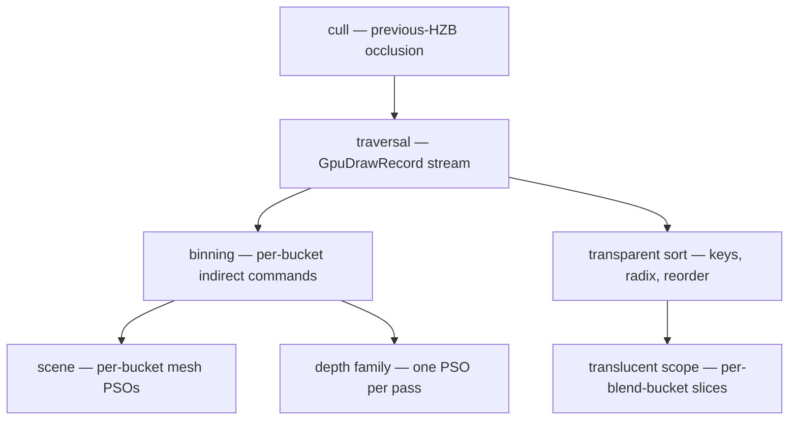

+++
title = 'Executor draws'
weight = 8
math = true
+++

# Executor draws

Every geometry pass draws from the [persistent GPU scene](../../frame-and-render-graph/persistent-gpu-scene/):
the visibility traversal emits a per-view stream of semantic draw records on the GPU, binning
kernels scatter them into indirect-command slices, and each pass replays those commands with
counted indirect draws. The CPU never builds a per-frame list of things to draw — render
preparation scales with scene *changes*, not with visible-instance count.

A frame draws the same geometry several times: shaded color, depth, shadows, G-buffer, motion
vectors. All of them consume the one record stream the traversal produced for the view.

## Records: the semantic draw vocabulary

The [visibility chain](../../frame-and-render-graph/hierarchical-visibility/) culls instances
against the previous frame's HZB, then traverses each survivor's resident page hierarchy by
projected appearance error. Every emitted `GpuDrawRecord` names one drawable cut:

```text
(geometry, instance, part, representation, material, deformation, psoBin, shaderIndex)
```

The record carries everything a draw needs to reconstruct itself on the GPU: the instance's
transform (via the instance table), the material's parameter block and textures (via the
material table), and the cluster or voxel-surface index range (via the resident page).

## Buckets: records into indirect commands

The CPU enumerates the frame's *draw buckets* — the live `(shaderIndex, psoBin)` combos the
[GPU-scene mirror](../../frame-and-render-graph/persistent-gpu-scene/) reports — and
partitions the command buffer into equal per-bucket slices (`build_executor_buckets`,
`SceneBucketTable`). The binning kernels count each record's bucket, seed per-bucket cursors,
and scatter one `VkDrawIndexedIndirectCommand` per record into its bucket's slice. A record's
command indexes the global pages arena (the executor's index buffer) with `firstInstance`
carrying the record index.

Each pass then issues one `vkCmdDrawIndexedIndirectCount` per bucket over its slice, with the
per-bucket count buffer supplying the draw count. The scene pass binds one mesh PSO per
bucket (the bucket's material class + registered shader decode to the PSO request). The depth
family (depth prepass, the virtual-shadow pages, G-buffer, motion) uses one
vertex-only executor PSO per pass for every opaque/masked bucket.

## Vertex pulling

The übershader's `vertexMainExecutor` entry runs with no vertex input state:
`SV_VulkanVertexID` is the pulled index value plus the command's `vertexOffset`,
`SV_VulkanInstanceID` is the record index. Both semantics are the Vulkan-flavoured ones on
purpose — Slang's `SV_VertexID`/`SV_InstanceID` follow D3D and subtract the draw's base
values back out, which for a displaced row would discard its slice base in the amplification
arena. The vertex loads its record, resolves the instance transform and material through the
[address block](../../frame-and-render-graph/persistent-gpu-scene/), and pulls positions
through buffer device addresses — the static vertex arena for a rigid instance, the
per-frame deformed buffer for a [skinned or morphing](../../frame-and-render-graph/compute-skinning/)
one. The emitted interface matches the instanced vertex path exactly, so every fragment
shades identically.



## Transparency

Alpha-blended records sort on the GPU: a keys kernel collects `(key, record)` pairs, a
stable LSD radix sort orders them, and a reorder kernel writes one full-length
back-to-front command slice per live blend bucket — a pair belonging to another bucket
masks to a zero draw, so each blend PSO replays the whole global order. The scene's
translucent scope draws each slice with its bucket's blend PSO (depth-test on, depth-write
off), counted by the transparent counter word.

The sorted slices live in the same command arena as the binner's bucket slices, past them,
and carry both executors' arguments at every slot exactly as the scatter writes them: the
indexed command and the mesh-task dispatch covering the same draw. One arena and one
`sliceBase` push therefore serve both scopes, so the translucent scope reaches the sorted cut
through whichever stage the frame's [executor](../../frame-and-render-graph/hierarchical-visibility/)
is — the alternative, a stream only one executor can consume, would make transparency the one
raster family that silently changes shape with the device.

The sort key is lexicographic over four words — cluster, page, instance slot, flipped
view-space depth — run least significant first, four 8-bit radix passes each, with the keys
kernel rewriting the pair's key word between levels. Depth alone is not a total order: an
instance's records all carry its origin depth, and two instances can share one exactly.
Ordering those ties by the record's own identity is what makes the emitted order a function
of the record set instead of a function of the order the traversal's atomic append happened
to produce, so a record entering or leaving the stream never reshuffles the rest and equal
keys hold their relative order from frame to frame.

## Deformation and displacement

The scene driver's per-frame job is the frame's ray instances and one `DeformationWork` item
per skinned, morphing, or displaced instance. Neither costs a scene walk. Every per-instance
fact — world bounds, the opacity class its materials resolve to, the displacement they select
— is derived by the [GPU-scene mirror](../../frame-and-render-graph/persistent-gpu-scene/)
when the journal last touched that entity, and the mirror hands the driver its cached ray cut
whole while nothing has moved and the reach window has not stepped. What is resolved live is
what no journal covers: joint palettes and morph weights, whose ECS queries visit only the
entities carrying them. The driver submits the work and the concatenated joint palette through
`Renderer::submit_gpu_scene_deformations`, which wires the skin/morph compute dispatches; the
deformed outputs are pulled by the executor vertex path.

A displaced (`HeightMode::Displacement`) instance owns a row in the frame's amplification
arena. The traversal emits one record naming that row instead of walking the instance's base
hierarchy, and the binner turns it into a counted-indirect command from the row's draw seed —
the same binned cut and the same draw call shape as every other representation (see
[displacement](../../frame-and-render-graph/compute-displacement/)).

## Stats

The frame's counters derive from the visibility readback: `drawCalls` is the emitted record
count, `instances` the cull survivors, `triangles` the traversal's per-record index counts
over three, `batches` the live bucket count. Two more report what preparation cost:
`instanceUploadBytes` is the GPU-scene table bytes staged this frame, and
`sceneGatherEntities` the instances the driver visited. Both read zero on a steady
scene of any size, which is the measurable form of "preparation scales with changes":

```sh
sa render-stats
# { "drawCalls": 12, "batches": 2, "instances": 2, "triangles": 24,
#   "instanceUploadBytes": 0, "sceneGatherEntities": 0, ... }
```

## In the code

| What | File | Symbols |
|---|---|---|
| Frame facts + deformation work | `assets/src/render_scene/{frame,gather}.rs` | `render_scene`, `gather_static_frame_facts`, `gather_skinned_frame_facts` |
| Cached per-instance facts + ray cut | `assets/src/gpu_scene_mirror/{facts,resolve}.rs` | `InstanceFacts`, `ray_instances`, `mirrored_instance`, `displaced_static_entities` |
| Buckets + visibility lists | `rendering/src/visibility.rs` | `build_executor_buckets`, `ExecutorBucket`, `SceneVisibilityView`, `ExecutorDrawInputs` |
| Pass recorders | `rendering/src/scene_pass.rs` | `record_executor_buckets`, `record_executor_depth_family`, `record_executor_transparent_stream`, `bucket_index_buffer` |
| Displacement arena | `rendering/src/tessellation.rs`; `rendering/src/renderer/tessellation_prep.rs` | `DisplacedFrameAddresses`, `DisplacedRow`, `access_displaced_arena` |
| Deformation driver | `rendering/src/renderer.rs`; `rendering/src/instancing.rs` | `submit_gpu_scene_deformations`, `DeformationWork`, `gather_instance_deformation` |
| Executor vertex path | `assets/shaders/mesh.slang` | `vertexMainExecutor` |
| Binning + sort kernels | `assets/shaders/` | `scene_bin_count/seed/scatter.slang`, `scene_transparent_keys.slang`, `scene_transparent_reorder.slang` |

> [!NOTE]
> The shader and the unlit flag follow `MaterialSet` slot 0 for the whole mesh, so one mesh
> cannot mix lit and unlit submeshes. Blend mode, textures, and every PBR factor vary freely
> per submesh through the material table.

## Related

- [Persistent GPU scene](../../frame-and-render-graph/persistent-gpu-scene/) — the tables the records resolve through
- [Hierarchical visibility](../../frame-and-render-graph/hierarchical-visibility/) — the cull + traversal that emits the records
- [Bindless textures](../../materials-and-pipelines/bindless-textures/) — why textures never split a bucket
- [Materials & PSOs](../../materials-and-pipelines/material-and-pso-selection/) — the bucket → PSO resolution
- [Compute skinning](../../frame-and-render-graph/compute-skinning/) — how a deforming instance is drawn
- [Render graph](../../frame-and-render-graph/render-graph-overview/) — the passes that replay the commands
- [Render commands](../../tooling-and-control/render-commands/) — reading the draw stats live
