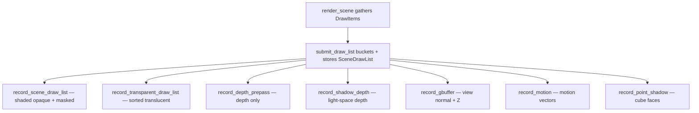

+++
title = 'Draw list'
weight = 8
math = true
+++

# Draw list

A draw list is a flat snapshot of everything the scene wants drawn this frame, gathered once
from the ECS into plain data and then replayed by every geometry pass. It sits between the
scene description and the Vulkan commands: the world is walked one time into a list of items,
and the [render graph](../../frame-and-render-graph/render-graph-overview/) passes consume
that list instead of querying the live scene.

A frame draws the same geometry several times: shaded color, depth, shadows, G-buffer, motion
vectors. Decoupling the gather from the record keeps the scene traversal in one place, and
each pass reads the one prepared list.

## Gather: ECS into DrawItem

`render_scene` walks the `hecs` world in two sweeps. `gather_static_draw_list` visits every
entity with a `Transform` and a `MeshComponent`, resolves the mesh through the
[asset server](../asset-server-and-catalog/) (`load_mesh_asset`) and its materials through
`resolve_entity_materials`, and pushes one `DrawItem`. `gather_skinned_draw_list` does the
same for `SkinnedMesh` entities, concatenating each one's joint palette into the frame's
joint array.

```rust
pub struct DrawItem {
    pub mesh: Arc<GpuMesh>,
    pub model: Mat4,
    pub normal_matrix: Mat4,
    pub submesh_materials: Vec<SubmeshMaterial>, // one per submesh (clamped)
    pub material: Material,      // the PSO base: shader + unlit
    pub skinned: bool,
    pub joint_offset: u32,       // this instance's slice of the joint palette
    pub joint_count: u32,
    pub morph_weights: Vec<f32>, // empty = not a morph draw
    pub entity: u64,             // keys the cross-frame motion caches
}
```

`SubmeshMaterial` is the fully resolved surface for one submesh: texture handles (each `None`
falls back to the default white slot), PBR factors, UV tiling and offset, the blend mode, and
the height mode. `resolve_entity_materials` builds one per mesh submesh from the entity's
`MaterialSet`: each submesh's `material_slot` picks a slot (clamped to the slot count), and
each slot loads its referenced `.smat` asset with the slot's sparse overrides layered on top.
The whole-mesh `unlit` flag and the codegen shader follow slot 0; an entity with no
`MaterialSet` resolves to engine defaults.

The static sweep also accumulates the world-space scene bounds by transforming each mesh's
local AABB by its model matrix; the
[directional shadow](../../shadows-and-culling/directional-shadows/) frustum is fit to that
box. `render_scene` then collects lights and camera state and hands the items plus the joint
palette to the renderer's `submit_draw_list`, a `SceneRenderer` trait method.

## Bucket: DrawItem into instanced batches

`Instancing::submit_draw_list` merges items into buckets keyed on the mesh, the shader, the
unlit flag, and the per-submesh blend pattern. The key omits every texture: albedo and the
other maps are [bindless](../../materials-and-pipelines/bindless-textures/) indices carried
in the per-instance data, so two items that differ only by texture batch together. A skinned,
morph-active, displaced, or translucent-carrying item never merges — it keeps its own
deformed-buffer slice or depth-sort key.

Each item expands to one `InstanceData` row per submesh: model matrix, normal matrix,
previous model, base color, bindless texture indices, and an index into the frame's
deduplicated material table, packed to a 256-byte
[std430](https://docs.vulkan.org/guide/latest/shader_memory_layout.html) row. The rows
flatten *submesh-major*: a bucket of $N$ instances over a mesh with $S$ submeshes stores
submesh 0's $N$ rows, then submesh 1's $N$ rows, and so on.

Drawing submesh $s$ then offsets `firstInstance` by $s \times N$
(`base_instance + s * instance_count` in `record_batch_submeshes`). Vulkan's instance index
[includes `firstInstance`](https://docs.vulkan.org/spec/latest/chapters/drawing.html), so the
[übershader](../../materials-and-pipelines/ubershader-and-specialization/) reads each
instance's per-submesh material straight from the instance buffer with no per-submesh
descriptor or PSO change.

The PSO is resolved per submesh from the bucket's base material plus that submesh's blend
mode, and submeshes sharing a PSO group into one `DrawBatch` (see
[materials & PSOs](../../materials-and-pipelines/material-and-pso-selection/)). Opaque and
masked groups land in `batches`; translucent ones become lone-instance batches in
`transparent_batches`, sorted back-to-front by clip-space $w$. Every batch from the same mesh
reads the one shared submesh-major instance block.

```rust
pub struct SceneDrawList {
    pub view_proj: Mat4,
    pub batches: Vec<DrawBatch>,             // opaque + masked, first-seen order
    pub transparent_batches: Vec<DrawBatch>, // back-to-front translucent draws
    pub skin_dispatches: Vec<SkinDispatch>,  // + morph/displace + prev-pose lists
    pub deformed_rt_instances: Vec<DeformedRtInstance>,
    pub live_textures: Vec<Arc<GpuTexture>>, // pins indexed textures for the frame
    pub valid: bool,
}
```

`live_textures` holds an `Arc` to every texture an instance row indexed, so a texture cannot
be freed mid-frame while a bindless slot still points at it. A deforming item
([skinned](../../frame-and-render-graph/compute-skinning/), morph-active, or
[displaced](../../frame-and-render-graph/compute-displacement/)) is written once by its
compute pre-pass into a slice of the frame's deformed-vertex buffer, then drawn as a static
instance reading that slice.

## Replay: one list, many passes

A single `SceneDrawList` feeds every geometry pass in the frame, each recording the same
batches with a different pipeline and push constant:



The shaded pass `record_scene_draw_list` binds the bindless, light, instance, IBL, and
screen-space descriptor sets once, pushes the camera `view_proj`, then per batch binds its
PSO and vertex streams; the bind count is constant in the batch count. The shared
`record_batch_submeshes` helper issues one `cmd_draw_indexed` per submesh with the batch's
instance count and the submesh-major `firstInstance` offset. In the scene pass it also
applies each submesh's backface-cull mode (two-sided disables culling) through dynamic state.

`record_transparent_draw_list` replays the sorted translucent batches in the scene pass's
trailing scope with the blend PSO: depth-test on, depth-write off, nearer surfaces
compositing over farther ones. The depth, shadow, G-buffer, motion, and point-shadow passes
are vertex-only variants of the same loop that bind only the instance set and push their own
matrix. All of them replay `batches` only — translucent draws write no depth.

## Stats

`submit_draw_list` tallies `RenderStats` while flattening: draw calls (one `cmd_draw_indexed`
per submesh per batch), distinct batches, total instances, and triangles. The control plane
exposes the counters, so instanced batching is checkable live — two cubes with different
textures collapse to one batch:

```sh
sa render-stats
# { "drawCalls": 1, "batches": 1, "instances": 2, "triangles": 24, ... }
```

## In the code

| What | File | Symbols |
|---|---|---|
| Gather ECS → items | `assets/src/render_scene.rs` | `render_scene`, `gather_static_draw_list`, `gather_skinned_draw_list` |
| Resolve materials | `assets/src/render_material.rs` | `resolve_entity_materials`, `ResolvedMaterials`, `build_submesh_material` |
| Item + list types | `rendering/src/draw_list.rs` | `DrawItem`, `SubmeshMaterial`, `DrawBatch`, `SceneDrawList`, `RenderStats` |
| Bucket + flatten + stats | `rendering/src/instancing.rs` | `Instancing::submit_draw_list`, `build_instance_rows`, `compute_stats` |
| Per-instance row | `rendering/src/gpu_types.rs` | `InstanceData` |
| Shaded + translucent replay | `rendering/src/scene_pass.rs` | `record_scene_draw_list`, `record_transparent_draw_list`, `record_batch_submeshes` |
| Vertex-only replays | `rendering/src/scene_pass.rs`; `rendering/src/aa.rs` | `record_depth_prepass`, `record_shadow_depth`, `record_gbuffer`, `record_point_shadow`, `record_motion` |

> [!NOTE]
> The shader and the unlit flag are per item (they follow `MaterialSet` slot 0), so one mesh
> cannot mix lit and unlit submeshes. Blend mode, textures, and every PBR factor vary freely
> per submesh.

## Related

- [Asset catalog](../asset-server-and-catalog/) — resolves each item's mesh + textures
- [Bindless textures](../../materials-and-pipelines/bindless-textures/) — why textures never split a batch
- [Materials & PSOs](../../materials-and-pipelines/material-and-pso-selection/) — the per-submesh PSO resolution
- [Compute skinning](../../frame-and-render-graph/compute-skinning/) — how a deforming item is drawn
- [Render graph](../../frame-and-render-graph/render-graph-overview/) — the passes that replay the list
- [Render commands](../../tooling-and-control/render-commands/) — reading the batch/draw stats live
