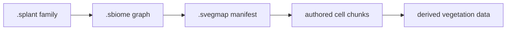

+++
title = 'Vegetation assets'
weight = 12
+++

# Vegetation assets

Vegetation authoring has three catalog asset kinds: plant families, biome graphs, and world maps.
Each kind owns a different part of the authored truth, while compiled cells and render data remain
disposable products.

## Three asset kinds

| Extension | Rust model | Owns |
|---|---|---|
| `.splant` | `PlantFamilyAsset` | Intrinsic plant structure, mechanics, phenotypes, proxies, materials, and habitat defaults |
| `.sbiome` | `BiomeAsset` | Community palette, density, suitability, competition, succession, seeds, and reusable graph modules |
| `.svegmap` | `VegetationMapAsset` | World bounds, ordered layers, local biome instances, and sparse authored chunk policy |

A `.splant` has exactly one source. An imported recipe records source identities, normalization
settings, semantic-part mapping, and provenance. A native source embeds one typed botanical graph.
Both fill the same normalized parts, dimensions, spines, mechanics, phenotype, collision, navigation,
interaction, and habitat fields.

A `.sbiome` declares either a root graph or a reusable module with typed parameters. Module calls are
ordinary `.sbiome` references with stable call identities. Asset validation rejects cycles and
requires a finite recursion bound, so modules do not create another graph-asset format.
[Biome graph evaluation](../biome-graph-evaluation/) covers typed compilation, deterministic cell
jobs, execution domains, and provenance.

## Sparse map package

The `.svegmap` file is the manifest of one logical catalog asset. Its sibling package directory holds
authored chunks addressed by `WorldCellKey`. Chunks contain quantized fields, explicit plants, pins,
transform and state overrides, blockers, and compact provenance.

Chunk writes are atomic and operate on the supplied cell set. Editing one cell does not rewrite the
manifest or neighbouring chunks. The map content hash covers the manifest and package, so catalog
scans detect a chunk edit without treating each chunk as an independent asset.



Generated `.splantc` and `.svegcell` files are outside `AssetType`. The scanner ignores them, the
import command rejects them, and cache cleanup cannot remove authored plant, biome, map, or chunk
bytes.

## Catalog and editor

Plant, biome, and vegetation-map rows use the same catalog operations as other standalone assets.
Their names and folders persist through `.smeta` sidecars; cold scans recover the type and content
hash. Each kind has a cached vector thumbnail and opens in the vegetation asset workspace.

The control plane imports and inspects the native formats directly:

```sh
sa import-vegetation-asset ./oak.splant plants
sa -o json vegetation-asset-summary 4101
```

References form catalog dependency edges. Plant families reference materials and optional source
assets. Biomes reference plant families and biome modules. Maps reference their biome instances,
layer dependencies, explicit plant families, and surface providers.

## In the code

| What | File | Symbols |
|---|---|---|
| Domain models and validation | `vegetation/src/asset.rs` | `PlantFamilyAsset`, `BiomeAsset`, `VegetationMapAsset` |
| Canonical codecs | `vegetation/src/codec.rs` | `write_plant_asset`, `write_biome_asset`, `write_vegetation_map_asset` |
| Catalog integration and sparse chunks | `assets/src/vegetation.rs` | `import_vegetation_asset`, `write_vegetation_map_chunks` |
| Scan and dependency graph | `assets/src/scan.rs`, `manage.rs` | `reconcile_catalog_from_disk`, `build_dependency_graph` |
| Native editor summary | `control/src/commands_asset.rs`, `VegetationAssetWorkspace.tsx` | `vegetation-asset-summary`, `VegetationAssetWorkspace` |

## Related

- [Asset server and catalog](../asset-server-and-catalog/) — catalog identity, sidecars, scans, and caches
- [Vegetation state](../../scene-and-ecs/vegetation-state/) — plant identities and persistent changes
- [Biome graph evaluation](../biome-graph-evaluation/) — typed compilation and deterministic placement
- [Spatial world](../../scene-and-ecs/spatial-world/) — exact cells, positions, surfaces, and fixed numerics
- [Native materials](../../materials-and-pipelines/native-materials/) — thin-sheet foliage material data
