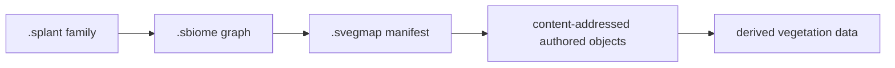

+++
title = 'Vegetation assets'
weight = 12
+++

# Vegetation assets

Vegetation authoring has three catalog asset kinds: plant families, biome graphs, and world maps.
Each kind owns a different part of the authored truth, while compiled cells and render data remain
disposable products.

## Three asset kinds

| Extension | Rust model | Owns |
|---|---|---|
| `.splant` | `PlantFamilyAsset` | Tags, intrinsic structure, mechanics, phenotypes, proxies, materials, and habitat defaults |
| `.sbiome` | `BiomeAsset` | Community palette, density, suitability, competition, succession, seeds, and reusable graph modules |
| `.svegmap` | `VegetationMapAsset` | World bounds, ordered layers, local biome instances, and sparse authored chunk policy |

A `.splant` has exactly one source. An imported recipe records source identities, normalization
settings, semantic-part mapping, and provenance. A native source embeds one typed
[botanical graph](../botanical-graph/), which grows the family's geometry instead of referencing it.
Both fill the same normalized parts, dimensions, spines, mechanics, phenotype, collision, navigation,
interaction, and habitat fields.

A plant export from a commercial modeller is an ordinary glTF or OBJ import: nothing about the tool
that wrote it needs its own code path, which is why the importer accepts one without knowing what
produced it. What does need care is attribution. A file's own asset block states what wrote it and
what it says about reuse, and the plant compiler raises a warning when a source file states a copyright
that the plant source records no attribution for.

The statement is surfaced verbatim rather than folded into the authored provenance. Filling in a
licence the engine inferred from a tool name would put a legal claim in the artifact that nobody
authored. Reimport settings ride on the source reference itself, so a recook reads the file exactly as
the first import did.

Plant-family tags are stable nonzero `PlantTagId` values stored in sorted, unique order. They classify
the family independently of a biome palette and participate in canonical `.splant`, `.splantc`, and
generation-manifest identities. The artifact store rejects a manifest whose plant tags differ from
the compiled family part table.

A `.sbiome` declares either a root graph or a reusable module with typed parameters. Module calls are
ordinary `.sbiome` references with stable call identities. Asset validation rejects cycles and
requires a finite recursion bound, so modules do not create another graph-asset format.
[Biome graph evaluation](../biome-graph-evaluation/) covers typed compilation, deterministic cell
jobs, execution domains, and provenance.

## Sparse map package

The `.svegmap` file is the root of one logical catalog asset. Its inventory maps typed logical keys
to immutable content hashes. The sibling `.svegmap.data/objects` directory stores field tiles,
anchor and override chunks, biome instances, layer metadata, and optional brush history.

A map transaction writes validated objects under their final hashes, then commits a new root
generation. The root changes only after every object is durable. Readers therefore observe either
the complete earlier generation or the complete new generation, including transactions that touch
several cells.



Generated `.splantc` and `.svegcell` files are outside `AssetType`. The scanner ignores them, the
import command rejects them, and cache cleanup cannot remove authored plant, biome, map, or chunk
bytes.

## Catalog and editor

Plant, biome, and vegetation-map rows use the same catalog operations as other standalone assets.
Their names and folders persist through `.smeta` sidecars; cold scans recover the type and content
hash. Each kind has a cached vector thumbnail and opens in a read-only vegetation asset workspace.

The workspace shows schema version, validation issues, source provenance, exact dependencies, and
live cook statistics. Plant summaries include source kind, semantic-part and phenotype counts, and
material slots. Biome summaries show role, palette, modules, and parameters; map summaries show
bounds, chunk level, biome instances, and ordered layer metadata.

The control plane imports and inspects the native formats directly:

```sh
sa import-vegetation-asset ./oak.splant plants
sa -o json vegetation-asset-summary 4101
```

References form catalog dependency edges. Plant families reference materials and optional source
assets. Biomes reference plant families and biome modules. Maps reference their biome instances,
layer dependencies, explicit plant families, and surface providers.

## In the code

| What | File | Symbols |
|---|---|---|
| Domain models and validation | `vegetation/src/asset.rs` | `PlantFamilyAsset`, `BiomeAsset`, `VegetationMapAsset` |
| Canonical codecs | `vegetation/src/codec.rs` | `write_plant_asset`, `write_biome_asset`, `write_vegetation_map_asset` |
| Catalog integration and map transactions | `assets/src/vegetation.rs` | `load_vegetation_map_snapshot`, `commit_vegetation_map_transaction` |
| Scan and dependency graph | `assets/src/scan.rs`, `manage.rs` | `reconcile_catalog_from_disk`, `build_dependency_graph` |
| Native editor summary | `control/src/commands_asset.rs`, `VegetationAssetWorkspace.tsx` | `vegetation-asset-summary`, `VegetationAssetWorkspace` |

## Related

- [Asset server and catalog](../asset-server-and-catalog/) — catalog identity, sidecars, scans, and caches
- [Vegetation state](../../scene-and-ecs/vegetation-state/) — plant identities and persistent changes
- [Biome graph evaluation](../biome-graph-evaluation/) — typed compilation and deterministic placement
- [Vegetation cooking](../vegetation-cooking/) — immutable plant, cell, and manifest artifacts
- [Spatial world](../../scene-and-ecs/spatial-world/) — exact cells, positions, surfaces, and fixed numerics
- [Native materials](../../materials-and-pipelines/native-materials/) — thin-sheet foliage material data
