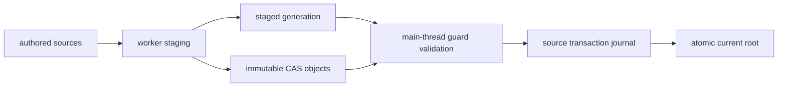

+++
title = 'Vegetation cooking'
weight = 14
+++

# Vegetation cooking

Vegetation cooking turns authored plant families, biome graphs, map objects, and surface snapshots
into immutable artifacts. Canonical inputs determine every output identity; worker scheduling and
observational measurements do not change a generation.

## Plant normalization

Every `.splant` enters one compiler and produces one normalized family contract. An imported recipe
resolves catalog models, meshes, and materials or a standard glTF, GLB, or OBJ file into a complete
format-erased snapshot. The compiler transforms spatial and UV conventions, builds valid tangent
frames, resolves material slots, and validates skin, joint, and semantic selections.

A native source contributes its canonical embedded botanical graph and complete material closure
through the same compiler input. Native-generated and imported sources fill the same geometry,
joint, phenotype, collision, navigation, provenance, and validation facets.

Each family carries sorted, unique, nonzero `PlantTagId` values. The compiler writes those tags into
the `.splantc` part table, and the world manifest repeats them in its plant directory. Generation
validation requires the authored asset, compiled artifact, and manifest row to agree exactly.

Manual imported-source targets remain attached to stable element and submesh selectors. A missing
selector produces a typed conflict and blocks publication. Changed source observations become
authored recipe state only when their staged generation commits.

That write-back is why a family's *declared* identity — everything it authors, with the observed hash
of each external source left out — is what a graph folds in when it names the family. A cook accepts
what it observed and publishes a generation in the same operation, so a graph keyed on the
observation would key the generation on bytes that same cook replaced, and the next cook of untouched
sources would land somewhere else. What the file itself holds still reaches every artifact: the
family's own cook node depends on the source bytes directly, and a cell depends on the compiled
family's output.

## Staging and commit

A cook has one publication route. A worker receives a `CookProjectView` containing project paths and
an immutable catalog snapshot, reads authored bytes through `CookAssetReader`, evaluates the graph,
and writes validated plant, cell, graph, and manifest objects to the content-addressed store (CAS).
These objects do not become the map's visible generation until its current root points at their
manifest.

Every worker read records an `AuthoredInputGuard`: canonical path, byte offset, byte length, and
content hash. Surface providers contribute immutable descriptors with stable identities and
revisions, and they answer masked coverage at one canonical phase; a provider revision does not
cover the raster path's per-frame dither, so an answer that followed it would change cooked bytes
while every cook key stayed the same. The worker checks cancellation between plant, global-stage,
and cell work and before it returns `StagedVegetationCook` to the control thread.

The control thread captures the live surface descriptors and calls `commit_staged_vegetation_cook`.
Commit takes the project-wide authored lock before the map generation lock, recovers any transaction
journal, and revalidates all of these inputs:

- project asset and cache roots;
- catalog rows and owning containers used by the generation;
- exact guarded file spans;
- surface-provider identities and revisions;
- the expected current manifest;
- accepted plant-family source bytes.

Commit writes a durable journal before installing accepted plant source observations. It validates
the complete CAS closure, advances the current-generation root last, and removes the journal after
success. A failure before root publication restores installed plant assets in reverse order. Crash
recovery chooses the journal's old or new plant bytes from the visible root identity.

Cook jobs are bounded and asynchronous. A new job for the same map cancels and marks the older queued
or running job as `superseded`; project replacement and shutdown cancel active jobs. Cancellation is
cooperative, while commit is an atomic main-thread operation: a result already entering commit may
complete, but readers still observe either the complete old generation or the complete new one.



## The work plan

Cell cooks execute through a published work plan rather than a loop. After evaluation, staging
builds one `CookWorkManifest`: an item per cell in coarsest-level-first order, each carrying a
payload (its own, ancestor-independent dependency half, published to the store), an own-input key
hashed under its own domain string, and `blocked_by` — the containing planned cell at every coarser
level, always an earlier item, so acyclicity holds by construction.

Execution is a claim protocol on disk, keyed by the plan's content identity. A claimant wins an
item by atomically creating its claim file, verifies the payload against the item's own-input key,
composes the full cook key only once its ancestors' completions publish their output hashes, cooks
and publishes the cell, and records a completion marker separate from the claim — so a swept claim
never erases a finished result. A stale sweep at plan start frees claims whose lease expired
without a completion; sweeping is safe because publication is idempotent by content address. The
single committer then assembles completions in item order into the generation's manifest and cook
graph. The in-process worker pool is the local degenerate case of a remote fleet: it races the
same on-disk claims a remote claimant would, and an interrupted run's completions count on resume.

## Artifact facets

`.svegcell` and `.splantc` use strict tables of contents. Each section records its kind, semantic
version, codec, alignment, byte sizes, and content hash. The cell format has twelve independent
facets:

| Facet | Owns |
|---|---|
| `macro-points` | Canonical schema-hashed point columns |
| `micro-fields` | Quantized density and attribute tiles |
| `provenance` | Accepted-point decision provenance |
| `rejection-diagnostics` | Rejected candidates and diagnostic streams |
| `surface-attachments` | Point-to-surface attachments and projection coordinates |
| `surface-dependencies` | Provider and tile revisions used for replay |
| `render-references` | Family, variation, and phenotype representation references |
| `render-bounds` | Static and deformation-aware conservative bounds |
| `collision-inputs` | Broadphase and collision-proxy derivation inputs |
| `navigation-contributions` | Obstacles and traversal-cost contributions |
| `ecology-boundary` | Cross-cell ecology boundary summaries |
| `ecology-checkpoint` | Deterministic ecology checkpoint seeds |

`VegetationCellArtifactReader` validates the header, table, padding, section hashes, payload hash,
complete artifact hash, and file extent through bounded-memory streaming. A caller can then seek to
one range and read that facet without allocating unrelated sections; the selected bytes are hashed
again after the ranged read.

The manifest binds the world and map identities to graph, plant, surface, schema, numeric, compiler,
and platform hashes. Its directory records plant tags and exact cell-to-cell content dependencies.
Store validation cross-checks the graph outputs, manifest rows, compiled plant headers, tag tables,
cell headers, section tables, and dependency targets before root publication.

The compiled plant table contains all seventeen required facets: source normalization, part table,
geometry, materials and coverage, skeleton and weights, phenotypes, collision, navigation,
provenance, triangle hierarchy, voxel hierarchy, deformation, page directory, ray-tracing metadata,
validation, the distance field, and the texture container. The triangle and voxel sections form one
portable hierarchy with parent-first page dependencies and a guaranteed drawable root. See
[virtual geometry](../virtual-geometry/) for its cluster, aggregate, residency, and global GPU
contracts.

The texture-container section carries the family atlas's texels as a KTX2 container: the declared
`VkFormat`, the base extent, and a level index over the complete mip chain. Being a standard
container is the point — the payload states its own format and extent, so the loader uploads what
the bytes declare instead of what the calling code assumes, and the section can be lifted out and
opened by any texture tool.

It stores no supercompression of its own, because the section codec already frames the payload at
the artifact's one pinned zstd profile. Where each slot landed stays in the materials-and-coverage
section, so the layout and the texels are one atlas published as two sections; a family carrying
only one half fails the cook.

The distance-field section is what lets a placed plant occlude
[global illumination](../../global-illumination-and-raytracing/distance-field-reflection-occlusion/):
a family-space SDST field derived from the coarsest aggregate voxel brick's occupancy — the same
grid the aggregate raster form draws — through an exact integer distance transform, so the bytes
are identical on every target. It is encoded by the same codec the mesh bake's sidecar uses; at
load the family's mesh carries it like any baked field, and the occluder scatter emits it per
placed plant. A family that cooked no voxel brick writes an empty section and occludes nothing.

Work estimates participate in canonical graph and manifest bytes. Measured duration, memory, byte
counts, rejection totals, and cache-hit state remain job observations. `vegetation-cook-status` and
asset summaries report those values without making machine speed or cache history part of an
artifact identity.

## Control and inspection

The control plane starts a cook, polls or cancels its job, and inspects immutable results:

```sh
sa -o json vegetation-cook 4103 '{"kind":"all"}'
sa -o json vegetation-cook-status --job 7
sa -o json vegetation-cancel-cook --job 7
sa -o json vegetation-manifest 4103
sa -o json vegetation-cell-inspect 4103 '{"coordinates":["12","-4","9"],"level":0}'
sa -o json plant-validate 4101
sa -o json plant-recook 4101
```

`vegetation-cook-status` exposes `queued`, `running`, `completed`, `cancelled`, `superseded`, and
`failed` states with monotonic node, cache-hit, and cell-publication progress. A completed status
includes the manifest and live statistics. `vegetation-manifest` reads the current root by default or
an exact manifest identity; `vegetation-cell-inspect` returns a validated cell header and section
directory through the streamed reader.

`plant-validate` resolves the retained source recipe without publication. It reports source
selectors, provenance, conflicts, diagnostics, normalized counts, source updates, and exact cook-key
dependencies. `plant-recook` runs the same preparation and publishes the validated `.splantc`, with
an optional platform profile.

## Where the outputs live

Derived artifacts sit in a content-addressed store at `<project>/cache/vegetation/`, beside `assets/`
rather than inside it, so a catalog scan never reaches them and a copy of the authored assets never
carries them. Everything under that root is reproducible: delete it and the next cook rebuilds
byte-identical artifacts, because canonical inputs determine every output identity.

Persistent state is not reproducible, so it has its own root at `<project>/state/vegetation/`. A
published baseline is a snapshot of runtime mutations that no authored source regenerates, and keeping
it among disposable artifacts would mean clearing a cache destroys authored work. Those two roots are
the durability boundary: anything that copies vegetation — an export, a packager — copies both, and
the export closure lists them separately because they land in different places.

## Verifying what is on disk

An artifact's file name *is* the hash of its bytes, so verifying the store is a rehash rather than a
comparison against a side table that could itself rot. `vegetation-verify-artifacts` walks every
artifact the current generations name and reports each fault as `absent` or `corrupt`.

Repair deletes rather than rewrites. The bytes are the only copy, so there is nothing to rewrite from,
and the cooker's cache-miss path is already the thing that produces them — removing a corrupt artifact
is exactly what makes the next cook republish it.

```sh
sa vegetation-verify-artifacts '{"repair":true}'
#   checked=41  repaired=1  faults=[{"path":"cells/9f….svegcell","fault":"corrupt"}]
```

## What an export packages

A player never reads an authored `.splant`, `.sbiome`, or `.svegmap`. It binds a map's current
generation from the artifact store and streams the cells that generation names, so an exported package
carries the store's closure: the generation root, its manifest, and every compiled family and cell the
manifest names.

The closure comes from the manifest, not from a directory scan. A scan would copy every artifact the
project ever cooked, superseded generations included, which is how a package quietly grows to several
times the size of the world it ships.

A world may also ship a starting state. `vegetation-state-baseline` publishes the runtime's current
persistent state as the map's baseline, behind the same promoted-plant flush a save takes, and the
runtime imports it when it binds — so a shipped world boots into what the author saw rather than into
an untouched one. The baseline is keyed by the authored map and names inside itself the generation it
was reduced against; one per map, because a map has one accumulated world. It travels from the durable
state root into the package's own state root, so a player that clears its artifact cache still boots
into the authored starting state.

Keying it by the map rather than by the generation is what lets it survive a recook. A cook that
accepts an authored source observation, or an authored edit, publishes a different generation
identity; state keyed to the old one would be orphaned on disk while the world came up bare. The
runtime instead rebases what it holds onto the incoming base — the identity moves, every delta
crosses — because a plant is addressed by an identity derived from authoring ancestry rather than by
the cook that placed it. A delta the new base has no ground for is inert rather than dropped.

Every packaged plant source whose provenance requires attribution gets a line in the package's
`ATTRIBUTION.txt`. A licence obligation that lives only in the editor is one the shipped product
breaks.

`export-app` reports what it packaged, per map: the manifest identity, family and cell counts, macro
plants, closure bytes, and stored bytes per cell facet. The facet figures come from each cell's table
of contents rather than by decoding it — a size report that decodes every section costs as much as
loading the world it reports on. An artifact the manifest names but the store does not hold is a
warning naming the map and the count, because a package built on a partial cook fails at the player's
first frame instead of at export.

The authored `.splant`, `.sbiome`, and `.svegmap` files stay behind, along with their sidecar
packages. That is safe on two counts: the project loader treats the filesystem as the source of truth
and drops a catalog row whose file is absent, and vegetation binds by identity through the artifact
store rather than through the catalog.

## In the code

| What | File | Symbols |
|---|---|---|
| Cook identities and dependency graph | `vegetation/src/cook.rs` | `CookGraph`, `CookNodeRecord`, `CookDependency` |
| Sectioned artifact formats and ranged reads | `vegetation/src/artifact/cell.rs` · `plant.rs` | `VegetationCellArtifactReader`, `VegetationCellSectionKind`, `PlantCompiledArtifactIndex` |
| Complete base manifest | `vegetation/src/manifest.rs` | `VegetationBaseManifest`, `VegetationManifestCell` |
| Plant source normalization | `vegetation/src/plant_compile.rs` | `compile_plant_family`, `PlantCompileOutput` |
| Portable triangle/voxel hierarchy | `vegetation/src/virtual_hierarchy.rs` | `cook_portable_virtual_hierarchy`, `validate_portable_virtual_hierarchy` |
| Read guards and catalog snapshot | `assets/src/cook_reader.rs` | `CookProjectView`, `CookAssetReader`, `AuthoredInputGuard` |
| Staging, journal recovery, and commit | `assets/src/vegetation_cooker.rs` | `stage_vegetation_cook`, `StagedVegetationCook`, `commit_staged_vegetation_cook` |
| Work plan, claims, and completions | `vegetation/src/cook_work.rs`, `assets/src/vegetation_cooker.rs`, `assets/src/vegetation_store.rs` | `CookWorkManifest`, `CookWorkPayload`, `CookWorkCompletion`, `cook_work_own_input_key`, `run_work_items`, `cook_one_cell`, `claim_work_item`, `sweep_stale_work_claims` |
| Content-addressed publication | `assets/src/vegetation_store.rs` | `VegetationArtifactStore`, `publish_generation_locked` |
| Durable persistent-state root | `assets/src/vegetation_state.rs` | `VegetationStateStore`, `publish_baseline`, `read_baseline_if_present` |
| Export closure over both roots | `assets/src/vegetation_export.rs` | `vegetation_export_closure`, `VegetationExportClosure` |
| Asynchronous jobs and commands | `control/src/vegetation_cook_jobs.rs`, `control/src/commands_vegetation.rs` | `VegetationCookJobs`, `register_vegetation_commands` |

## Related

- [Vegetation assets](../vegetation-assets/) — authored plant, biome, and map ownership
- [Biome graph evaluation](../biome-graph-evaluation/) — canonical placement and provenance
- [Vegetation state](../../scene-and-ecs/vegetation-state/) — runtime base-plus-delta state
- [Spatial world](../../scene-and-ecs/spatial-world/) — cells, fixed numerics, and surface providers
- [Asset commands](../../tooling-and-control/asset-commands/) — shell access to cook and inspection commands
