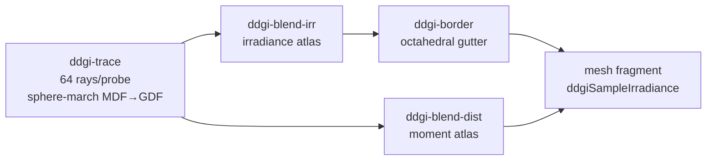

+++
title = 'DDGI overview'
weight = 1
+++

# DDGI overview

Dynamic Diffuse Global Illumination is a real-time technique that computes multi-bounce diffuse
indirect light from a grid of irradiance probes re-traced a slice at a time across frames. Each probe
gathers radiance by sphere-marching rays through the real distance field — the per-mesh signed
distance field for the near field and the camera-centered [Global Distance Field](../../) clipmap
beyond — and the sky enters a ray's radiance only when that ray escapes to open space. A shaded
surface then samples the nearest probes for its diffuse indirect term.

The probe cage follows the camera, so indirect light is always resolved where the player is looking;
the trace is software, so DDGI runs on any GPU including the llvmpipe dev device.

## The per-frame pipeline

DDGI is an all-compute prelude before the scene pass. Four passes rebuild the probe state each
frame, then the mesh fragment reads it. The probes form a 16×8×16 camera-centered clipmap
(`DDGI_PROBES_X/Y/Z`) at a fixed 1.5 m spacing (`DDGI_PROBE_SPACING`), each tracing 64 rays
(`DDGI_RAYS_PER_PROBE`).



1. **Trace** sphere-marches 64 Fibonacci-sphere rays from each probe through the shared distance
   field (the `sdf` module's `sampleField`: the full-resolution per-mesh MDF for the first ~2 m, the
   Global Distance Field beyond), returning radiance and hit distance per ray
   ([software trace](../software-ray-trace/)). The trace is **budgeted**: each frame re-rays only a
   rolling `DDGI_PROBE_BUDGET` slice (a quarter of the volume), the offset advancing so the whole
   grid refreshes every four frames at a quarter of the trace cost. Untraced probes keep their last
   rays, which the (full) blend re-applies — stable while the volume is static, a few frames of
   latency under fast relight or a camera scroll. Only the expensive trace is budgeted; the cheap
   blend + border passes stay full-volume.
2. **Blend irradiance** and **blend distance** integrate those rays into two octahedral atlases —
   directional irradiance and Chebyshev distance moments — with temporal hysteresis.
3. **Border** copies each probe tile's octahedral gutter so bilinear sampling wraps correctly. These
   three live in [the atlases](../irradiance-and-moment-atlases/).

The mesh fragment then calls `ddgiSampleIrradiance(worldPos, n)`, which blends the eight probes
around the surface using trilinear, backface, and Chebyshev weights
([probe sampling](../probe-volume-and-sampling/)) and *replaces* the analytic IBL diffuse where the
cage covers the surface (gated on `screenFlags.z`).

## Sky on miss — why interiors go dark

The key to occluded indirect light is structural, not a visibility factor. A probe inside a sealed
room sphere-marches its rays against the room's real geometry: almost every ray hits an enclosing
wall and returns that wall's (dim) outgoing radiance — a flat per-cell base color from the
[lite albedo cache](../../) times a crude sun+sky direct term, plus last frame's bounce. Only a ray
that genuinely escapes through an opening returns the sky color. So an enclosed probe is dark by
construction, while an exterior probe — whose rays escape — picks up the sky.

This is the Lumen-style piece, and it is why the analytic [IBL diffuse](../../image-based-lighting/ibl-overview/)
is *replaced* by DDGI irradiance where the probe cage covers a surface rather than added to it: the
probe already carries its own sky occlusion, so stacking the two would re-introduce the indoor
skybox leak DDGI exists to kill.

`ddgiSampleIrradiance` returns coverage in `w` — the saturated trilinear weight mass, ~1 deep inside
the cage and falling toward 0 outside it. The shading code lerps the probe irradiance over the
analytic irradiance by that coverage:

```hlsl
indirectIrr = lerp(indirectIrr, ddgi.rgb, ddgi.w);
```

Where coverage is full the occluded probe irradiance wins outright; where the cage thins out (a
surface beyond the camera-centered volume) the analytic term carries over.

## A camera-centered scrolling clipmap

The probe cage is not authored and does not fit the scene. `set_ddgi_scene` runs from `render_scene`
each frame with the camera position, and the volume snaps its min corner to the probe grid so the
cage centres on the camera without shimmering sub-cell. As the camera moves a whole cell, the cage
scrolls: probes are addressed **toroidally** (a probe's physical atlas tile is `wrapMod(cell, count)`),
so every probe that stays in view keeps its tile *and* its converged history, and only the leading
slab that scrolls in is fresh. A scrolled-in probe drops its stale history the first time it is
re-rayed (a per-probe generalization of the whole-volume first-frame reset), so the volume keeps
converging while the player walks instead of flashing.

Probe spacing is fixed at 1.5 m — below typical wall thickness — so the Chebyshev moment test can
actually bound light leaking between rooms, and the near-field MDF trace keeps full per-mesh
resolution where a thin wall would otherwise leak.

## Why probes over screen-space

Screen-space GI is bounded by the framebuffer. Light from off-screen or back-facing geometry
contributes nothing, and the term flickers as the camera turns.
[Image-based lighting](../../image-based-lighting/ibl-overview/) gives only a static ambient, and
[screen-space GI](../../screen-space-and-post/) can bounce only what is on screen. DDGI stores
irradiance in world space, so a surface lit by a wall behind the camera stays lit. The cost is a
fixed per-frame budget (four compute passes regardless of view) and coarse spatial resolution — one
probe every 1.5 m. DDGI is therefore the *diffuse* indirect term only; specular still comes from IBL
and screen-space reflections.

## Multi-bounce convergence

The trace samples last frame's irradiance atlas at each ray hit and folds it back in. A ray that
hits a lit wall picks up that wall's bounce, which was itself fed by the bounce before it. Each frame
adds one bounce, and the temporal blend converges to many bounces over a fraction of a second with no
extra rays. That feedback is why the volume is re-traced rather than baked.

## In the code

| What | File | Symbols |
|---|---|---|
| Four-pass per-frame pipeline | `rendering/src/renderer.rs` | `Renderer::add_ddgi_passes` (the `ddgi-trace` … `ddgi-border` passes) |
| Probe / clipmap constants | `rendering/src/ddgi.rs` | `DDGI_PROBES_X/Y/Z`, `DDGI_PROBE_SPACING`, `DDGI_RAYS_PER_PROBE`, `DDGI_PROBE_BUDGET` |
| Camera-centered snap + scroll | `rendering/src/ddgi.rs` | `Ddgi::set_scene`, `Ddgi::scroll_base_ubo`; `assets/src/render_scene.rs` · `render_scene` |
| Sampling into shading | `lighting.slang` | `ddgiSampleIrradiance` (coverage in `.w`, toroidal tile fold), the `screenFlags.z` lerp |
| State + toggle | `rendering/src/ddgi.rs` | `Ddgi`, `Ddgi::wants_ddgi`; `renderer.rs` · `Renderer::set_ddgi`, `ddgi_enabled` |

> [!NOTE]
> DDGI is **on by default** — it is the engine's interior-darkening indirect path, four compute
> passes every frame. Enabling it from off (or a resize) sets the history-reset flag
> (`Ddgi::reset_history`), which zeroes the temporal blend for one frame so the probes re-converge
> instead of ghosting in from stale data. The per-cell albedo cache is a documented fidelity cap — a
> flat base color, not a Surface Cache — so bounce light is the wrong hue near multi-material cells.

## Related

- [Software ray trace](../software-ray-trace/) — how each probe sphere-marches the distance field
- [Probe sampling](../probe-volume-and-sampling/) — the camera-centered cage + the toroidal tile fold
- [Distance field reflection occlusion](../distance-field-reflection-occlusion/) — the one per-pixel SDF consumer left (it occludes the reflected skybox, not the diffuse)
- [Image-based lighting](../../image-based-lighting/ibl-overview/) — the analytic diffuse DDGI replaces
- [Cook-Torrance BRDF](../../lighting-and-brdf/cook-torrance-brdf/) — the shading the irradiance feeds
