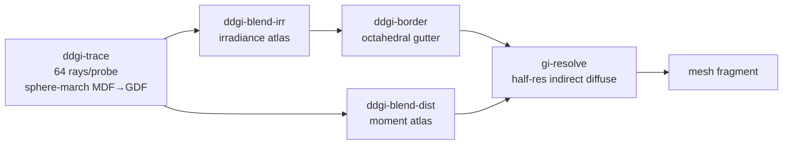

+++
title = 'DDGI overview'
weight = 1
+++

# DDGI overview

Dynamic Diffuse Global Illumination computes multi-bounce diffuse indirect light from a volume of
irradiance probes re-traced continuously at runtime, after
[Majercik et al. (JCGT 2019)](https://jcgt.org/published/0008/02/01/paper-lowres.pdf). Each probe
gathers radiance by sphere-marching rays through the engine's distance fields in a compute shader,
so the whole path runs on any GPU, including the llvmpipe dev device. A shaded surface then reads
the probes around it for its diffuse indirect term.

The probe cage follows the camera, so indirect light is always resolved where the player is
looking. The sky enters a ray's radiance only when that ray escapes to open space, which is what
darkens enclosed interiors.

## The per-frame pipeline

DDGI is an all-compute prelude to the scene pass: four passes rebuild the probe state each frame,
then the half-res GI resolve and the mesh fragment read it. The probes form a 16×8×16
camera-centered clipmap (`DDGI_PROBES_X/Y/Z`, 2048 probes) at a fixed 1.5 m spacing
(`DDGI_PROBE_SPACING`), each tracing 64 rays (`DDGI_RAYS_PER_PROBE`).



1. **Trace** (`ddgi-trace`) sphere-marches 64 Fibonacci-sphere rays from each probe through the
   shared distance field, the per-mesh MDF near the probe and the Global Distance Field clipmap
   beyond, and writes radiance plus hit distance per ray
   ([software ray trace](../software-ray-trace/)).
2. **Blend** (`ddgi-blend-irr`, `ddgi-blend-dist`) integrates the rays into two octahedral
   atlases, directional irradiance and Chebyshev distance moments, with a 0.95 temporal
   hysteresis (`DDGI_HYSTERESIS`).
3. **Border** (`ddgi-border`) copies each irradiance tile's one-texel gutter so bilinear sampling
   wraps across octahedral tile edges ([probe atlases](../irradiance-and-moment-atlases/)).

The trace is budgeted: each frame re-rays a rolling window of `DDGI_PROBE_BUDGET` probes, a
quarter of the volume, so the whole grid refreshes every four frames at a quarter of the trace
cost. The blend updates only the probes traced this frame. An untraced probe keeps its last
integrated atlas value, because its stored rays belong to an earlier ray-set rotation.

## Where shading reads it

For opaque surfaces the probe cage is sampled once per half-resolution pixel, not per fragment.
The `gi-resolve` compute pass reconstructs world position and normal from the thin G-buffer, calls
the shared `giprobe` module's `ddgiSampleIrradiance`, and lerps the result over the analytic
[IBL diffuse](../../image-based-lighting/ibl-overview/) by the returned coverage:

```hlsl
float4 ddgi = ddgiSampleIrradiance(params.vol, ddgiIrradiance, ddgiDistance, worldPos, n);
indirectIrr = lerp(analyticIrr, ddgi.rgb, ddgi.w);
```

The mesh fragment samples the upsampled resolve output (`giIndirectMap`) and applies the per-pixel
`kd · albedo` tail. Translucent surfaces cannot read that resolve, since it is keyed to the opaque
G-buffer behind them, so they call `ddgiSampleIrradiance` directly in the fragment. The non-IBL
fallback path does the same and *adds* the cage irradiance weighted by coverage, because it has no
analytic diffuse to replace. Both fragment paths are gated on `screenFlags.z`.

Coverage (`ddgi.w`) is the trilinear weight mass of the probes genuinely inside the cage: ~1 deep
within the volume, falling to 0 outside it, so a surface beyond the camera-centered cage keeps the
analytic term. The eight-probe blend itself, trilinear × backface × Chebyshev, is covered in
[probe sampling](../probe-volume-and-sampling/).

## Sky only on a miss

DDGI *replaces* the analytic IBL diffuse where the cage has coverage rather than adding to it,
because each probe carries its own sky occlusion structurally. A probe inside a sealed room
marches its rays into the enclosing walls, and a wall hit returns no sky at all: its radiance is
the hit surface's flat per-cell base color times a sun term, plus last frame's bounce.

Only a ray that escapes through an opening returns the sky color, so an enclosed probe is dark by
construction while an exterior probe picks up the sky. Stacking probe irradiance on top of the
IBL diffuse would leak the skybox back into interiors.

The sun half of the hit term is gated too. The field gradient at the hit gives a surface normal
for an N·L factor, and a second sphere-march toward the sun zeroes the term when an occluder
blocks it, so a hit deep inside an interior receives no direct sun either.

## A camera-centered scrolling clipmap

The probe cage is not authored and does not fit the scene. `render_scene` calls `set_ddgi_scene`
each frame with the camera position and the sun/sky, and the volume snaps its min corner to the
probe grid so the cage centers on the camera without shimmering sub-cell.

When the camera crosses a whole cell the cage scrolls. Probes are addressed toroidally (a probe's
physical atlas tile is `wrapMod(cell, count)`), so every probe that stays in view keeps its tile
and its converged history. A scrolled-in probe drops its stale history the first time the
round-robin budget re-rays it, so the volume keeps converging while the player walks.

Probe spacing is fixed at 1.5 m, below typical wall thickness, so the Chebyshev moment test can
bound light leaking between rooms. DDGI is on by default; the `set-gi` control command switches
the indirect-diffuse source at runtime:

```sh
sa set-gi off    # analytic IBL diffuse everywhere
sa set-gi ddgi   # probe irradiance where the cage covers, IBL beyond it
```

Enabling from off, or a view temporal reset such as a resize, arms `Ddgi::reset_history`: the next
blend runs with no history for one frame so the probes re-converge instead of ghosting in from
stale data.

## Multi-bounce convergence

The trace samples last frame's irradiance atlas at each ray hit and folds half of it, times the
hit albedo, back into the ray's radiance. A ray that hits a lit wall picks up that wall's bounce,
which was itself fed by the bounce before it. Each frame deepens the result by one bounce, and the
temporal blend converges to many bounces over a fraction of a second with no extra rays. That
feedback loop is why the volume is re-traced rather than baked.

## Probes against screen-space

[Screen-space GI](../../screen-space-and-post/ssgi/) can bounce only what the framebuffer sees:
light from off-screen or back-facing geometry contributes nothing, and the term shifts as the
camera turns. DDGI stores irradiance in world space, so a surface lit by a wall behind the camera
stays lit. The cost is a fixed per-frame compute budget and coarse spatial resolution, one probe
every 1.5 m. DDGI supplies the *diffuse* indirect term only; specular still comes from IBL and
screen-space reflections.

## In the code

| What | File | Symbols |
|---|---|---|
| Four-pass per-frame pipeline | `rendering/src/renderer.rs` | `Renderer::add_ddgi_passes` (the `ddgi-trace` … `ddgi-border` passes) |
| Probe / clipmap constants | `rendering/src/ddgi.rs` | `DDGI_PROBES_X/Y/Z`, `DDGI_PROBE_SPACING`, `DDGI_RAYS_PER_PROBE`, `DDGI_PROBE_BUDGET`, `DDGI_HYSTERESIS` |
| Camera-centered snap + scroll | `rendering/src/ddgi.rs` | `Ddgi::set_scene`, `Ddgi::advance_frame`, `Ddgi::scroll_base_ubo`; `assets/src/render_scene.rs` · `render_scene` |
| Cage sampling (shared module) | `giprobe.slang` | `ddgiSampleIrradiance` (coverage in `.w`), `DdgiVolume` |
| Half-res indirect resolve | `gi_resolve.slang` | `computeMain`; `renderer.rs` · the `gi-resolve` pass |
| Fragment consumers | `lighting.slang` | `giIndirectMap`, `ddgiVolumeFromGlobals`, the `screenFlags.z` gates |
| State + toggle | `rendering/src/ddgi.rs` | `Ddgi`, `Ddgi::wants_ddgi`, `Ddgi::reset_history`; `renderer.rs` · `Renderer::set_ddgi`, `ddgi_enabled` |
| Control command | `control/src/commands_render.rs` | `set-gi` (`SetGiParams`, `SetGiResult`) |

## Related

- [Software ray trace](../software-ray-trace/) — how each probe sphere-marches the distance field
- [Probe sampling](../probe-volume-and-sampling/) — the camera-centered cage + the toroidal tile fold
- [Probe atlases](../irradiance-and-moment-atlases/) — the temporal blend and the moment test's storage
- [Image-based lighting](../../image-based-lighting/ibl-overview/) — the analytic diffuse DDGI replaces
- [SSGI](../../screen-space-and-post/ssgi/) — the screen-space bounce layered on top
- [Cook-Torrance BRDF](../../lighting-and-brdf/cook-torrance-brdf/) — the shading the irradiance feeds
