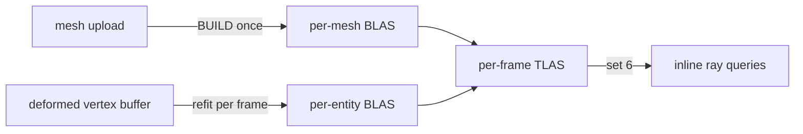

+++
title = 'Acceleration structures'
weight = 6
+++

# Acceleration structures

An acceleration structure is a GPU spatial index that lets a ray find the triangle it hits without
testing every triangle in the scene. The engine builds the two-level layout defined by
[Vulkan Ray Tracing](https://www.khronos.org/blog/ray-tracing-in-vulkan): per-mesh bottom-level
structures (BLAS) over triangles, and one top-level structure (TLAS) per frame over the scene's
instances. Inline ray queries traverse the TLAS for [shadows](../ray-query-shadows/), reflections,
and [ReSTIR](../restir-overview/)'s visibility ray.

Everything on this page requires `VK_KHR_acceleration_structure` and `VK_KHR_ray_query` (see
[RT device gating](../raytracing-device-gating/)). On a device without them `Rt::new` stays inert,
meshes carry no BLAS, and shading takes the shadow-map path.



## The resource

A BLAS and a TLAS share one type. `AccelerationStructure` is a move-only wrapper owning the
`vk::AccelerationStructureKHR` handle, its backing device buffer
(`ACCELERATION_STRUCTURE_STORAGE_KHR | SHADER_DEVICE_ADDRESS` usage), and its device address. The
address is how a TLAS instance references a BLAS and how shaders bind the structure.

`AccelerationStructure::create` allocates the storage buffer, creates the structure over it with
`create_acceleration_structure`, and queries the address; the caller records the build separately.
The wrapper clones the `ash::khr::acceleration_structure::Device` dispatch at construction, because
the destroy entry point is an extension command, not core Vulkan. `Drop` destroys the handle
through that clone, then frees the buffer through the allocator.

The storage takes a **dedicated** allocation rather than a suballocation from a shared block.
Acceleration-structure memory sharing a block with ordinary buffers wedges the GPU — not at the
build, but on an unrelated later submission — so the isolation is a correctness requirement, not a
tuning choice. Build scratch is allocated at the device's
`minAccelerationStructureScratchOffsetAlignment` for the same reason: a misaligned scratch address
is invalid input to the build and loses the device.

## One BLAS per mesh, built at upload

`Uploader::build_mesh_blas` runs once per uploaded mesh when the device supports RT. It records
`record_mesh_blas_build` on a one-off command buffer and waits for the submit, the same synchronous
shape as the upload copy: a load-time cost, never a per-frame one. The result is stored as
`GpuMesh::blas`, an `Option<Arc<AccelerationStructure>>` that stays `None` on a non-RT device.

The build covers the mesh's whole vertex/index buffer as a single triangles geometry: positions
read as `R32G32B32_SFLOAT` at the full `Vertex` stride, `UINT32` indices, flagged `OPAQUE`. Vertex
and index data are referenced by buffer device address, which is why mesh buffers carry
`SHADER_DEVICE_ADDRESS` and AS-build-input usage.

The build flags are `PREFER_FAST_TRACE | ALLOW_COMPACTION`, and the structure is compacted before it
is kept: a second submit writes an `ACCELERATION_STRUCTURE_COMPACTED_SIZE_KHR` query, and the result
is copied into an exactly-sized structure. A static mesh's structure lives for the whole session, so
the slack a build reserves would be held that long too. A driver reporting no saving keeps the built
structure — compaction is a memory win, never a correctness precondition.

Instances of one mesh share that structure. `render-stats` reports `rtInstances` against
`blasCount`, the distinct structures this frame's TLAS references, so instancing shows up as the two
numbers diverging.

## Plant families: one structure per prototype

A plant family is not one mesh. It is a library of prototypes — a trunk section, a frond, a leaf
card — placed many times by *uses*, each with its own family-local transform. Acceleration
structures have no notion of nested instancing inside a bottom-level structure, so a family cannot
be one BLAS over the placed result.

It is instead one structure per prototype, plus one TLAS instance per placed use. Each prototype
owns a contiguous slice of the family's flattened index stream, and its structure builds over that
range alone; a use becomes an instance whose transform is the family-local matrix composed with the
plant's world placement. A single-prototype family needs none of this and is cooked as an ordinary
mesh.

Which uses are active depends on the plant's combination — the same mask table the raster path
resolves — so a phenotype that drops a frond drops its ray instances with it.

> [!NOTE]
> If any prototype's structure fails to build, the whole family is left out rather than partly
> placed. A canopy casting half its shadows looks plausible, which makes it worse than a canopy
> casting none.

Vegetation reaches this path without passing through the scene graph: plants stream through the
GPU-scene mirror rather than existing as entities, so their ray instances are derived from the
mirror's retained plant state each frame. Deriving them from a streaming delta instead would
publish nothing on a frame where no cell changed, and every plant would silently stop casting.

### Cluster acceleration structures

On a device with `VK_NV_cluster_acceleration_structure`, a prototype's structure is not rebuilt
from its triangle stream: it composes from the same clusters the cooker already emitted. Each
cooked triangle cluster becomes one CLAS — its 8-bit local indices verbatim, its positions pulled
from the flattened vertex stream, its submesh as the geometry index so material resolution is
identical to the KHR layout — and one bottom-level structure builds over the CLAS references,
both through the extension's indirect batch. The result is a device address like any BLAS, so
TLAS packing, byte telemetry, and retention are representation-blind (`RtBlas`).

The capability is optional and per-device: without the extension — or when a cluster exceeds the
device's limits, the clusters do not exactly cover the prototype's fine range, or the span
carries cooked opacity micromaps (which only the KHR geometry chain attaches) — the prototype
takes the KHR triangle build. There is no NVIDIA-specific cooked representation; the clusters
are the same bytes every device consumes. The pinned ash release carries no binding for the
extension, so it enters through one hand-transcribed private module whose pinned-version test
fails on every ash bump with instructions to delete it in favour of the generated binding.
`render-stats` reports `clusterAsSupported`, `clusterBlasCount`, and `clasCount`.

## The aggregate representation

The virtual hierarchy's coarsest cut is not triangles at all: it is voxel bricks, each carrying an
indexed surface the cooker emitted. When every root of a mesh's hierarchy is a voxel brick, upload
builds one extra family-space structure over those root surfaces — the aggregate — and TLAS packing
chooses per instance between it and the fine expansion. The choice is the raster traversal's own
refine test, evaluated on the root cut with the camera's eye, projection scale, threshold, and cut
override (`RtCutView`), so ray and raster swap representations on the same boundary: a plant far
enough that raster draws its root bricks is also one coarse TLAS instance instead of one per use.
The aggregate builds opaque — it merges its sources' coverage into solid occupancy — and its hits
resolve through the instance's scene slot like any other. `render-stats` reports the swap as
`rtAggregateInstances`, and `sa set-hierarchy-cut coarse` pins it for inspection.

## The partitioned top level

A KHR top-level structure is rebuilt whole every frame: the instance table is repacked and
the driver re-derives the hierarchy even when one plant moved. Where
`VK_NV_partitioned_acceleration_structure` is available the top level is instead a
partitioned structure, advanced by an op stream that names only what changed — a frame costs
the instances it touched rather than the instances that exist.

Partitions are the world's own base cells, hashed into a fixed table, because that is the
granularity content changes at: a cook republishes a cell, a plant is felled in a cell. A
deforming instance has no fixed cell — its bottom level is refit every frame anyway — so it
goes in the global partition rather than churning between spatial ones.

What makes the diff expressible is that instance indices are stable across frames. Each
placement owns a slot keyed by its scene identity (the GPU-scene instance slot, plus the
assembly use within it), so an unchanged instance is left alone, one whose structure address
moved under an unchanged transform takes the cheaper update op, and one that left the scene
is written inert and returns its slot. Both top-level forms derive from one list of
placements, so they cannot disagree about the same scene.

The structure alternates between per-frame buffers: a build reads the slot the previous frame
wrote and writes the slot whose fence is already waited, which is what lets it be both
incremental and safe to overwrite. `render-stats` reports `ptlasSupported`,
`ptlasPartitions`, `ptlasWrites` and `ptlasUpdates`; writes and updates far below
`rtInstances` is the partitioning paying for itself.

> [!NOTE]
> The partitioned path is opt-in (`SAFFRON_PTLAS=1`) rather than taken automatically. It
> renders a frame byte-identical to the KHR path, but the SDK validation layers do not model
> the extension: a partitioned structure has no SPIR-V form for a shader variable to declare,
> and it is memory rather than an object, so the layer can resolve neither the descriptor type
> nor the structure's address. Neither is reachable from engine code, and a default-on path
> that cannot be validated is worse than an opt-in one that can. e2e `rt-ptlas` runs it,
> asserts the picture is identical, and whitelists exactly those two VUIDs so any other
> validation message still fails.

## Refit BLAS for deforming meshes

A skinned or morphing mesh cannot trace against its upload-time BLAS, whose geometry is the frozen
bind pose. Each deforming instance instead gets a per-entity BLAS rebuilt from its slice of the
deformed vertex buffer: a full `BUILD` with `ALLOW_UPDATE` on first sight, then an in-place
`UPDATE` every frame after. The map is per frame-in-flight, keyed by entity id
(`FrameRt::skinned_blas`), and the instances ride the frame's `DeformedRtInstance` list.
[Compute skinning](../../frame-and-render-graph/compute-skinning/#ray-tracing) covers the
world-space transform subtlety and the fence discipline.

## One TLAS per frame

`render_scene` hands the frame's static instance transforms and meshes to `set_rt_scene`, which
arms the build when a ray-query toggle (shadows or reflections) is on. When armed and at least one
static or deforming instance exists, the renderer calls `prepare_tlas_build` and schedules the
`tlas-build` compute pass to replay the returned plan.

`prepare_tlas_build` does every `&mut` step up front: it plans the deforming-BLAS refits, packs one
`vk::AccelerationStructureInstanceKHR` per static mesh that has a BLAS plus one per deforming
instance, and (re)creates the TLAS and scratch when the instance count outgrows them. The recording
half, `record_tlas_build_plan`, replays the plan inside the graph pass. The halves are split
because the pass body is a `'static` closure, so the plan is owned and `Send`.

Each packed instance holds a transform, a custom index, a `0xFF` visibility mask, the
triangle-facing-cull-disable flag, and the referenced BLAS address. `vk::TransformMatrixKHR` is a
row-major 3×4 (see the spec's
[acceleration-structures chapter](https://docs.vulkan.org/spec/latest/chapters/accelstructures.html))
while glam's `Mat4` is column-major, so `transform_rows` transposes each model matrix on the way
in — without the transpose, instances trace at wrong placements:

```rust
let index = instances.len() as u32;
instances.push(make_instance(transform_rows(model), index, blas.address));
```

The instance buffer is host-visible and mapped, one per frame in flight, grown by doubling from a
64-instance seed (`ensure_tlas_capacity`). The TLAS is sized for the buffer's capacity rather than
the frame's count, so it is recreated only when capacity grows; otherwise the same structure is
rebuilt in place. `write_mesh_set` rewrites the set-6 descriptor on that recreation. The TLAS
builds with `PREFER_FAST_BUILD`, the opposite trade from the BLAS: rebuilt every frame, traced
once per query.

## What the structures cost

`sa render-stats` reports both tiers live — how many structures exist, what they occupy, and which
representation each instance selected:

```sh
sa render-stats
# … "rtSupported": true, "rtShadows": true, "blasCount": 12,
#    "blasBytes": "115072", "blasBuiltBytes": "254848",
#    "tlasBytes": "12672", "rtScratchBytes": "6912",
#    "skinnedBlasCount": 0, "tessellatedBlasCount": 0, …
```

Byte counts are decimal strings, since they exceed what a JSON number holds exactly.

`blasBytes` is **deduplicated by device address**, for the same reason `blasCount` is: a structure
shared by many instances charged once per instance would report instancing as memory growth, which
inverts what sharing does. Adding instances of a mesh already in the scene moves `rtInstances` and
leaves `blasBytes` alone.

`blasBuiltBytes` is what those same structures would occupy had none been compacted, so the
difference is the saving compaction realized. It is an upper bound rather than a promise — a driver
may decline to shrink, in which case the two are equal.

`skinnedBlasCount` and `tessellatedBlasCount` name the other two representations: a refit in place,
and a full rebuild for geometry whose topology varies per frame. Scratch is grow-only and shared
across builds, so `rtScratchBytes` is reported apart from the structures themselves.

## Opacity micromaps

A masked surface makes its triangles non-opaque ray candidates, so every ray that meets one runs the
coverage classifier to decide whether the hit commits. Most micro-areas of such a triangle are not
ambiguous at all: they are wholly covered or wholly cut out, and paying for a classifier invocation
there buys nothing.

`VK_EXT_opacity_micromap` is how a device is told that in advance: a micromap subdivides each
triangle and labels the micro-triangles opaque, transparent, or unknown, and the traversal only
invokes the classifier on the unknown ones. A micromap can therefore remove work, never change the
answer — a derivation that is unsure must say **unknown**, not guess.

The capability is gated on ray tracing, since a micromap is only meaningful attached to an
acceleration-structure build, and surfaces as `ommSupported` on `render-stats`:

```sh
sa render-stats
# … "rtSupported": true, "ommSupported": true, …
```

> [!NOTE]
> The extension is `VK_EXT_opacity_micromap`. There is no `VK_KHR_` micromap extension, and the
> feature (`PhysicalDeviceOpacityMicromapFeaturesEXT::micromap`) must be requested at device
> creation as well as the extension enabled.

Deriving the micromap data itself is not built. The derivation policy a material carries — whether
to derive at all, the subdivision cap, and the thresholds separating opaque from transparent — is
already part of the surface vocabulary and reaches the GPU, but nothing consumes it into a built
micromap yet.

## Barriers

The recorded plan manages its own synchronization: a scratch-reuse barrier between consecutive
refits (they share one scratch region), an AS-build → AS-build-read barrier handing the finished
BLASes to the TLAS build, and a final AS-build → fragment ray-query barrier. The pass additionally
declares `AccelStructBuildRead` on the deformed vertex buffer, so the
[render graph](../../frame-and-render-graph/usage-and-barrier-derivation/) orders it after the
skin, morph, and displace dispatches that write it.

## The empty-TLAS seed

The mesh fragment statically binds the TLAS at set 6 even while the ray-query toggles are off, and
an unwritten acceleration-structure descriptor is a validation error. `seed_empty_tlas` builds a
zero-instance TLAS at init on a private one-off command pool and writes it into every frame slot's
set 6. Ray queries against it miss; the first real build in a slot replaces it, since the slot's
capacity starts at zero.

## In the code

| What | File | Symbols |
|---|---|---|
| The AS resource | `rendering/src/resources.rs` | `AccelerationStructure`, `AccelerationStructure::create` |
| RT sub-state + frame ring | `rendering/src/rt.rs` | `Rt`, `RtScene`, `FrameRt`, `Rt::set_rt_scene` |
| Per-mesh BLAS | `rendering/src/rt.rs`, `upload.rs` | `record_mesh_blas_build`, `MeshBlasBuild`; `Uploader::build_mesh_blas` |
| Deforming-BLAS refit | `rendering/src/rt.rs`, `draw_list.rs` | `plan_skinned_blas_refits`, `BlasRefitOp`; `DeformedRtInstance` |
| TLAS prep + record | `rendering/src/rt.rs` | `Rt::prepare_tlas_build`, `TlasBuildPlan`, `record_tlas_build_plan`, `ensure_tlas_capacity`, `seed_empty_tlas` |
| Instance packing | `rendering/src/rt.rs` | `make_instance`, `transform_rows` |
| Static-instance capture | `assets/src/render_scene.rs` | `render_scene` (the `set_rt_scene` call) |
| The graph pass | `rendering/src/renderer.rs` | the `tlas-build` `RgPass` |
| Plant family structures | `rendering/src/upload.rs`, `rt.rs`, `assets/src/gpu_scene_mirror.rs` | `MeshAssembly::prototype_index_ranges`, `GpuMesh::assembly_blas`, `MeshBlasGeometry`, `GpuSceneMirror::vegetation_ray_instances` |
| Aggregate representation | `rendering/src/upload.rs`, `rt.rs` | `GpuMesh::aggregate_blas`, `RtCutView`, `Rt::aggregate_instance_count` |
| Storage telemetry | `rendering/src/rt.rs`, `resources.rs` | `distinct_blas_bytes`, `Rt::blas_bytes`; `AccelerationStructure::size`, `note_compacted_from` |
| Micromap capability | `rendering/src/device.rs` | `Capabilities::opacity_micromap`, `Device::omm_supported`, `Device::omm_dispatch` |
| Cluster acceleration structures | `rendering/src/rt_cluster.rs`, `vk_nv_cluster.rs`, `upload.rs` | `ClusterBlasBuilder`, `ClusterBlas`, `RtBlas`, `Uploader::build_prototype_cluster_blas` |
| Partitioned top level | `rendering/src/rt_ptlas.rs`, `vk_nv_ptlas.rs`, `rt.rs` | `Ptlas`, `PtlasKey`, `partition_for_translation`, `Rt::plan_ptlas_build`, `TopLevelBuild` |
| Stats readout | `control/src/commands_render.rs` | `render_stats_dto` (`blas_count`) |

## Related

- [RT device gating](../raytracing-device-gating/) — how RT support is detected and the entry points resolved
- [Ray-query shadows](../ray-query-shadows/) — the fragment-shader consumer of the TLAS
- [ReSTIR](../restir-overview/) — the other consumer, for its one visibility ray
- [Compute skinning](../../frame-and-render-graph/compute-skinning/) — the deformed buffer the refit BLASes read
- [Software ray trace](../software-ray-trace/) — the DDGI distance-field trace that needs no acceleration structure
