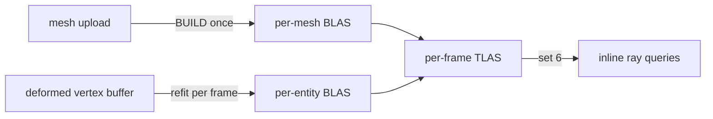

+++
title = 'Acceleration structures'
weight = 6
+++

# Acceleration structures

An acceleration structure is a GPU spatial index that lets a ray find the triangle it hits without
testing every triangle in the scene. The engine builds the two-level layout defined by
[Vulkan Ray Tracing](https://www.khronos.org/blog/ray-tracing-in-vulkan): per-mesh bottom-level
structures (BLAS) over triangles, and one top-level structure (TLAS) per frame over the scene's
instances. Inline ray queries traverse the TLAS for [shadows](../ray-query-shadows/), reflections,
and [ReSTIR](../restir-overview/)'s visibility ray.

Everything on this page requires `VK_KHR_acceleration_structure` and `VK_KHR_ray_query` (see
[RT device gating](../raytracing-device-gating/)). On a device without them `Rt::new` stays inert,
meshes carry no BLAS, and shading takes the shadow-map path.



## The resource

A BLAS and a TLAS share one type. `AccelerationStructure` is a move-only wrapper owning the
`vk::AccelerationStructureKHR` handle, its backing device buffer
(`ACCELERATION_STRUCTURE_STORAGE_KHR | SHADER_DEVICE_ADDRESS` usage), and its device address. The
address is how a TLAS instance references a BLAS and how shaders bind the structure.

`AccelerationStructure::create` allocates the storage buffer, creates the structure over it with
`create_acceleration_structure`, and queries the address; the caller records the build separately.
The wrapper clones the `ash::khr::acceleration_structure::Device` dispatch at construction, because
the destroy entry point is an extension command, not core Vulkan. `Drop` destroys the handle
through that clone, then frees the buffer through the allocator.

## One BLAS per mesh, built at upload

`Uploader::build_mesh_blas` runs once per uploaded mesh when the device supports RT. It records
`record_mesh_blas_build` on a one-off command buffer and waits for the submit, the same synchronous
shape as the upload copy: a load-time cost, never a per-frame one. The result is stored as
`GpuMesh::blas`, an `Option<Arc<AccelerationStructure>>` that stays `None` on a non-RT device.

The build covers the mesh's whole vertex/index buffer as a single triangles geometry: positions
read as `R32G32B32_SFLOAT` at the full `Vertex` stride, `UINT32` indices, flagged `OPAQUE`. Vertex
and index data are referenced by buffer device address, which is why mesh buffers carry
`SHADER_DEVICE_ADDRESS` and AS-build-input usage. The build flags are `PREFER_FAST_TRACE` with no
compaction — built once, traced every frame.

## Refit BLAS for deforming meshes

A skinned or morphing mesh cannot trace against its upload-time BLAS, whose geometry is the frozen
bind pose. Each deforming instance instead gets a per-entity BLAS rebuilt from its slice of the
deformed vertex buffer: a full `BUILD` with `ALLOW_UPDATE` on first sight, then an in-place
`UPDATE` every frame after. The map is per frame-in-flight, keyed by entity id
(`FrameRt::skinned_blas`), and the instances ride the frame's `DeformedRtInstance` list.
[Compute skinning](../../frame-and-render-graph/compute-skinning/#ray-tracing) covers the
world-space transform subtlety and the fence discipline.

## One TLAS per frame

`render_scene` hands the frame's static instance transforms and meshes to `set_rt_scene`, which
arms the build when a ray-query toggle (shadows or reflections) is on. When armed and at least one
static or deforming instance exists, the renderer calls `prepare_tlas_build` and schedules the
`tlas-build` compute pass to replay the returned plan.

`prepare_tlas_build` does every `&mut` step up front: it plans the deforming-BLAS refits, packs one
`vk::AccelerationStructureInstanceKHR` per static mesh that has a BLAS plus one per deforming
instance, and (re)creates the TLAS and scratch when the instance count outgrows them. The recording
half, `record_tlas_build_plan`, replays the plan inside the graph pass. The halves are split
because the pass body is a `'static` closure, so the plan is owned and `Send`.

Each packed instance holds a transform, a custom index, a `0xFF` visibility mask, the
triangle-facing-cull-disable flag, and the referenced BLAS address. `vk::TransformMatrixKHR` is a
row-major 3×4 (see the spec's
[acceleration-structures chapter](https://docs.vulkan.org/spec/latest/chapters/accelstructures.html))
while glam's `Mat4` is column-major, so `transform_rows` transposes each model matrix on the way
in — without the transpose, instances trace at wrong placements:

```rust
let index = instances.len() as u32;
instances.push(make_instance(transform_rows(model), index, blas.address));
```

The instance buffer is host-visible and mapped, one per frame in flight, grown by doubling from a
64-instance seed (`ensure_tlas_capacity`). The TLAS is sized for the buffer's capacity rather than
the frame's count, so it is recreated only when capacity grows; otherwise the same structure is
rebuilt in place. `write_mesh_set` rewrites the set-6 descriptor on that recreation. The TLAS
builds with `PREFER_FAST_BUILD`, the opposite trade from the BLAS: rebuilt every frame, traced
once per query.

`sa render-stats` reports the structures live:

```sh
sa render-stats
# … "rtSupported": true, "rtShadows": true, "blasCount": 12, …
```

## Barriers

The recorded plan manages its own synchronization: a scratch-reuse barrier between consecutive
refits (they share one scratch region), an AS-build → AS-build-read barrier handing the finished
BLASes to the TLAS build, and a final AS-build → fragment ray-query barrier. The pass additionally
declares `AccelStructBuildRead` on the deformed vertex buffer, so the
[render graph](../../frame-and-render-graph/usage-and-barrier-derivation/) orders it after the
skin, morph, and displace dispatches that write it.

## The empty-TLAS seed

The mesh fragment statically binds the TLAS at set 6 even while the ray-query toggles are off, and
an unwritten acceleration-structure descriptor is a validation error. `seed_empty_tlas` builds a
zero-instance TLAS at init on a private one-off command pool and writes it into every frame slot's
set 6. Ray queries against it miss; the first real build in a slot replaces it, since the slot's
capacity starts at zero.

## In the code

| What | File | Symbols |
|---|---|---|
| The AS resource | `rendering/src/resources.rs` | `AccelerationStructure`, `AccelerationStructure::create` |
| RT sub-state + frame ring | `rendering/src/rt.rs` | `Rt`, `RtScene`, `FrameRt`, `Rt::set_rt_scene` |
| Per-mesh BLAS | `rendering/src/rt.rs`, `upload.rs` | `record_mesh_blas_build`, `MeshBlasBuild`; `Uploader::build_mesh_blas` |
| Deforming-BLAS refit | `rendering/src/rt.rs`, `draw_list.rs` | `plan_skinned_blas_refits`, `BlasRefitOp`; `DeformedRtInstance` |
| TLAS prep + record | `rendering/src/rt.rs` | `Rt::prepare_tlas_build`, `TlasBuildPlan`, `record_tlas_build_plan`, `ensure_tlas_capacity`, `seed_empty_tlas` |
| Instance packing | `rendering/src/rt.rs` | `make_instance`, `transform_rows` |
| Static-instance capture | `assets/src/render_scene.rs` | `render_scene` (the `set_rt_scene` call) |
| The graph pass | `rendering/src/renderer.rs` | the `tlas-build` `RgPass` |
| Stats readout | `control/src/commands_render.rs` | `render_stats_dto` (`blas_count`) |

## Related

- [RT device gating](../raytracing-device-gating/) — how RT support is detected and the entry points resolved
- [Ray-query shadows](../ray-query-shadows/) — the fragment-shader consumer of the TLAS
- [ReSTIR](../restir-overview/) — the other consumer, for its one visibility ray
- [Compute skinning](../../frame-and-render-graph/compute-skinning/) — the deformed buffer the refit BLASes read
- [Software ray trace](../software-ray-trace/) — the DDGI distance-field trace that needs no acceleration structure
