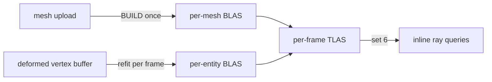

+++
title = 'Acceleration structures'
weight = 6
+++

# Acceleration structures

An acceleration structure is a GPU spatial index that lets a ray find the triangle it hits without
testing every triangle in the scene. The engine builds the two-level layout defined by
[Vulkan Ray Tracing](https://www.khronos.org/blog/ray-tracing-in-vulkan): per-mesh bottom-level
structures (BLAS) over triangles, and one top-level structure (TLAS) per frame over the scene's
instances. Inline ray queries traverse the TLAS for [shadows](../ray-query-shadows/), reflections,
and [ReSTIR](../restir-overview/)'s visibility ray.

Everything on this page requires `VK_KHR_acceleration_structure` and `VK_KHR_ray_query` (see
[RT device gating](../raytracing-device-gating/)). On a device without them `Rt::new` stays inert,
meshes carry no BLAS, and shading takes the shadow-map path.



## The resource

A BLAS and a TLAS share one type. `AccelerationStructure` is a move-only wrapper owning the
`vk::AccelerationStructureKHR` handle, its backing device buffer
(`ACCELERATION_STRUCTURE_STORAGE_KHR | SHADER_DEVICE_ADDRESS` usage), and its device address. The
address is how a TLAS instance references a BLAS and how shaders bind the structure.

`AccelerationStructure::create` allocates the storage buffer, creates the structure over it with
`create_acceleration_structure`, and queries the address; the caller records the build separately.
The wrapper clones the `ash::khr::acceleration_structure::Device` dispatch at construction, because
the destroy entry point is an extension command, not core Vulkan. `Drop` destroys the handle
through that clone, then frees the buffer through the allocator.

The storage takes a **dedicated** allocation rather than a suballocation from a shared block.
Acceleration-structure memory sharing a block with ordinary buffers wedges the GPU — not at the
build, but on an unrelated later submission — so the isolation is a correctness requirement, not a
tuning choice. Build scratch is allocated at the device's
`minAccelerationStructureScratchOffsetAlignment` for the same reason: a misaligned scratch address
is invalid input to the build and loses the device.

## One BLAS per mesh, built at upload

`Uploader::build_mesh_blas` runs once per uploaded mesh when the device supports RT. It records
`record_mesh_blas_build` on a one-off command buffer and waits for the submit, the same synchronous
shape as the upload copy: a load-time cost, never a per-frame one. The result is stored as
`GpuMesh::blas`, an `Option<Arc<AccelerationStructure>>` that stays `None` on a non-RT device.

The build covers the mesh's whole vertex/index buffer as a single triangles geometry: positions
read as `R32G32B32_SFLOAT` at the full `Vertex` stride, `UINT32` indices, flagged `OPAQUE`. Vertex
and index data are referenced by buffer device address, which is why mesh buffers carry
`SHADER_DEVICE_ADDRESS` and AS-build-input usage.

The build flags are `PREFER_FAST_TRACE | ALLOW_COMPACTION`, and the structure is compacted before it
is kept: a second submit writes an `ACCELERATION_STRUCTURE_COMPACTED_SIZE_KHR` query, and the result
is copied into an exactly-sized structure. A static mesh's structure lives for the whole session, so
the slack a build reserves would be held that long too. A driver reporting no saving keeps the built
structure — compaction is a memory win, never a correctness precondition.

Instances of one mesh share that structure. `render-stats` reports `rtInstances` against
`blasCount`, the distinct structures this frame's TLAS references, so instancing shows up as the two
numbers diverging.

## Plant families: one structure per prototype

A plant family is not one mesh. It is a library of prototypes — a trunk section, a frond, a leaf
card — placed many times by *uses*, each with its own family-local transform. Acceleration
structures have no notion of nested instancing inside a bottom-level structure, so a family cannot
be one BLAS over the placed result.

It is instead one structure per prototype, plus one TLAS instance per placed use. Each prototype
owns a contiguous slice of the family's flattened index stream, and its structure builds over that
range alone; a use becomes an instance whose transform is the family-local matrix composed with the
plant's world placement. A single-prototype family needs none of this and is cooked as an ordinary
mesh.

Which uses are active depends on the plant's combination — the same mask table the raster path
resolves — so a phenotype that drops a frond drops its ray instances with it.

> [!NOTE]
> If any prototype's structure fails to build, the whole family is left out rather than partly
> placed. A canopy casting half its shadows looks plausible, which makes it worse than a canopy
> casting none.

Vegetation reaches this path without passing through the scene graph: plants stream through the
GPU-scene mirror rather than existing as entities, so their ray instances are derived from the
mirror's retained plant state each frame. Deriving them from a streaming delta instead would
publish nothing on a frame where no cell changed, and every plant would silently stop casting.

### Cluster acceleration structures

On a device with `VK_NV_cluster_acceleration_structure`, a prototype's structure is not rebuilt
from its triangle stream: it composes from the same clusters the cooker already emitted. Each
cooked triangle cluster becomes one CLAS — its 8-bit local indices verbatim, its positions pulled
from the flattened vertex stream, its ordinal as the geometry index so a candidate can name the
cluster it hit — and one bottom-level structure builds over the CLAS references, both through the
extension's indirect batch. The result is a device address like any BLAS, so TLAS packing, byte
telemetry, and retention are representation-blind (`RtBlas`).

What a candidate on such a structure resolves through is
[its own two side tables](#what-a-candidate-resolves-against), because a cluster's triangles are a
permutation of its submesh's rather than a slice of them.

The capability is optional and per-device: without the extension — or when a cluster exceeds the
device's limits, the clusters do not exactly cover the prototype's fine range, or the span
carries cooked opacity micromaps (which only the KHR geometry chain attaches) — the prototype
takes the KHR triangle build. There is no NVIDIA-specific cooked representation; the clusters
are the same bytes every device consumes. The pinned ash release carries no binding for the
extension, so it enters through one hand-transcribed private module whose pinned-version test
fails on every ash bump with instructions to delete it in favour of the generated binding.
`render-stats` reports `clusterAsSupported`, `clusterBlasCount`, and `clasCount`.

## The aggregate representation

The virtual hierarchy's coarsest cut is not triangles at all: it is voxel bricks, each carrying an
indexed surface the cooker emitted. When every root of a mesh's hierarchy is a voxel brick, upload
builds one extra family-space structure over those root surfaces — the aggregate — and TLAS packing
chooses per instance between it and the fine expansion. The choice is the raster traversal's own
refine test, evaluated on the root cut with the camera's eye, projection scale, threshold, and cut
override (`RtCutView`), so ray and raster swap representations on the same boundary: a plant far
enough that raster draws its root bricks is also one coarse TLAS instance instead of one per use.
The aggregate builds opaque — it merges its sources' coverage into solid occupancy — and its hits
resolve through the instance's scene slot like any other. `render-stats` reports the swap as
`rtAggregateInstances`, and `sa set-hierarchy-cut coarse` pins it for inspection.

## The partitioned top level

A KHR top-level structure is rebuilt whole every frame: the instance table is repacked and
the driver re-derives the hierarchy even when one plant moved. Where
`VK_NV_partitioned_acceleration_structure` is available the top level is instead a
partitioned structure, advanced by an op stream that names only what changed — a frame costs
the instances it touched rather than the instances that exist.

Partitions are the world's own base cells, hashed into a fixed table, because that is the
granularity content changes at: a cook republishes a cell, a plant is felled in a cell. A
deforming instance has no fixed cell — its bottom level is refit every frame anyway — so it
goes in the global partition rather than churning between spatial ones.

What makes the diff expressible is that instance indices are stable across frames. Each
placement owns a slot keyed by its scene identity (the GPU-scene instance slot, plus the
assembly use within it), so an unchanged instance is left alone, one whose structure address
moved under an unchanged transform takes the cheaper update op, and one that left the scene
is written inert and returns its slot. Both top-level forms derive from one list of
placements, so they cannot disagree about the same scene.

The structure alternates between per-frame buffers: a build reads the slot the previous frame
wrote and writes the slot whose fence is already waited, which is what lets it be both
incremental and safe to overwrite. `render-stats` reports `ptlasSupported`,
`ptlasPartitions`, `ptlasWrites` and `ptlasUpdates`; writes and updates far below
`rtInstances` is the partitioning paying for itself.

> [!NOTE]
> The partitioned path is opt-in (`SAFFRON_PTLAS=1`) rather than taken automatically. It
> renders a frame byte-identical to the KHR path, but the SDK validation layers do not model
> the extension: a partitioned structure has no SPIR-V form for a shader variable to declare,
> and it is memory rather than an object, so the layer can resolve neither the descriptor type
> nor the structure's address. Neither is reachable from engine code, and a default-on path
> that cannot be validated is worse than an opt-in one that can. e2e `rt-ptlas` runs it,
> asserts the picture is identical, and whitelists exactly those two VUIDs so any other
> validation message still fails.

## Refit BLAS for deforming meshes

A skinned or morphing mesh cannot trace against its upload-time BLAS, whose geometry is the frozen
bind pose. Each deforming instance instead gets a per-entity BLAS rebuilt from its slice of the
deformed vertex buffer: a full `BUILD` with `ALLOW_UPDATE` on first sight, then an in-place
`UPDATE` every frame after. The map is per frame-in-flight, keyed by entity id
(`FrameRt::skinned_blas`), and the instances ride the frame's `DeformedRtInstance` list.
[Compute skinning](../../frame-and-render-graph/compute-skinning/#ray-tracing) covers the
world-space transform subtlety and the fence discipline.

The structure is built one geometry per submesh of the run it covers, each carrying that submesh's
cooked opacity class — the same layout the upload-time build uses. A single-geometry refit could
hold only one class for the whole instance, and every candidate on it would resolve to the run's
first submesh.

### Wind reaches a structure only as vertices

Every raster pass displaces a wind-flagged instance in its vertex stage, from the record the
[wind prepass](../../scene-and-ecs/wind-field/) writes. Ray traversal has no vertex stage, so a
plant whose structure was built from its cooked rest pose would cast ray shadows and appear in
reflections standing still while the image sways it — the cross-consumer disagreement the shared
deformation output exists to prevent.

The `rt-deform` compute pass closes it. Per placed use of a wind-flagged instance, one dispatch
reads the family's static vertex stream, applies the use's family-local transform, the instance
world transform, and the same `gpuSceneWindDeform` displacement the vertex stage applies, and
writes world-space vertices into the shared deformed arena. The result is an ordinary
`DeformedRtInstance`, so the refit path above builds and updates it like a skinned mesh, and the
TLAS places it at identity.

The materialized set is a **budgeted cache over the static representation**, not a replacement for
it. A field at rest takes nothing: every deformation term scales with the mean speed — the gust is
a fraction of it, and the branch and flutter modes ride the sway — so at zero the rest-pose
structures the upload built are already the pose every pass draws, and an assembly prototype keeps
the cluster-composed structure a triangle build would replace. Under a moving field
`plan_wind_deformation` takes the nearest wind-flagged instances first — sway is a world-space
field displacement, so its projected size falls with distance alone — up to a per-frame job and
vertex ceiling. Anything past the budget keeps its shared per-prototype structures at rest pose. A
plant is materialized whole or not at all: half a swaying canopy reads as a broken model rather
than as a budget. A family the cut has already coarsened to its aggregate structure is skipped,
because that representation merged the geometry sway would move.

Two invariants the slices rest on. A family's index stream addresses its vertices absolutely while
a use's slice mirrors only one prototype's run, so the build rebases the vertex address by the run's
base — which is why a slice is never placed below that base, and why the run's base is read from the
part table the executor's own vertex fetch uses rather than re-derived. And the refit key names the
scene slot and use ordinal rather than an entity, because vegetation never enters the ECS; keys the
frame did not ask for are retired, so a camera crossing a vegetated world does not accumulate a
structure per plant it passed.

### Reconstructed grass blades reach a structure the same way

A micro vegetation field's blades have no instance at all: the raster executor derives a blade's
vertices from a frame-transient candidate the reconstruction scatters over the field tile's density
samples. So there is nothing for the wind materialization above to take, and a field that draws
casts nothing.

`micro-rt-deform` closes that from the tile directory. One workgroup per materialized tile re-derives
the identical blade set the reconstruction places — the frustum verdict deliberately absent, because
an off-screen blade still casts — bakes the same analytic wind bend the raster candidates carry, and
writes the shared blade template's vertices and indices into the tile's slice of a transient arena.
Each tile is then generated geometry: a full per-frame rebuild, placed unmirrored and forced opaque,
because minted topology names no submesh and a candidate on it has nothing to resolve against.
Forcing it opaque loses nothing, since a blade is a closed tapered strip rather than a coverage-masked
card — its triangles already describe the silhouette a classifier would have carved out of a quad.

The reservation is per tile and fixed, since the blade count is decided on device: a tile's whole
texel grid at full density is the bound, and the cleared index tail past what the dispatch wrote is
degenerate triangles the builder discards. The materialized set is capped and reach-gated, so it
tracks the tiles near the camera rather than the world's tile count.

## One TLAS per frame

`render_scene` hands the frame's static instance transforms and meshes to `set_rt_scene`, which
arms the build when a ray-query toggle (shadows or reflections) is on. When armed and at least one
static or deforming instance exists, the renderer calls `prepare_tlas_build` and schedules the
`tlas-build` compute pass to replay the returned plan.

The set comes from the render mirror. `GpuSceneMirror::ray_instances` cuts the mirrored instances
and the resident plants against `gi_occluder_bounds` — the coarsest distance-field cascade window,
the same reach the [visibility hierarchy](../../frame-and-render-graph/hierarchical-visibility/)
culls the SDF occluder feed against — and caches the result until the mirror changes or the window
steps, so an unchanged scene re-derives nothing. The cut is reach rather than the camera frustum
because a reflection shows the camera what it cannot see.

Raster and the occluder feed take their instances from the hierarchy's device visible lists; this
stream is assembled on the host instead, and the build is what forces it. An acceleration-structure
build is recorded on the host, so the instance count and every structure the frame references have
to be host-known before recording. The [partitioned top level](#the-partitioned-top-level)
expresses a frame as a diff against instance slots that stay stable across frames, which a
device-side compaction would renumber every frame. The host holds an `Arc` on every placed
structure for as long as the build can read it, and the
[wind materialization budget](#wind-reaches-a-structure-only-as-vertices) is planned against this
same list, because the structures it mints are host-recorded builds too.

`prepare_tlas_build` does every `&mut` step up front: it plans the deforming-BLAS refits, packs one
`vk::AccelerationStructureInstanceKHR` per static mesh that has a BLAS plus one per deforming
instance, and (re)creates the TLAS and scratch when the instance count outgrows them. The recording
half, `record_tlas_build_plan`, replays the plan inside the graph pass. The halves are split
because the pass body is a `'static` closure, so the plan is owned and `Send`.

Each packed instance holds a transform, a custom index, a `0xFF` visibility mask, the
triangle-facing-cull-disable flag, and the referenced BLAS address. `vk::TransformMatrixKHR` is a
row-major 3×4 (see the spec's
[acceleration-structures chapter](https://docs.vulkan.org/spec/latest/chapters/accelstructures.html))
while glam's `Mat4` is column-major, so `transform_rows` transposes each model matrix on the way
in — without the transpose, instances trace at wrong placements:

```rust
let index = instances.len() as u32;
instances.push(make_instance(transform_rows(model), index, blas.address));
```

## What a candidate resolves against

A traced candidate carries the bottom-level structure it hit and a geometry index within it. Neither
names a scene record, and both are needed: the record supplies the material overrides and coverage
inputs the [canonical classifier](../../materials-and-pipelines/ubershader-and-specialization/) reads, and the
geometry index supplies the submesh whose index slice the primitive belongs to.

So each packed instance's `instanceCustomIndex` is its own position in the frame's placement list,
and a parallel **ray-instance table** turns that position back into an identity: the GPU-scene
instance slot, and the submesh element the structure's geometry 0 corresponds to.

The submesh element is what makes a plant work. A plain mesh's structure holds one geometry per
submesh of the mesh, so geometry 0 is submesh 0. An assembly prototype's structure holds one geometry
per submesh of **its span**, so geometry 0 is wherever that prototype's run starts in the family's
table. Without the rebase a leaf card would resolve the trunk's material, and reaching for a
containing index range instead of the geometry index resolves the wrong submesh for every geometry
after the first — a per-geometry primitive index is not a position in the shared stream.

A cluster-composed structure needs more than the submesh element, because neither half of what a
candidate carries points into the shared streams. Its geometry index is the ordinal of the cluster
that was hit, since each CLAS is built carrying that ordinal as its base geometry index, and its
primitive index counts triangles inside that cluster in the cache-optimized order the cook produced.
The clusters of one submesh are neither contiguous nor in submesh order, so the submesh's index
slice cannot place the triangle.

The build therefore records two side tables the identity carries: one record per cluster naming its
prototype-relative submesh and its run in the second, and a corner stream of three geometry-local
vertex indices per triangle in cluster order. A candidate reads its cluster's record, slices the
corner stream at `firstCorner + primitive · 3`, and lands on exactly the three vertices the raster
path would have used.

An entry whose slot reads `RT_UNMIRRORED_INSTANCE` resolves nothing and its candidates commit. That
is the honest answer for the two representations that have no submeshes to name: the aggregate,
which merges its sources into voxel bricks, and a generated-topology structure — an amplified
instance's dice output or a materialized field tile's blades — whose minted stream has no relation to
the base submeshes. Both are placed `FORCE_OPAQUE`, and both are closed surfaces rather than masked
cards, so nothing a classifier would have decided is lost. Every other representation resolves — a
refit structure carries its run's submesh span and the same per-submesh opacity classes the static
build lays down, so a masked leaf card surfaces candidates whether it is swaying or standing still.

`sa render-stats` reports `rtResolvableInstances` beside `rtInstances`, and the gap between them is
exactly `rtAggregateInstances + tessellatedBlasCount`: each aggregate stand-in is one placement, and
each generated-topology structure the frame rebuilds is placed once. A representation that quietly
stopped resolving widens the gap past that sum.

An instance's opacity class is derived from its *resolved* materials, not stored with them, so a
material edit that flips a coverage class re-resolves every mirrored instance. Refreshing the
material records alone would leave a leaf card that just became masked still casting a solid ray
shadow.

The table is sized before the frame's address block is published — from an upper bound on the
placements the captured scene can expand into — because the block carries its address, and a table
that regrew mid-frame would leave the block naming a freed allocation.

The instance buffer is host-visible and mapped, one per frame in flight, grown by doubling from a
64-instance seed (`ensure_tlas_capacity`). The TLAS is sized for the buffer's capacity rather than
the frame's count, so it is recreated only when capacity grows; otherwise the same structure is
rebuilt in place. `write_mesh_set` rewrites the set-6 descriptor on that recreation. The TLAS
builds with `PREFER_FAST_BUILD`, the opposite trade from the BLAS: rebuilt every frame, traced
once per query.

## What the structures cost

`sa render-stats` reports both tiers live — how many structures exist, what they occupy, and which
representation each instance selected:

```sh
sa render-stats
# … "rtSupported": true, "rtShadows": true, "blasCount": 12,
#    "blasBytes": "115072", "blasBuiltBytes": "254848",
#    "tlasBytes": "12672", "rtScratchBytes": "6912",
#    "skinnedBlasCount": 0, "tessellatedBlasCount": 0, …
```

Byte counts are decimal strings, since they exceed what a JSON number holds exactly.

`blasBytes` is **deduplicated by device address**, for the same reason `blasCount` is: a structure
shared by many instances charged once per instance would report instancing as memory growth, which
inverts what sharing does. Adding instances of a mesh already in the scene moves `rtInstances` and
leaves `blasBytes` alone.

`blasBuiltBytes` is what those same structures would occupy had none been compacted, so the
difference is the saving compaction realized. It is an upper bound rather than a promise — a driver
may decline to shrink, in which case the two are equal.

`skinnedBlasCount` and `tessellatedBlasCount` name the other two representations: a refit in place,
and a full rebuild for geometry whose topology varies per frame. `windDeformedInstances` counts the
placed uses whose wind-deformed geometry the frame materialized, reported apart from the refits it
produces because the two scale with different content — and because a windy scene that materialized
nothing is exactly the case where rays show a pose the image has already left. Scratch is grow-only
and shared across builds, so `rtScratchBytes` is reported apart from the structures themselves.

## Opacity micromaps

A masked surface makes its triangles non-opaque ray candidates, so every ray that meets one runs the
coverage classifier to decide whether the hit commits. Most micro-areas of such a triangle are not
ambiguous at all: they are wholly covered or wholly cut out, and paying for a classifier invocation
there buys nothing.

`VK_EXT_opacity_micromap` is how a device is told that in advance: a micromap subdivides each
triangle and labels the micro-triangles opaque, transparent, or unknown, and the traversal only
invokes the classifier on the unknown ones. A micromap can therefore remove work, never change the
answer — a derivation that is unsure must say **unknown**, not guess.

The capability is gated on ray tracing, since a micromap is only meaningful attached to an
acceleration-structure build, and surfaces as `ommSupported` on `render-stats`:

```sh
sa render-stats
# … "rtSupported": true, "ommSupported": true, …
```

> [!NOTE]
> The extension is `VK_EXT_opacity_micromap`. There is no `VK_KHR_` micromap extension, and the
> feature (`PhysicalDeviceOpacityMicromapFeaturesEXT::micromap`) must be requested at device
> creation as well as the extension enabled.

The data is derived at cook, from the same coverage texture and cutoff the classifier would read.
For each masked submesh the cooker bounds the alpha over every micro-triangle's texel footprint and
labels it against the rule the ray path itself follows: a surface with a constant cutoff settles on
either side of that cutoff, while one whose alpha *is* a coverage probability — the thin-sheet
foliage case, where the classifier compares it against an object-anchored spatial hash — settles
only saturated alpha, because the hash can land anywhere in between. A footprint whose bounds
straddle the rule stays unknown, and a triangle uniform across its whole footprint collapses to the
format's special index and carries no block at all. The subdivision level follows the triangle's texel density up to the
policy's cap. Upload then builds one `VkMicromapEXT` per cooked micromap and the BLAS build
attaches it — on a device that carries the extension, and unless `SAFFRON_OMM=off` suppresses the
attachment.

"Removes work, never changes the answer" is proved where the answer lives, against the classifier
rather than against a picture: every micro-triangle the derivation settles is replayed through
`classify_canonical_coverage` at its corners, edge midpoints and centroid, under every spatial-hash
salt, anchor and temporal phase, for both coverage rules. A frame is far too blunt for that — a
shadow ray that terminates one leaf early lands on a pixel the same leaf already darkened — so what
the `SAFFRON_OMM=off` A/B pins down is the *attachment*: two hosts differing only in whether the
structures carry micromaps must render the same frame but for isolated pixels on a cutout's
staircase, where the intersector resolves an exactly-on-edge candidate differently once the micromap
path is live. That tie is the traversal's, not the data's — widening the derivation's own bound
until it settles a thirtieth as many micro-triangles leaves the same pixels — while a structure
attached to the wrong geometry, or a block stream read at the wrong offset, moves contiguous blocks
of them.

Two sets of counters report it, because the two halves fail differently. `ommDerivedMicromaps`,
with `ommDerivedOpaque` / `ommDerivedTransparent` / `ommDerivedUnknown`, counts what the cook
produced, read off the cooked hierarchy before any device gate — so it reads the same on a target
that can attach nothing. `ommMicromaps`, with `ommOpaque` / `ommTransparent` / `ommUnknown`, counts
what this frame's structures actually reference. Derived zero means the cook found no coverage to
work from; derived nonzero against attached zero means the device declined the extension, or the
attachment is switched off.

## Barriers

The recorded plan manages its own synchronization: a scratch-reuse barrier between consecutive
refits (they share one scratch region), an AS-build → AS-build-read barrier handing the finished
BLASes to the TLAS build, and a final AS-build → fragment ray-query barrier. The pass additionally
declares `AccelStructBuildRead` on the deformed vertex buffer, so the
[render graph](../../frame-and-render-graph/usage-and-barrier-derivation/) orders it after the
skin, morph, and displace dispatches that write it.

## The empty-TLAS seed

The mesh fragment statically binds the TLAS at set 6 even while the ray-query toggles are off, and
an unwritten acceleration-structure descriptor is a validation error. `seed_empty_tlas` builds a
zero-instance TLAS at init on a private one-off command pool and writes it into every frame slot's
set 6. Ray queries against it miss; the first real build in a slot replaces it, since the slot's
capacity starts at zero.

## In the code

| What | File | Symbols |
|---|---|---|
| The AS resource | `rendering/src/resources/` | `AccelerationStructure`, `AccelerationStructure::create` |
| RT sub-state + frame ring | `rendering/src/rt/` | `Rt`, `RtScene`, `FrameRt`, `Rt::set_rt_scene` |
| Per-mesh BLAS | `rendering/src/rt/`, `upload/` | `record_mesh_blas_build`, `MeshBlasBuild`; `Uploader::build_mesh_blas` |
| Deforming-BLAS refit | `rendering/src/rt/`, `draw_list.rs` | `plan_skinned_blas_refits`, `BlasRefitOp`, `RefitGeometry`, `refit_geometries`; `DeformedRtInstance` |
| Wind materialization | `rendering/src/rt_deform.rs`, `rt_deform.slang` | `plan_wind_deformation`, `RtDeformPush`, `record_rt_deform`, `wind_blas_key`, `RT_DEFORM_MAX_JOBS`; `computeMain` |
| Micro-blade materialization | `rendering/src/rt_micro.rs`, `micro_rt_deform.slang` | `plan_micro_rt_arena`, `plan_micro_rt_tiles`, `MicroRtDeformPush`, `micro_blas_key`, `MICRO_RT_MAX_TILES`, `MICRO_RT_REACH_METRES`; `computeMain` |
| Generated-topology builds | `rendering/src/rt/` | `plan_generated_blas_builds`, `GeneratedRtGeometry`, `TessellatedBlas` |
| TLAS prep + record | `rendering/src/rt/` | `Rt::prepare_tlas_build`, `TlasBuildPlan`, `record_tlas_build_plan`, `ensure_tlas_capacity`, `seed_empty_tlas` |
| Instance packing | `rendering/src/rt/` | `make_instance`, `transform_rows`, `Placement` |
| Ray-instance identity | `rendering/src/rt/`, `global_gpu_data.slang` | `GpuRayInstanceRecord`, `Rt::ensure_frame_ray_instances`, `Rt::write_ray_instances`, `ray_instance_record`, `resolvable_placements`; `gpuSceneRayInstance`, `gpuSceneResolveCandidate`, `gpuSceneRayCandidateCovered` |
| Cluster candidate resolution | `rendering/src/rt_cluster.rs`, `upload/accel.rs`, `global_gpu_data.slang` | `ClusterResolutionRecord`, `ClusterBuildInput::corners`, `ClusterBlas::resolution_address`, `RtBlas::cluster_resolution`; `GpuClusterResolutionRecord` |
| Static-instance capture | `assets/src/render_scene/` | `render_scene` (the `set_rt_scene` call) |
| The graph pass | `rendering/src/renderer/` | the `tlas-build` `RgPass` |
| Plant family structures | `rendering/src/upload/`, `rt/`, `assets/src/gpu_scene_mirror/` | `MeshAssembly::prototype_slices`, `AssemblyPrototypeSlice`, `GpuMesh::assembly_blas`, `MeshBlasGeometry`, `GpuSceneMirror::ray_instances` |
| Aggregate representation | `rendering/src/upload/`, `rt/` | `GpuMesh::aggregate_blas`, `RtCutView`, `Rt::aggregate_instance_count` |
| Storage telemetry | `rendering/src/rt/`, `resources/` | `distinct_blas_bytes`, `Rt::blas_bytes`; `AccelerationStructure::size`, `note_compacted_from` |
| Micromap capability | `rendering/src/device/` | `Capabilities::opacity_micromap`, `Device::omm_supported`, `Device::omm_dispatch` |
| Micromap derivation | `geometry/src/opacity_micromap.rs` | `derive_opacity_micromap`, `AlphaBounds`, `subdivision_level`, `barycentrics_to_index` |
| Micromap build + attach | `rendering/src/upload/`, `rt/build.rs` | `Uploader::build_cooked_micromaps`, `cooked_micromap_builds`, `record_micromap_build`, `mesh_blas_build_flags` |
| Micromap telemetry | `rendering/src/rt/build.rs`, `resources/mod.rs` | `distinct_micromap_classes`, `DeviceResources::add_derived_micromap`, `Renderer::rt_omm_derived` |
| Derivation conformance | `rendering/src/canonical_coverage.rs` | `settled_micro_triangles_agree_with_the_classifier_under_every_hash` |
| Cluster acceleration structures | `rendering/src/rt_cluster.rs`, `vk_nv_cluster.rs`, `upload/` | `ClusterBlasBuilder`, `ClusterBlas`, `RtBlas`, `Uploader::build_prototype_cluster_blas` |
| Material-driven opacity re-resolve | `assets/src/gpu_scene_mirror/` | `GpuSceneMirror::consume_asset_journal`, `instance_facts` |
| Partitioned top level | `rendering/src/rt_ptlas.rs`, `vk_nv_ptlas.rs`, `rt/` | `Ptlas`, `PtlasKey`, `partition_for_translation`, `Rt::plan_ptlas_build`, `TopLevelBuild` |
| Stats readout | `control/src/commands_render/` | `render_stats_dto` (`blas_count`) |

## Related

- [RT device gating](../raytracing-device-gating/) — how RT support is detected and the entry points resolved
- [Ray-query shadows](../ray-query-shadows/) — the fragment-shader consumer of the TLAS
- [ReSTIR](../restir-overview/) — the other consumer, for its one visibility ray
- [Compute skinning](../../frame-and-render-graph/compute-skinning/) — the deformed buffer the refit BLASes read
- [Software ray trace](../software-ray-trace/) — the DDGI distance-field trace that needs no acceleration structure
