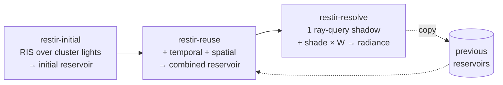

+++
title = 'ReSTIR'
weight = 9
math = true
+++

# ReSTIR

[ReSTIR DI](https://research.nvidia.com/publication/2020-07_spatiotemporal-reservoir-resampling-real-time-ray-tracing-dynamic-direct)
(Reservoir Spatiotemporal Importance Resampling) is a direct-lighting technique that represents many
lights with at most one shadow ray per shaded pixel. Each pixel keeps one *reservoir*: a chosen light
plus the statistics needed to weight it. Temporal and spatial resampling refine that choice without
shading every light each frame.

> [!NOTE]
> ReSTIR requires acceleration-structure and ray-query support. The pass chain also requires a TLAS,
> per-view reservoirs, a G-buffer, and clustered-light data for the current frame.

## The reservoir

A reservoir is the state weighted reservoir sampling carries: the chosen light, the running weight
sum, the sample count $M$, and the unbiased contribution weight $W$. It packs into two `float4`s
(32 bytes, one per pixel): `a` holds the chosen light index, $W$, the weight sum, and $M$; `b`
holds the target pdf of the chosen sample.

## Resampled importance sampling

Ideal sampling draws lights proportional to a target function $\hat p$. Here that function is a
scalar proxy for the light's unshadowed diffuse contribution at the surface. Sampling $\hat p$
directly is intractable, so RIS draws $K$ candidates uniformly from the pixel's froxel light list
and keeps one proportional to $\hat p / p_\text{source}$. Each candidate's resampling weight is

$$
w_i = \frac{\hat p(x_i)}{p_\text{source}(x_i)}
$$

and weighted reservoir sampling keeps candidate $i$ with probability $w_i / \sum_j w_j$ in a single
streaming pass. The kept sample's unbiased contribution weight is

$$
W = \frac{1}{\hat p(x)}\cdot\frac{1}{K}\sum_{i} w_i
$$

so shading the chosen light and multiplying by $W$ gives an unbiased estimate of the sum over *all*
candidate lights — one light evaluated, many accounted for.

## Spatiotemporal reuse

Reservoirs combine by treating each one as a weighted sample and running WRS again. A pixel can
borrow a light choice from its **own pixel last frame**, reprojected through the
[motion vector](../../screen-space-and-post/), and from four **screen neighbours** with similar depth
and normal. A merge accumulates $M$ and reevaluates the incoming light's target function *at this
pixel*, so a neighbour's light competes according to its contribution at the destination surface.
The history contribution is clamped to $M=20$ before merging.

## The three passes

1. **Initial** — `restir_initial.slang` draws $K$ candidate lights from the froxel cluster and
   keeps one by RIS. No shadow ray (visibility is deferred).
2. **Reuse** — `restir_reuse.slang` merges the initial reservoir with last frame's (reprojected)
   and a few spatial neighbours, with M-clamping to bound bias.
3. **Resolve** — `restir_resolve.slang` traces the single shadow ray for the surviving sample,
   shades it scaled by $W$, writes the per-pixel direct radiance, and copies the combined reservoir
   into the previous buffer for next frame.

[ReSTIR passes](../restir-passes/) covers each in detail. The mesh fragment samples the resolved
radiance and adds it as the diffuse direct term, gated on `screenFlags.w`. The sampled value already
includes geometry × visibility × $W$, so the fragment only applies `albedo / PI`.

## Cost against light count

The clustered-forward path shades every punctual light in a pixel's froxel list, capped at 64.
ReSTIR evaluates $K=16$ unshadowed candidates, carries one selected light into reuse, and traces at
most one visibility ray during resolve. Once clustered-light data exists, this per-pixel work is
bounded independently of the total punctual-light count.

The trade is stochastic variance. Temporal and spatial reservoir reuse improve the selected-light
distribution without accumulating the final radiance image. Background and empty-reservoir pixels
exit without a ray. Occluded samples write zero radiance after the visibility query.

## In the code

| What | File | Symbols |
|---|---|---|
| The reservoir struct | `restir_initial.slang` | `Reservoir` (mirrored by `Reservoir` in `rendering/src/restir.rs`) |
| RIS candidate sampling | `restir_initial.slang` | `computeMain`, `targetContribution` |
| Reuse + M-clamping | `restir_reuse.slang` | `combineInto` |
| Resolve + shade | `restir_resolve.slang` | `computeMain`, `rayShadow` |
| State + toggle | `rendering/src/restir.rs` | `Restir`, `RestirView`; `renderer.rs` · `Renderer::set_restir`, `restir_enabled` |
| Sampling into shading | `lighting.slang` | the `screenFlags.w` branch (`evalLighting`) |

> [!WARNING]
> `Renderer::set_restir` clamps the request off when RT support or per-view resources are absent.
> `Renderer::add_restir_passes` additionally requires a current TLAS, G-buffer, and froxel cull;
> otherwise opaque meshes retain the clustered-forward punctual-light loop.

## Related

- [ReSTIR passes](../restir-passes/) — initial, reuse, resolve in detail
- [Clustered forward](../../lighting-and-brdf/clustered-forward/) — the per-light loop ReSTIR replaces, and its candidate source
- [Ray-query shadows](../ray-query-shadows/) — the visibility ray the resolve pass uses
- [Cook-Torrance BRDF](../../lighting-and-brdf/cook-torrance-brdf/) — the shading the resolved radiance feeds
