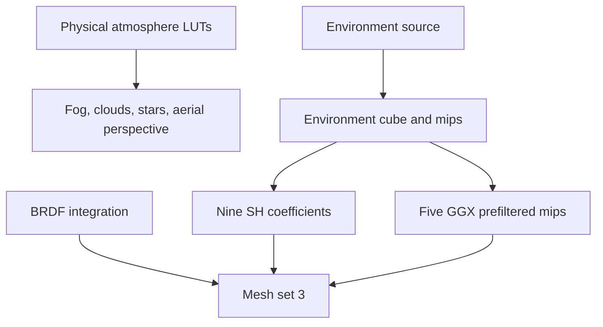

+++
title = 'Baking'
weight = 7
+++

# Baking

The IBL startup bake makes every environment-lighting binding valid before frame zero. Runtime refreshes keep those allocations stable: a fence-owned submission updates the environment and atmosphere LUTs, while render-graph passes update diffuse SH and prefiltered specular lighting.

## Persistent products

`Ibl::new` allocates the environment capture sets, one persistent prefiltered cube, a nine-coefficient SH buffer, the BRDF LUT, and the atmosphere LUTs. The environment cube carries a full mip chain because SH projection reads a coarse level and the specular prefilter selects source levels by sample solid angle.

| Product | Extent | Levels | Use |
|---|---:|---:|---|
| Environment cube | 256² × 6 faces | 9 | visible sky and convolution source |
| Sky SH buffer | 9 × `vec4` | — | diffuse ambient and sky-ray radiance |
| Prefiltered cube | 256² × 6 faces | 5 | roughness-dependent specular ambient |
| BRDF LUT | 256² | 1 | split-sum scale and bias |
| Transmittance LUT | 256 × 64 | 1 | atmosphere transmission |
| Multiple-scattering LUT | 32² | 1 | repeated-scattering energy |
| Sky-view LUT | 192 × 108 | 1 | atmosphere radiance by view direction |

Each frame slot owns a mesh descriptor set 3. Bindings 0 through 2 point at the shared SH buffer,
prefiltered cube, and BRDF LUT, while bindings 3 through 5 point at frame-safe reflection-probe
state. The persistent image and buffer handles do not change during refreshes.

## Startup sequence

The startup submission first evaluates transmittance, multiple scattering, and sky view from the
physical atmosphere defaults. Fog, clouds, stars, and aerial perspective can therefore bind valid,
sampled-layout LUTs even when the selected environment source is procedural or equirectangular.

The selected `EnvSource` then fills environment mip zero:

- `Procedural` dispatches `ibl_skygen.slang`.
- `Equirect` projects a loaded panorama through `ibl_equirect.slang`.
- `Atmosphere` evaluates the [Hillaire atmosphere model](https://sebh.github.io/publications/egsr2020.pdf) and feeds `atmos_skygen.slang`.

The command builds the source mip chain, projects SH, fills every prefiltered mip with a blend alpha
of one, and integrates the BRDF LUT. Waiting for that submission's fence guarantees valid bindings
before rendering begins.

## Runtime refresh

`Ibl::request_env_bake` compares the active source and parameters. Procedural and atmosphere sources use a 0.25-degree celestial-direction threshold; atmosphere settings and panorama bindings use exact source-state changes.

`Ibl::update_refresh` polls a submission fence without blocking the render loop. A completed environment cube blends into the retained front cube, rebinds the live capture source, and arms specular reconvergence. Atmosphere-independent transmittance and multiple-scattering LUTs update only when their physical parameters change.

The render graph imports the environment, SH buffer, and prefiltered cube. It runs SH projection on every live-atmosphere frame and advances the armed specular schedule. Declared storage and sampled uses provide the required compute and fragment barriers.

## Ownership and synchronization

`BakeScratch` owns the transient command pool, command buffer, fence, descriptor pool, environment
pipelines, descriptor sets, and storage views for one environment submission. `LiveCapture` owns the
persistent SH and prefilter pipelines, their descriptor layouts, and the prefiltered mip views.
`Ibl` owns one set 3 per frame slot. `ReflectionProbes` pairs each set with a metadata buffer and
writes only the slot whose frame fence has completed.

Environment images transition directly because the fence-owned bake sits outside the render graph. Live SH and prefilter work uses `RgUsage::StorageWriteCompute`, `StorageImageRwCompute`, `StorageReadCompute`, and sampled-read declarations so graph execution derives synchronization and writes the prefiltered cube's exit layout back for the next frame.

## Runtime gate

Scene lighting enables global IBL when both `Ibl::use_ibl` and `Ibl::ready` are true. `Renderer::set_scene_lighting` stores the result in the light UBO. The mesh shader reads set 3 only when this flag is nonzero.

## In the code

| What | File | Symbols |
|---|---|---|
| Persistent resources | `engine/crates/rendering/src/ibl/` | `Ibl::new`, `LiveCapture`, `Ibl::write_mesh_set` |
| Startup and environment submission | `engine/crates/rendering/src/ibl/` | `Ibl::bake`, `Ibl::submit_refresh`, `BakeScratch` |
| Live graph capture | `engine/crates/rendering/src/ibl/` | `Ibl::add_live_capture_passes`, `Ibl::resolve_live_layouts` |
| Re-bake decision | `engine/crates/rendering/src/ibl/` | `Ibl::request_env_bake`, `should_rebake` |
| Scene source resolution | `engine/crates/assets/src/render_scene/` | `drive_env_bake` |
| Runtime control | `engine/crates/control/src/commands_render/` | `set-ibl` |

## Related

- [IBL overview](../ibl-overview/) explains how the products contribute to scene lighting.
- [Real-time sky-light capture](../realtime-skylight-capture/) explains SH and specular cadence.
- [Cubemaps and mips](../cubemaps-and-mips/) explains cube views and roughness levels.
- [Procedural atmosphere](../procedural-atmosphere/) explains the physical LUT source.
