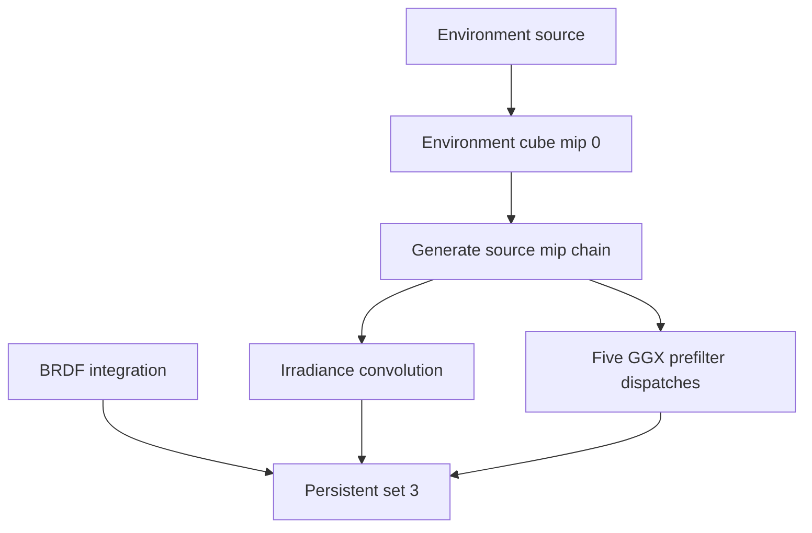

+++
title = 'Baking'
weight = 7
+++

# Baking

The IBL bake turns one environment source into the textures used for diffuse and specular ambient lighting. It performs the expensive convolution and [split-sum integration](https://blog.selfshadow.com/publications/s2013-shading-course/karis/s2013_pbs_epic_notes_v2.pdf) outside the per-frame render graph, leaving stable sampled images for scene rendering.

## Persistent images

`Ibl::new` allocates seven `R16G16B16A16_SFLOAT` images and the persistent descriptor set. The environment cube has a full mip chain because the specular prefilter samples coarser source levels to reduce variance.

| Image | Extent | Levels | Use |
|---|---:|---:|---|
| Environment cube | 256² × 6 faces | 9 | source for convolution and procedural visible sky |
| Irradiance cube | 32² × 6 faces | 1 | diffuse ambient |
| Prefiltered cube | 256² × 6 faces | 5 | roughness-dependent specular ambient |
| BRDF LUT | 256² | 1 | split-sum scale and bias |
| Transmittance LUT | 256 × 64 | 1 | atmosphere transmission |
| Multiple-scattering LUT | 32² | 1 | atmosphere energy returned by repeated scattering |
| Sky-view LUT | 192 × 108 | 1 | atmosphere radiance by view direction |

The renderer calls `Ibl::bake` after construction for the project IBL and the thumbnail-preview IBL. The first successful bake writes bindings 0 through 2 of set 3 with the irradiance cube, prefiltered cube, and BRDF LUT, then marks the set ready. Later bakes overwrite the same images, so their views and descriptor bindings stay valid.

## Bake sequence

The selected `EnvSource` determines how mip 0 of the environment cube is filled:

- `Procedural` dispatches `ibl_skygen.slang` with the sun direction, color, and intensity.
- `Equirect` projects a loaded panorama through `ibl_equirect.slang`. A missing panorama uses the procedural shader.
- `Atmosphere` runs the [Hillaire atmosphere model](https://sebh.github.io/publications/egsr2020.pdf) when `AtmosphereParams::enabled` is true. Its three LUT passes feed `atmos_skygen.slang`.

The environment cube then receives its mip chain. Diffuse irradiance, the five prefiltered levels, and the BRDF LUT run in dependency order.

Every compute shader uses 8 by 8 workgroups. Cube passes dispatch six Z groups, one per face. The irradiance shader integrates a hemisphere, the prefilter uses 128 GGX samples per output texel, and the BRDF LUT uses 512 samples per texel.

## Synchronization

The bake owns its command pool, command buffer, fence, descriptor pool, descriptor layouts, compute pipelines, descriptor sets, and per-mip storage views through `BakeScratch`. Its `Drop` implementation frees these transient handles on both success and error paths. The `IblCube` and `IblImage` wrappers retain the sampled images for the renderer's lifetime.

Each output moves from `UNDEFINED` to `GENERAL` before a storage write and to `SHADER_READ_ONLY_OPTIMAL` before sampling. `cube_barrier` records these synchronization2 image barriers directly because the bake is not a render-graph pass. `generate_cube_mips` performs the environment cube's transfer transitions and blits.

The bake submits once to the graphics queue and blocks until its fence signals. A re-bake also calls `Device::wait_idle` before recording because it overwrites images that an in-flight frame may still sample. The first bake runs before any frame can reference those images and does not need that device-wide wait.

## Re-bake gate

`drive_env_bake` resolves the requested source in this order: a loaded texture panorama, an enabled atmosphere, then the procedural source. `Ibl::request_env_bake` stores the source, panorama, and parameters and calls `should_rebake` to decide whether work is needed.

The comparison depends on the active source. A procedural environment reacts to sun changes. An atmosphere reacts to sun or atmosphere-parameter changes. An equirect environment reacts to its source or panorama binding. Source changes always arm a bake.

`Renderer::render_scene_offscreen` consumes `rebake_pending` before recording the frame. `Ibl::fire_rebake` clears the flag, performs the bake, and commits the pending source and parameters only after success. A failed bake is reported once and is not retried every frame.

## Runtime gate

Scene lighting enables global IBL when both `Ibl::use_ibl` and `Ibl::ready` are true. `Renderer::set_scene_lighting` passes that result to `Lighting::set_frame_ibl`, which stores it in `LightUbo.counts.z`. The mesh shader reads set 3 only when this flag is nonzero. `sa set-ibl 0` selects the flat ambient path without destroying the baked images.

## In the code

| What | File | Symbols |
|---|---|---|
| Image sizes and source selection | `engine/crates/rendering/src/ibl.rs` | `IBL_ENV_SIZE`, `IBL_IRRADIANCE_SIZE`, `IBL_PREFILTER_SIZE`, `IBL_PREFILTER_MIPS`, `IBL_LUT_SIZE`, `EnvSource` |
| Persistent resources and bake | `engine/crates/rendering/src/ibl.rs` | `Ibl::new`, `Ibl::bake`, `Ibl::write_mesh_set` |
| Transient state and barriers | `engine/crates/rendering/src/ibl.rs` | `BakeScratch`, `cube_barrier`, `generate_cube_mips`, `group` |
| Re-bake decision | `engine/crates/rendering/src/ibl.rs` | `Ibl::request_env_bake`, `Ibl::fire_rebake`, `should_rebake` |
| Scene source resolution | `engine/crates/assets/src/render_scene.rs` | `drive_env_bake` |
| Runtime UBO gate | `engine/crates/rendering/src/renderer.rs`, `engine/crates/rendering/src/lighting.rs` | `Renderer::set_scene_lighting`, `Lighting::set_frame_ibl` |
| Runtime control | `engine/crates/control/src/commands_render.rs` | `register_render_commands`, `"set-ibl"` |

## Related

- [IBL overview](../ibl-overview/) — how the baked textures contribute to scene lighting
- [Cubemaps and mips](../cubemaps-and-mips/) — cube storage views and roughness levels
- [Procedural atmosphere](../procedural-atmosphere/) — the physical LUT chain used by one source
- [Procedural sky](../procedural-sky/) — the analytic environment source
- [Render graph](../../frame-and-render-graph/render-graph-overview/) — the per-frame scheduler that does not own the bake
