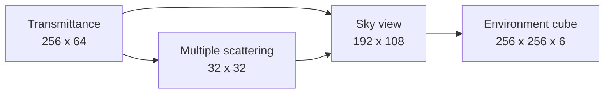

+++
title = 'Procedural atmosphere'
weight = 4
math = true
+++

# Procedural atmosphere

The procedural atmosphere computes sky radiance from wavelength-dependent Rayleigh scattering, directional Mie scattering, and ozone absorption. Anima follows Sébastien Hillaire's [scalable atmosphere model](https://sebh.github.io/publications/egsr2020.pdf): small lookup tables capture the costly path integrals, then a cube-generation pass turns the sky view into the environment used by visible sky and IBL.

The atmosphere is one `EnvSource` for the shared environment cube. Diffuse irradiance and specular prefiltering do not need a separate atmosphere path; they convolve the resulting cube in the same way as procedural or equirectangular sources.

## Physical parameters

`AtmosphereSettings` stores lengths in kilometres and sea-level optical coefficients in inverse megametres. `drive_env_bake` copies those values into `AtmosphereParams`. `AtmosPush` packs them with the directional light's direction and intensity into five `float4` values for all four atmosphere shaders.

The default settings describe an Earth-scale atmosphere:

| Parameter | Default |
|---|---:|
| Planet radius | 6,360 km |
| Atmosphere height | 100 km |
| Rayleigh scale height | 8 km |
| Mie scale height | 1.2 km |
| Mie anisotropy | 0.8 |
| Sun disk angular radius | 0.00465 rad |
| Sun disk intensity | 20 |

Rayleigh and Mie densities fall exponentially with altitude. Ozone uses a tent profile centred at 25 km and reaches zero 15 km below and above that centre.

## LUT chain

`Ibl::record_atmosphere` records three 8 by 8 compute dispatches. Each pass writes an `R16G16B16A16_SFLOAT` image, transitions it to sampled layout, and supplies it to the next pass.

### Transmittance

The transmittance LUT indexes view-zenith cosine horizontally and altitude vertically. `computeMain` takes 40 midpoint samples from that position to the top of the atmosphere. It accumulates Rayleigh, Mie, and ozone extinction and stores the fraction of light that survives:

$$
T = \exp\left(-10^{-3}\int_0^d \sigma_t(s)\,ds\right).
$$

The factor $10^{-3}$ converts ray lengths in kilometres to the inverse-megametre units used by the coefficients.

### Multiple scattering

The 32² multiple-scattering LUT indexes sun-zenith cosine and altitude. Each texel integrates 64 directions over a sphere, with 20 midpoint steps along each ray. Downward rays stop at the planet surface; the others continue to the atmosphere boundary.

The pass records second-order radiance $L_2$ and the fraction $f_{ms}$ scattered into another bounce. It closes the repeated-scattering series component-wise:

$$
\Psi_{ms} = \frac{L_2}{\max(1-f_{ms}, 10^{-3})}.
$$

### Sky view

The sky-view LUT indexes azimuth and a quadratic elevation coordinate that puts more texels near the horizon. It traces 32 steps from an observer altitude of 0.5 km, combines the Rayleigh and anisotropic Mie phase terms, and samples both earlier LUTs for solar transmission and repeated scattering.

`AtmosPush::new` leaves the camera-altitude lane at zero, and the shader clamps it to 0.5 km. This sky-view bake therefore does not move with the scene camera. [Aerial perspective](../../screen-space-and-post/aerial-perspective/) reconstructs scene positions separately while reusing the physical coefficients and the first two LUTs.

## Environment cube

`atmos_skygen.slang` runs one invocation per cube texel. `cubeFaceDir` reconstructs the world direction, and `dirToSkyViewUv` converts its azimuth and elevation to sky-view coordinates. The sampled radiance receives a smooth sun disk based on `sun_disk_angular_radius`, `sun_disk_intensity`, and the directional light's intensity.

The atmosphere push does not contain the directional light's RGB color. Atmosphere radiance and the sun disk use scalar sun intensity; the scene's directional-light color still applies to direct surface lighting.

## Activation and consumers

`drive_env_bake` gives a loaded texture panorama first priority. If no panorama is selected and `AtmosphereSettings::enabled` is true, it requests `EnvSource::Atmosphere`; otherwise it requests the procedural sky. The atmosphere chain runs only when both the source and the enabled field select it.

`Ibl::atmosphere_live` reports whether the last successful bake used the atmosphere source. The visible-sky pass and IBL sample the environment cube. The fog composite can use the sky-view LUT for its in-scatter tint, while the aerial-perspective pass samples the transmittance and multiple-scattering LUTs.

Changes to the source, directional-light inputs, or atmosphere settings arm `Ibl::rebake_pending` through `should_rebake`. The renderer performs that bake before recording a later frame, so all consumers see LUTs and an environment cube from the same completed bake.

## In the code

| What | File | Symbols |
|---|---|---|
| Scene settings and defaults | `engine/crates/scene/src/environment.rs` | `AtmosphereSettings`, `AtmosphereSettings::default` |
| Renderer parameter packing | `engine/crates/rendering/src/ibl.rs` | `AtmosphereParams`, `AtmosPush`, `AtmosPush::new` |
| LUT allocation and dispatch | `engine/crates/rendering/src/ibl.rs` | `ATMOS_TRANSMITTANCE_W`, `ATMOS_MULTI_SCATTER_SIZE`, `ATMOS_SKY_VIEW_W`, `Ibl::record_atmosphere` |
| Transmittance integration | `engine/assets/shaders/atmos_transmittance.slang` | `densities`, `rayTopDistance`, `computeMain` |
| Repeated scattering | `engine/assets/shaders/atmos_multiscatter.slang` | `sampleTransmittance`, `hitsGround`, `computeMain` |
| Sky radiance | `engine/assets/shaders/atmos_skyview.slang` | `rayleighPhase`, `hgPhase`, `computeMain` |
| Cube generation | `engine/assets/shaders/atmos_skygen.slang` | `cubeFaceDir`, `dirToSkyViewUv`, `computeMain` |
| Source resolution | `engine/crates/assets/src/render_scene.rs` | `drive_env_bake` |

## Related

- [Baking](../ibl-bake-pass/) — the command sequence around the atmosphere chain
- [Procedural sky](../procedural-sky/) — the analytic environment source
- [IBL overview](../ibl-overview/) — diffuse and specular consumers of the cube
- [Aerial perspective](../../screen-space-and-post/aerial-perspective/) — scene-depth atmosphere integration
- [Fog](../../screen-space-and-post/height-fog/) — sky-view tint and volumetric in-scatter
