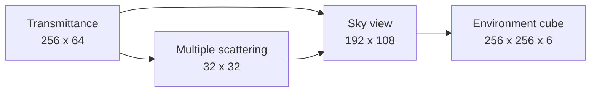

+++
title = 'Procedural atmosphere'
weight = 4
math = true
+++

# Procedural atmosphere

The procedural atmosphere computes sky radiance from wavelength-dependent Rayleigh scattering, directional Mie scattering, and ozone absorption. Anima follows Sébastien Hillaire's [scalable atmosphere model](https://sebh.github.io/publications/egsr2020.pdf): small lookup tables capture the costly path integrals, then a cube-generation pass turns the sky view into the environment used by visible sky and IBL.

The atmosphere is one `EnvSource` for the shared environment cube. [Real-time sky-light capture](../realtime-skylight-capture/) projects its diffuse radiance into SH and incrementally prefilters its specular radiance through the same source-independent path used by procedural and equirectangular environments.

## Physical parameters

`AtmosphereSettings` stores lengths in kilometres and sea-level optical coefficients in inverse megametres. `drive_env_bake` copies those values into `AtmosphereParams`. `AtmosPush` packs them with the sun, moon, and disc controls into seven `float4` values shared by all four atmosphere shaders.

The default settings describe an Earth-scale atmosphere:

| Parameter | Default |
|---|---:|
| Planet radius | 6,360 km |
| Atmosphere height | 100 km |
| Rayleigh scale height | 8 km |
| Mie scale height | 1.2 km |
| Mie anisotropy | 0.8 |
| Sun disk angular radius | 0.00465 rad |
| Sun disk intensity trim | 1 |
| Moon disk angular radius | 0.00496 rad |
| Moon disk intensity trim | 1 |
| Moon earthshine | 0.02 |
| Per-pixel transmittance | off |
| Sky capture cadence | 9 frames |

Rayleigh and Mie densities fall exponentially with altitude. Ozone uses a tent profile centred at 25 km and reaches zero 15 km below and above that centre.

## LUT chain

The atmosphere uses three compute stages. Each stage writes an `R16G16B16A16_SFLOAT` image, transitions it to sampled layout, and supplies it to the next stage. `record_atmosphere_base` records transmittance and multiple scattering when the atmosphere composition changes. `record_sky_view` records the sun-dependent stage whenever either celestial direction crosses the refresh threshold.



### Transmittance

The transmittance LUT indexes view-zenith cosine horizontally and altitude vertically. `computeMain` takes 40 midpoint samples from that position to the top of the atmosphere. It accumulates Rayleigh, Mie, and ozone extinction and stores the fraction of light that survives:

$$
T = \exp\left(-10^{-3}\int_0^d \sigma_t(s)\,ds\right).
$$

The factor $10^{-3}$ converts ray lengths in kilometres to the inverse-megametre units used by the coefficients.

### Multiple scattering

The 32² multiple-scattering LUT indexes sun-zenith cosine and altitude. Each texel integrates 64 directions over a sphere, with 20 midpoint steps along each ray. Downward rays stop at the planet surface; the others continue to the atmosphere boundary.

The pass records second-order radiance $L_2$ and the fraction $f_{ms}$ scattered into another bounce. It closes the repeated-scattering series component-wise:

$$
\Psi_{ms} = \frac{L_2}{\max(1-f_{ms}, 10^{-3})}.
$$

### Sky view

The sky-view LUT indexes azimuth and a quadratic elevation coordinate that puts more texels near the horizon. It traces 32 steps from an observer altitude of 0.5 km, combines the Rayleigh and anisotropic Mie phase terms, and samples both earlier LUTs for solar transmission and repeated scattering.

`AtmosPush::new` leaves the camera-altitude lane at zero, and the shader clamps it to 0.5 km. This sky-view bake therefore does not move with the scene camera. [Aerial perspective](../../screen-space-and-post/aerial-perspective/) reconstructs scene positions separately while reusing the physical coefficients and the first two LUTs.

## Environment cube

`atmos_skygen.slang` runs one invocation per cube texel. `cubeFaceDir` reconstructs the world direction, and `dirToSkyViewUv` converts its azimuth and elevation to sky-view coordinates. The sampled radiance receives solar and lunar discs from the two role-selected directional lights.

## Dynamic refresh

Atmosphere composition and celestial motion have different costs. Transmittance and multiple scattering depend on the gas profile, so they remain unchanged while the sun or moon moves. Sky view and the environment cube depend on direction and refresh when the angle from the committed direction exceeds 0.25°. The split follows the small-LUT decomposition in [Hillaire's scalable atmosphere model](https://onlinelibrary.wiley.com/doi/10.1111/cgf.14050).

The refresh records into a back cube set and submits it with a fence. Frames continue sampling the front set while the GPU works. Once the fence signals, descriptor updates commit the result, and five exponential moving-average steps with $\alpha=0.2$ blend the new environment into the retained one. Dynamic refresh never waits for the whole device to become idle; the split-sum BRDF LUT remains a startup-only bake.

## Sun and moon coupling

The Sun-role directional light, the solar disc, and the atmosphere share one transmittance calculation. A 40-step CPU integral mirrors the transmittance shader for smooth direct lighting between cube refreshes. The engine scales top-of-atmosphere solar illuminance into its linear-light range, multiplies it by wavelength-dependent transmittance, and derives the light's chromaticity and intensity from that result. The disc divides the same illuminance by its solid angle and applies a $u=0.6$ limb-darkening profile.

The Moon-role directional light uses the same atmosphere path at full-moon illuminance. Its disc uses a Lommel–Seeliger response, a compact opposition surge, an in-shader phase terminator, and blue earthshine. These choices model the strongly backscattering lunar surface described by [Hapke's Lunar Reconnaissance Orbiter measurements](https://agupubs.onlinelibrary.wiley.com/doi/abs/10.1029/2011JE003916), rather than treating the Moon as a limb-darkened solar copy. The moon remains a single-scatter, unshadowed fill light.

`perPixelTransmittance` samples transmittance across each disc instead of only at its centre. This preserves the atmosphere and planet boundary across the disc for large-scale views.

## Example

Enable the atmosphere, tune both physical-disc trims, and assign a directional light to the lunar role through the existing component path:

```sh
sa set-atmosphere --enabled true --sunDiskIntensity 1 --moonDiskIntensity 1 --moonEarthshine 0.02 --perPixelTransmittance true
sa set-component-field --entity 2048 --component DirectionalLight --field atmosphereRole --value moon
```

Moving the Sun-role light by more than 0.25° queues a dynamic sky refresh. Direct lighting changes every frame from the CPU transmittance integral, while the visible sky and IBL converge without a hard swap.

## Activation and consumers

`drive_env_bake` gives a loaded texture panorama first priority. If no panorama is selected and
`AtmosphereSettings::enabled` is true, it requests `EnvSource::Atmosphere`; otherwise it requests
the procedural sky. The startup bake evaluates the LUT chain once for every source so all persistent
consumers begin with defined physical data. Later LUT refreshes run when the atmosphere source is
active and its physical or celestial inputs change.

`Ibl::atmosphere_live` reports whether the committed source is the atmosphere. The visible-sky pass and IBL sample the front environment cube. Fog can use the sky-view LUT for in-scatter tint, while aerial perspective samples the frozen transmittance and multiple-scattering LUTs.

## In the code

| What | File | Symbols |
|---|---|---|
| Scene settings and defaults | `engine/crates/scene/src/environment.rs` | `AtmosphereSettings`, `AtmosphereSettings::default` |
| Renderer parameter packing | `engine/crates/rendering/src/ibl/` | `AtmosphereParams`, `AtmosPush`, `AtmosPush::new` |
| Dynamic refresh | `engine/crates/rendering/src/ibl/` | `Ibl::bake`, `Ibl::update_refresh`, `Ibl::record_atmosphere_base`, `Ibl::record_sky_view`, `should_rebake` |
| Coupled key lights | `engine/crates/rendering/src/ibl/` · `engine/crates/rendering/src/renderer/` | `sun_transmittance`, `SOLAR_ILLUMINANCE_TOA`, `Renderer::set_scene_lighting` |
| Celestial roles and settings | `engine/crates/scene/src/component.rs` · `engine/crates/scene/src/environment.rs` | `AtmosphereRole`, `DirectionalLight`, `AtmosphereSettings` |
| Transmittance integration | `engine/assets/shaders/atmos_transmittance.slang` | `densities`, `rayTopDistance`, `computeMain` |
| Repeated scattering | `engine/assets/shaders/atmos_multiscatter.slang` | `sampleTransmittance`, `hitsGround`, `computeMain` |
| Sky radiance | `engine/assets/shaders/atmos_skyview.slang` | `rayleighPhase`, `hgPhase`, `computeMain` |
| Solar and lunar discs | `engine/assets/shaders/atmos_skygen.slang` | `atmosphereTransmittance`, `solidAngle`, `computeMain` |
| Source resolution | `engine/crates/assets/src/render_scene/` | `drive_env_bake` |

## Related

- [Baking](../ibl-bake-pass/) — the command sequence around the atmosphere chain
- [Procedural sky](../procedural-sky/) — the analytic environment source
- [IBL overview](../ibl-overview/) — diffuse and specular consumers of the cube
- [Aerial perspective](../../screen-space-and-post/aerial-perspective/) — scene-depth atmosphere integration
- [Fog](../../screen-space-and-post/height-fog/) — sky-view tint and volumetric in-scatter
