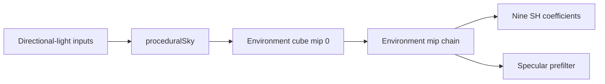

+++
title = 'Procedural sky'
weight = 3
math = true
+++

# Procedural sky

The procedural sky is an analytic HDR environment with a blue upper hemisphere, a dark ground hemisphere, and a directional sun. It gives IBL a complete source without requiring a panorama asset.

`EnvSource::Procedural` selects `ibl_skygen.slang` for the environment-cube fill. The later irradiance, prefilter, and BRDF passes consume its output through the same interfaces used by equirectangular and atmosphere sources.

## Hemisphere gradient

`proceduralSky` starts with three fixed linear-radiance colors:

| Region | RGB |
|---|---|
| Zenith | `(0.10, 0.26, 0.62)` |
| Horizon | `(0.62, 0.70, 0.86)` |
| Ground | `(0.16, 0.14, 0.12)` |

Above the horizon, the upward direction controls a softened blend from horizon to zenith:

$$
t_{sky}=\operatorname{saturate}(d_y)^{0.6}.
$$

Below the horizon, `saturate(-3 d_y)` reaches the ground color by $d_y=-1/3$. The shader multiplies either result by 1.6 before adding the sun.

## Sun lobes

`SkygenParams` receives the scene's directional-light color and intensity. Its sun direction points toward the light, so `drive_env_bake` negates the directional light's travel direction before filling `SkygenPush`.

The shader adds a narrow core and a broad glow around that direction:

```hlsl
float s = max(dot(normalize(dir), sunDir), 0.0);
col += pow(s, 1200.0) * float3(22.0, 20.0, 17.0) * sunTint * sunI;
col += pow(s, 6.0) * float3(0.30, 0.26, 0.20) * sunTint * sunI;
```

Both terms are linear HDR radiance. The high exponent keeps the core close to the sun direction, while the sixth-power lobe spreads a lower-intensity tint across nearby directions. The specular prefilter carries those values into roughness-dependent reflections.

## Cube generation

The output is mip 0 of a 256²-per-face `R16G16B16A16_SFLOAT` cube. `computeMain` uses an 8 by 8 by 1 local size and dispatches six Z groups, one for each cube face.

`cubeFaceDir` maps the face index and texel-centred coordinates to the corresponding world direction. The six cases match Vulkan cube sampling orientation. The shader writes the normalized direction's radiance through a six-layer `RWTexture2DArray<float4>` storage view.



The bake generates the environment's full mip chain immediately after this dispatch. The prefilter shader samples those coarser source levels when an importance sample covers more solid angle than one mip-0 texel.

## Environment and background

The procedural environment is the fallback when no loaded panorama is selected and the physical atmosphere is disabled. This source choice controls IBL regardless of the visible background mode.

When `SkyMode::Procedural` is active, the fullscreen sky pass samples the same environment cube. `SkyRenderSettings::rotation` yaws that visible lookup, and `SkyRenderSettings::intensity` scales its output. Those presentation values do not modify the baked cube or its lighting contribution.

Color mode draws `SceneEnvironment::clear_color` while IBL can still use the procedural environment. Texture mode draws its panorama when loaded; a missing texture falls back to the clear color for the background and leaves environment-source resolution to `drive_env_bake`.

## Re-bake behavior

`should_rebake` compares procedural inputs with the last successful bake. A change to sun direction, color, or intensity arms `rebake_pending`. The next completed bake replaces the cube contents in place, and existing sky and IBL descriptors continue to reference its views.

## In the code

| What | File | Symbols |
|---|---|---|
| Gradient, sun, and face mapping | `engine/assets/shaders/ibl_skygen.slang` | `proceduralSky`, `cubeFaceDir`, `computeMain` |
| Bake inputs | `engine/crates/rendering/src/ibl/` | `EnvSource::Procedural`, `SkygenParams`, `SkygenPush` |
| Dispatch and mip generation | `engine/crates/rendering/src/ibl/` | `Ibl::bake`, `generate_cube_mips`, `IBL_ENV_SIZE` |
| Source and sun resolution | `engine/crates/assets/src/render_scene/` | `drive_env_bake` |
| Background modes | `engine/crates/scene/src/environment.rs`, `engine/assets/shaders/sky.slang` | `SkyMode`, `fragmentMain` |
| Visible-sky state | `engine/crates/rendering/src/ibl/` | `SkyRenderSettings`, `Sky::submit`, `Sky::bind_env_cube` |

## Related

- [Baking](../ibl-bake-pass/) — dispatch and synchronization around the cube fill
- [Procedural atmosphere](../procedural-atmosphere/) — the physical LUT-based source
- [Real-time sky-light capture](../realtime-skylight-capture/) — SH projection and specular reconvergence from this cube
- [Specular prefilter](../specular-prefilter/) — roughness-dependent convolution of this cube
- [IBL overview](../ibl-overview/) — runtime use of the baked textures
