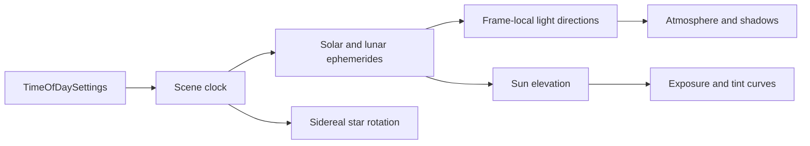

+++
title = 'Time of day'
weight = 5
+++

# Time of day

Time of day is scene-owned calendar and location state that drives the Sun, Moon, exposure, and environment tint. Direction comes from astronomy, while appearance curves let an artist shape the look around sunrise, noon, and night.

## Scene clock

`TimeOfDaySettings` stores a Gregorian date, normalized UTC time, observer latitude and longitude, and the length of a simulated day. A time value of `0` means midnight and `0.5` means noon. Longitude is east-positive.

The host and exported player call `advance_time_of_day` from their shared update loop. A positive `dayLengthSeconds` maps that many real seconds to one simulated day. Zero pauses the clock. Crossing midnight advances the date with Gregorian leap-year rules without creating an undo entry or changing the authored scene version.

## Celestial directions

`drive_time_of_day` evaluates the Sun with the [NREL Solar Position Algorithm](https://docs.nrel.gov/docs/fy08osti/34302.pdf) and evaluates the Moon from its periodic ecliptic terms. Both results are topocentric: they account for the observer's place on Earth before conversion to Anima's east-up-north world frame.

The resulting travel directions override the Sun-role and Moon-role directional lights for the frame. The component values remain authored data. This keeps continuous celestial motion out of persistence, undo history, and protocol inspection while the renderer receives the ephemeris direction through its normal light-gather path.

Manual Sun disables both celestial direction overrides. The authored light directions then drive the frame, but the calendar continues to rotate the star field. Appearance curves use the authored Sun elevation in this mode.



## Appearance curves

The curve input is normalized Sun elevation rather than clock time. An input of `0` corresponds to a Sun elevation of -90°, `0.5` to the horizon, and `1` to +90°. This makes a sunset control point follow the horizon at different dates and latitudes.

Anima evaluates the control points with the same Fritsch-Carlson monotone cubic in Rust and in the editor. An active exposure curve owns renderer exposure for each frame. Disabling that curve returns exposure control to `set-exposure`. The master and RGB tint curves multiply visible-sky and ambient light without rebaking the atmosphere. Coverage and cloud-type curves own the corresponding cloud-shape inputs when active; clearing either curve returns that input to `CloudSettings`.

## Example

This command selects Stockholm, starts at 06:00 UTC on the March equinox, and runs a ten-minute day:

```sh
sa set-time-of-day --enabled true --timeOfDay 0.25 --year 2026 --month 3 --day 20 --latitude 59.3293 --longitude 18.0686 --dayLengthSeconds 600
```

The reply is the complete environment block, including the merged `timeOfDay` state. A cinematic can return to its authored light directions without stopping the calendar:

```sh
sa set-time-of-day --manualOverride true
```

## In the code

| What | File | Symbols |
|---|---|---|
| Scene state | `engine/crates/scene/src/environment.rs` | `TimeOfDaySettings`, `TodCurve`, `TodTintCurve` |
| Clock and ephemerides | `engine/crates/assets/src/time_of_day.rs` | `advance_time_of_day`, `solar_position`, `lunar_position`, `world_from_equatorial` |
| Frame application | `engine/crates/assets/src/render_scene.rs` | `drive_time_of_day`, `CelestialDirectionOverrides`, `TimeOfDayFrame` |
| Curve evaluation | `engine/crates/assets/src/time_of_day.rs` | `eval_monotone_curve` |
| Control command | `engine/crates/protocol/src/dto.rs` · `engine/crates/control/src/commands_scene.rs` | `SetTimeOfDayParams`, `set-time-of-day` |
| Editor controls | `editor/src/panels/EnvironmentPanel.tsx` | `patchTod`, `todCoalescerFor`, `recordTodEdit` |

## Related

- [Night sky](../night-sky/) — sidereal stars, the phased Moon, and low-light adaptation
- [Procedural atmosphere](../procedural-atmosphere/) — atmosphere refresh and role-tagged celestial lights
- [Real-time sky-light capture](../realtime-skylight-capture/) — ambient and reflection reconvergence as the sky moves
