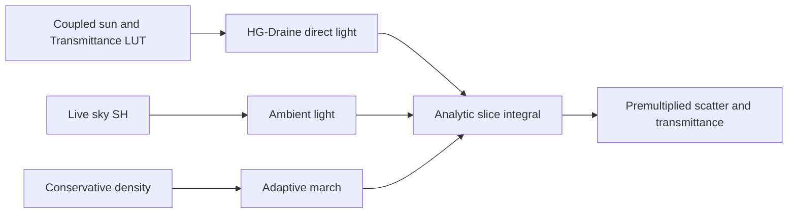

+++
title = 'Volumetric cloud lighting'
weight = 8
math = true
+++

# Volumetric cloud lighting

Volumetric cloud lighting turns the shared density field into premultiplied scene-linear radiance and transmittance. The renderer evaluates a sparse, reduced-resolution march, reconstructs it over time, and upscales it before bloom. This keeps the cost tied to cloud detail rather than display resolution.

## Adaptive march

The raymarch intersects the authored cloud layer and stops at opaque scene depth. A conservative lookup uses the weather map, height profile, and base noise to find occupied regions. Empty regions advance by a coarse step; occupied regions switch to short steps and evaluate the full curl-warped, detail-eroded density. The march returns to coarse stepping after repeated empty samples and exits once transmittance falls below one percent.

This follows the conservative-density and empty-space strategy described in [Nubis, Cubed](https://advances.realtimerendering.com/s2023/Nubis%20Cubed%20(Advances%202023).pdf). `primarySteps` sets the upper bound on detailed samples. It is a budget, not a uniform partition of the ray.

Each occupied slice uses Beer-Lambert transmittance and the analytic integral

$$
S_{\mathrm{slice}} = \frac{L - L T}{\max(\sigma_t, \epsilon)}.
$$

The closed form keeps accumulated energy stable when the adaptive step length or `primarySteps` changes. It is the same integration model used for the froxel fog.

## Direct and ambient light

Direct light comes from the atmosphere-coupled sun or moon. The cloud march samples the shared
cascaded cloud shadow map for broad self-shadowing. When cloud shadows are disabled, `lightSteps`
controls a cone-distributed density march instead. Each lit position also samples the atmosphere
Transmittance LUT, keeping low clouds and the active celestial light on the same colour model.

The phase function is the analytic HG-Draine approximation from [Jendersie and d'Eon](https://research.nvidia.com/labs/rtr/approximate-mie/). `dropletDiameter` selects the published fit for water droplets between 5 and 50 micrometres. It controls the forward peak and broad lobe together, so there is no separate silver-lining or dual-HG control.

Thick cloud interiors use two multiple-scattering octaves. Each octave reduces scattering, extinction, and phase eccentricity while preserving the energy condition that scattering does not fall more slowly than extinction. This produces bright interiors without a powder-darkening term. Ambient light is reconstructed from the live nine-coefficient sky SH and biased from ground bounce at the base toward sky irradiance at the top.



## Temporal reconstruction

Clouds render at half width and half height. One pixel in each 4×4 phase receives a fresh march per frame, with the phase and ray-start offset driven by the view's existing Halton index. The reconstruction pass uses the same history parity, previous view-projection matrix, and motion target as the rest of the temporal pipeline.

Fresh samples blend into reprojected reduced-resolution history with `temporalFactor`. Off-screen reprojection and surface-motion disagreement discard history. A 3×3 bounds clamp limits stale radiance during fast camera turns. Reprojection happens before upscale, so the accumulation remains in one reduced-resolution linear domain.

The upscale gathers nearby cloud samples with spatial and front-depth weights. Opaque scene depth
rejects clouds behind geometry and prevents halos at silhouettes. The pass writes a full-resolution
premultiplied radiance/transmittance image and an opacity-weighted mean cloud front depth for
distance-aware atmosphere composition.

## Full-resolution composition inputs

The upscale output follows the premultiplied cloud identity

$$
C_{\mathrm{out}} = C_{\mathrm{scene}} T_{\mathrm{cloud}} + S_{\mathrm{cloud}}.
$$

`S_cloud` is already premultiplied during front-to-back integration. The
[cloud integration](../cloud-integration/) fold combines this tuple with fog and aerial perspective in
`height_fog.slang`, the only cloud color composite. The result stays in scene-linear HDR before bloom.

An inspection setup can lower the layer and increase convergence weight:

```sh
sa set-clouds --enabled true --coverage 0.6 --layerAltitude 50 --layerHeight 400 \
  --primarySteps 96 --lightSteps 6 --dropletDiameter 20 --temporalFactor 0.1
```

## In the code

| What | File | Symbols |
|---|---|---|
| Adaptive march and lighting | `engine/assets/shaders/cloud_raymarch.slang` · `cloud_lighting.slang` | `computeMain`, `cloudIncidentLighting`, `cloudMiePhase` |
| Temporal reconstruction | `engine/assets/shaders/cloud_reconstruct.slang` | `computeMain` |
| Bilateral full-resolution outputs | `engine/assets/shaders/cloud_upscale.slang` | `computeMain` |
| Shared GPU state | `engine/crates/rendering/src/clouds.rs` | `Clouds`, `CloudParams`, `CloudRenderSettings` |
| Render-graph passes | `engine/crates/rendering/src/renderer.rs` | `add_cloud_passes`, `submit_clouds` |
| Per-view targets | `engine/crates/rendering/src/view_target.rs` | `cloud_reduced`, `cloud_reduced_depth`, `cloud_full_color`, `cloud_full_depth` |
| Scene and wire controls | `engine/crates/scene/src/environment.rs` · `engine/crates/protocol/src/dto.rs` | `CloudSettings`, `SetCloudsParams` |

## Related

- [Volumetric cloud shape](../volumetric-cloud-shape/) — the weather, profile, and erosion field consumed by the march
- [Realtime skylight capture](../realtime-skylight-capture/) — the live SH ambient source
- [Procedural atmosphere](../procedural-atmosphere/) — the Transmittance LUT and coupled sunlight
- [Cloud integration](../cloud-integration/) — shared aerial perspective, cloud shadows, wind, and final composition
