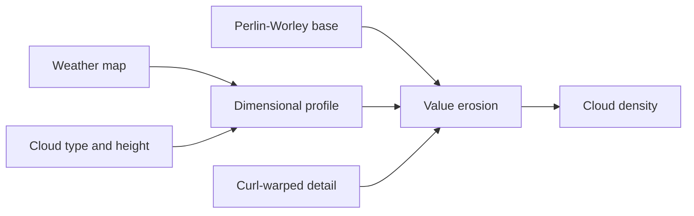

+++
title = 'Volumetric cloud shape'
weight = 7
+++

# Volumetric cloud shape

Volumetric cloud shape is a scene-wide density field built from a weather map, a vertical profile, and tileable noise. These parts have separate jobs: the weather map places cloud systems, the profile gives them a recognizable silhouette, and the noise carves billows and wisps into that silhouette.

## Shape fields

The static field set follows the channel packing described in [The Real-Time Volumetric Cloudscapes of Horizon Zero Dawn](https://advances.realtimerendering.com/s2015/The%20Real-time%20Volumetric%20Cloudscapes%20of%20Horizon%20-%20Zero%20Dawn%20-%20ARTR.pdf). A 128³ RGBA image holds a Perlin-Worley base and three rising Worley frequencies. A 32³ RGBA image holds finer Worley erosion, while a 128² RG curl image bends the detail lookup into turbulent edges.

Compute shaders bake all three fields into device-local images during renderer setup. Their periodic lattice sizes divide the image dimensions, so a linear-repeat sampler crosses each boundary without a seam. The fields remain resident and are shared by every cloud density consumer.

The weather map is one 128² RGB image in which red is coverage, green is precipitation, and blue is cloud type. Procedural Perlin weather and a painted texture both resolve into this image. The density function therefore makes one weather fetch and does not care where the authoring data came from. Precipitation raises optical depth within the shaped cloud, which deepens its Beer-Lambert attenuation without adding a separate darkening path. A dirty flag limits the resolve to changes in weather inputs.

## Dimensional profile

The cloud layer spans `layerAltitude` to `layerAltitude + layerHeight`. Within that slab, a normalized height selects a blend of stratus, cumulus, and cumulonimbus gradients. `cloudType` moves continuously through those profiles, and `anvilBias` broadens the upper part of a tall storm profile.

`sampleCloudDensity` combines this envelope with the noise using the value-erosion model described in [Nubis, Evolved](https://www.guerrilla-games.com/read/nubis-evolved). It subtracts the empty part of the profile from the billowed base, then uses fine Worley noise to erode the remaining edges. Multiplication is not used here because it would thin the dense core along with the boundary.



The same function is the single source of cloud shape for inspection and lighting. Lighting code wraps scattering and transmittance around the returned density instead of rebuilding the weather, profile, or erosion calculation.

## Density view

The `cloud-density` view marches 48 fixed steps through the cloud slab and accumulates raw Beer-Lambert opacity. It stops at opaque scene depth and writes grayscale over the frame. This view is deliberately unlit: white means accumulated cloud mass, not reflected sunlight.

The default layer begins at 1,500 metres. A camera looking across a small test scene may not intersect it, so an inspection setup can lower the layer and look upward:

```sh
sa set-clouds --enabled true --coverage 0.7 --cloudType 0.4 --layerAltitude 50 --layerHeight 400
sa set-view-mode --mode cloud-density
```

Increasing coverage fills the profile toward a solid core. Moving cloud type toward `1` makes the
profile taller, and increasing anvil bias spreads its upper edge. `weatherOffset` moves the world-XZ
lookup without changing the authored noise fields. The scene-wide `WindSettings` advects the weather,
base, and detail coordinates on the monotonic simulation clock, at the shear-scaled mean speed of the
cloud layer's mid altitude; a curl-derived warp adds gust-driven motion
without changing the dimensional profile.

The procedural weather path suits broad, repeatable cloud systems. Hero clouds can use a sparse dimensional-profile volume such as the NVDF and SDF construction described in [Nubis, Cubed](https://advances.realtimerendering.com/s2023/Nubis%20Cubed%20(Advances%202023).pdf); the common density function remains the boundary between dimensional authoring and edge erosion.

## In the code

| What | File | Symbols |
|---|---|---|
| Static field bakes | `engine/assets/shaders/cloud_noise_base.slang` · `cloud_noise_detail.slang` · `cloud_curl.slang` | `computeMain` |
| Weather resolve | `engine/assets/shaders/cloud_weather.slang` | `computeMain` |
| Shared density | `engine/assets/shaders/clouds.slang` | `sampleCloudDensity`, `cloudHeightGradient`, `cloudRemap` |
| Persistent GPU state | `engine/crates/rendering/src/clouds/` | `Clouds`, `CloudRenderSettings`, `CloudParams` |
| Density view | `engine/crates/rendering/src/renderer/` · `engine/assets/shaders/cloud_density_debug.slang` | `ViewMode::CloudDensity`, `add_cloud_passes` |
| Scene state | `engine/crates/scene/src/environment.rs` | `CloudSettings` |
| Control command | `engine/crates/protocol/src/dto/` · `engine/crates/control/src/commands_scene/` | `SetCloudsParams`, `set-clouds` |

## Related

- [Time of day](../time-of-day/) — elevation curves that can own cloud coverage and type
- [Volumetric cloud lighting](../volumetric-cloud-lighting/) — adaptive marching and temporal reconstruction of this density field
- [Cloud integration](../cloud-integration/) — shared wind, atmosphere, and cascaded cloud shadows
- [Procedural atmosphere](../procedural-atmosphere/) — the sky behind the cloud layer
- [Night sky](../night-sky/) — stars and lunar appearance behind the atmosphere
