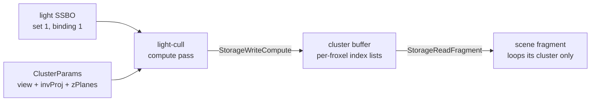

+++
title = 'Clustered forward'
weight = 5
math = true
+++

# Clustered forward

[Clustered forward shading](https://diglib.eg.org/items/6342d4d6-5220-4376-a5c6-a153058f4a3c)
limits per-fragment lighting work to a short spatial list. It divides the view frustum into a 3D grid
of froxels, assigns punctual lights to overlapping cells in a compute pass, and lets the fragment
shader loop over its cell's list.

A plain forward renderer loops every light per fragment, so a thousand lights cost a thousand
iterations per pixel even though most contribute nothing. Clustering replaces that loop with a
short per-froxel one.

## The froxel grid

The grid is $16 \times 9 \times 24 = 3456$ clusters. The $16 \times 9$ tiles the screen; the
24 slices it in depth. Depth slicing is exponential in view space, not linear. Perspective packs
near geometry into a thin band of screen depth, so equal-thickness slices would waste resolution
far away and starve it up close. Slice $i$ spans the view-space Z planes

$$
z_i = -n\left(\frac{f}{n}\right)^{i/N}, \qquad i = 0 \dots N
$$

where $n$ and $f$ are the near and far planes and $N$ is the slice count. Z is negative
because the camera looks down $-Z$. The cull shader builds each slice with `pow(far/near, ...)`;
the fragment shader inverts the same mapping with a `log` — see [cluster indexing](../cluster-indexing/).

## The cull pass

`light_cull.slang` runs one invocation per cluster (a flat `[numthreads(64,1,1)]` dispatch of
`ceil(CLUSTER_COUNT / 64)` groups). Each invocation unpacks its `(x, y, z)` grid coordinate and
builds the cluster's view-space AABB by back-projecting the screen tile's corners onto the near
plane, then intersecting those eye rays with the slice's two Z planes. It then tests every light
as a sphere-vs-box check:

```hlsl
float3 closest = clamp(posView, aabbMin, aabbMax);   // nearest box point to the light
float3 delta = posView - closest;
if (dot(delta, delta) <= radius * radius)            // sphere overlaps box
{
    if (count < MAX_LIGHTS_PER_CLUSTER)
    {
        clusters[clusterIndex].indices[count] = i;
        count = count + 1;
    }
}
```

The light's bounding radius is its `range`. This test is conservative for a spot light because it
uses the enclosing range sphere rather than the light cone. It does not miss a contribution because punctual
[attenuation](../punctual-lights-and-attenuation/) is windowed to reach zero at `range`, so a
light contributes nothing outside that sphere. The result per froxel is a `Cluster`: a `count` plus
a fixed array of light indices.

Pure CPU functions in `lighting.rs` mirror the assignment math. `cluster_aabb`,
`light_intersects_cluster`, and `cull_clusters_cpu` provide a device-free oracle for the compute
kernel.



## How it slots into the frame

The cull pass is added to the [render graph](../../frame-and-render-graph/render-graph-overview/)
in `record_scene_graph`, before the scene pass, when clustered mode is enabled and at least one
punctual light exists. `take_cluster_dispatch_pending` consumes that per-frame gate. The dispatch
contains 54 workgroups of 64 invocations, covering all 3,456 clusters.

The cull pass declares the cluster buffer as `RgUsage::StorageWriteCompute`. The scene pass reads the
same buffer through lighting-set binding 2, but does not declare a corresponding
`RgUsage::StorageReadFragment` access. The graph therefore has no cluster-buffer dependency from
`light-cull` to `scene` and derives no compute-to-fragment memory barrier for that pair.

The punctual-light SSBO is bound into both the compute cull set and the fragment lighting set. When
the per-frame list grows beyond its allocation, `ensure_light_capacity` creates a power-of-two-sized
buffer and rewrites both descriptors.

## Why it stays correct

The cull changes which light indices a fragment visits, not how each light is evaluated. Both the
clustered loop and the [brute-force loop](../brute-force-fallback/) call the same `punctual` and
`brdf` functions. Conservative sphere-versus-AABB assignment can add false positives, whose
attenuation evaluates to zero.

Each cluster records at most 64 indices. The clustered and brute-force paths produce the same
lighting while no fragment needs a light discarded by that cap. Above the cap, the clustered path
keeps the first 64 overlapping lights and the brute-force path visits every light.

`sa set-clustered 0` suppresses the cull dispatch and writes zero to the clustered-valid flag in
`ClusterParams.screen_size.z`. The mesh shader then loops over the full punctual-light list. A
GPU-runtime test dispatches a known light and compares its target cluster with the
`cull_clusters_cpu` oracle.

## In the code

| What | File | Symbols |
|---|---|---|
| Cull kernel | `engine/assets/shaders/light_cull.slang` | `computeMain`, `screenToView`, `rayToZ` |
| Grid + cap constants | `engine/crates/rendering/src/lighting/` | `CLUSTER_GRID_X`/`_Y`/`_Z`, `CLUSTER_COUNT`, `MAX_LIGHTS_PER_CLUSTER` |
| CPU mirror of the cull | `engine/crates/rendering/src/lighting/` | `cluster_aabb`, `light_intersects_cluster`, `cull_clusters_cpu` |
| Cluster params upload | `engine/crates/rendering/src/lighting/` | `Lighting::set_cluster_camera`, `ClusterParams`, `take_cluster_dispatch_pending` |
| Pass scheduling | `engine/crates/rendering/src/renderer/` | `Renderer::record_scene_graph` — the `light-cull` `RgPass::compute` |
| Fragment-side loop | `engine/assets/shaders/lighting.slang` | `evalLighting` — `clusterParams.screenSize.z` branch |
| Runtime control | `engine/crates/control/src/commands_render/` | `set-clustered` |

> [!NOTE]
> Grid dimensions and `MAX_LIGHTS_PER_CLUSTER` are duplicated across Rust and shader sources. The
> `cluster_grid_matches_shader` test asserts the Rust values but does not parse the shader files.

## Related

- [Cluster indexing](../cluster-indexing/) — how a fragment finds its froxel
- [Per-cluster cap](../per-cluster-cap/) — the 64-light ceiling per froxel
- [Brute-force fallback](../brute-force-fallback/) — the pixel-identical reference path
- [Render graph](../../frame-and-render-graph/render-graph-overview/) — how the barrier is derived
